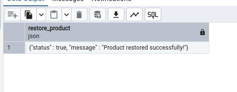
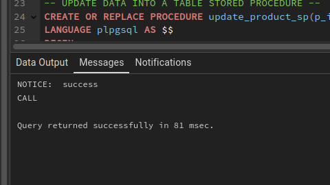
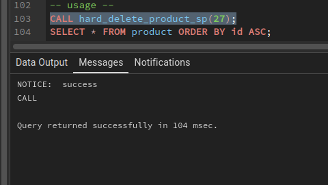
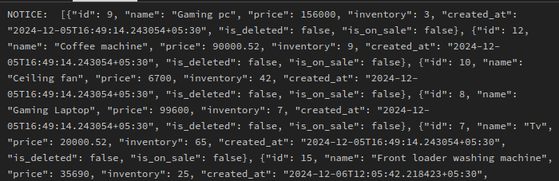
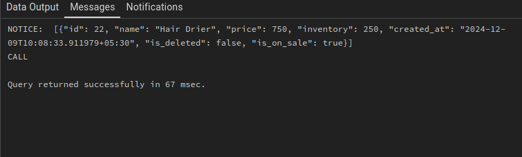
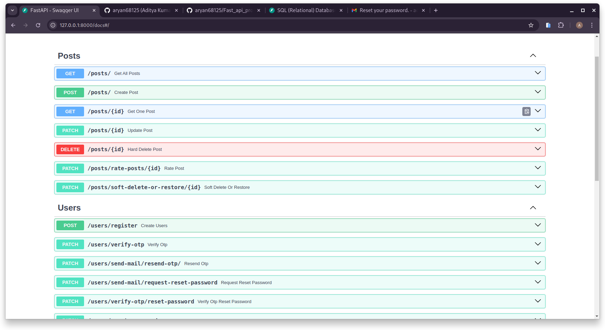

# Fast_api_project
This repo holds the fast api project for learning purposes
## Installation
Create a virtual environment <br>
```
virtualenv venv
```
Activate your virtual environment <br>
```
source venv/bin/activate
```
Install Fast api <br>
```
pip3 install fastapi[all]
```
OR you can run the command below to install Fastapi in your system <br>
```
pip3 install fastapi[all]
```
Install the server for fastapi <br>
```
pip install uvicorn
```
Install FastAPI ORM sqlmodel
<br>
``` 
pip install sqlmodel 
```

## Direcotry structure
#### fast_api_beginner folder
This folder holds the code that demonstrates
- How to use [GET] method
    - Imports and FastAPI Initialization
        - Creating an Instance of FastAPI
    - Defining the index Route
        - path parameter in fastAPI
        - query parameter in fastAPI
            - Accepting a single query
            - Multiple query chaining example
            - Make your query optional
        - FastAPI can differentiate between path parameters and query parameters
- Request body [POST , PATCH]
    - model.py
    - main.py
- Change the port of the FastAPI server

#### fast_api_intermediate
- Pydantic Schemas

## Some tips and tricks in FastAPI
### PostgreSQL Installation process 
Folow the guide from the official postgreSQL docs provided in the link given below <br>
https://www.postgresql.org/download/linux/debian/

### Set password to the default user in postgreSQL server
In PostgreSQL, the `postgres` role does not have a password set by default, and you cannot log in using this role with a password until one is explicitly set. Here's how you can set or change the password for the `postgres` role:

---

#### 1. **Log In as the `postgres` User**
Since you’re already logged in to the system, you can switch to the `postgres` user and enter the PostgreSQL shell:
```bash
sudo -u postgres psql
```

---

#### 2. **Set a Password for `postgres`**
In the PostgreSQL shell, run the following command to set or change the password:
```sql
ALTER USER postgres WITH PASSWORD 'your_secure_password';
```
Replace `your_secure_password` with a strong password of your choice.

---

#### 3. **Verify the Password**
Exit the PostgreSQL shell:
```sql
\q
```
Then try logging in using the `postgres` user with the password:
```bash
psql -U postgres -W
```
You’ll be prompted to enter the password.

---

#### 4. **Optional: Update Authentication Method in `pg_hba.conf`**
If the `pg_hba.conf` file is configured for `peer` or `trust` authentication, PostgreSQL will not ask for a password. To require a password, you need to update the authentication method:

1. Open the `pg_hba.conf` file (usually located in `/etc/postgresql/<version>/main/`):
   ```bash
   sudo nano /etc/postgresql/<version>/main/pg_hba.conf
   ```

2. Find the line for the `postgres` user or `local` connections and change the method to `md5`:
   ```plaintext
   local   all   postgres   md5
   ```

3. Save and close the file, then restart PostgreSQL:
   ```bash
   sudo systemctl restart postgresql
   ```

Now, the `postgres` role will require a password to log in.

### Run server when your main.py file is inside a python package 
The directory structure looks something like this : 
```
.
├── blog_app
│   ├── __init__.py
│   ├── main.py
│   └── __pycache__
│       ├── __init__.cpython-312.pyc
│       └── main.cpython-312.pyc
├── dummy_data_CRUD.py
├── images
│   └── readme_images
│       ├── crud.png
│       ├── path_operation.png
│       └── post_request.png
├── naive_main_code.py
├── __pycache__
│   ├── Blog.cpython-312.pyc
│   └── main.cpython-312.pyc
├── pydantic_custom_models
│   ├── Blog.py
│   ├── __init__.py
│   └── __pycache__
│       ├── Blog.cpython-312.pyc
│       └── __init__.cpython-312.pyc
└── utility
    ├── common_response.py
    ├── dummy_data.py
    ├── __init__.py
    └── __pycache__
        ├── common_response.cpython-312.pyc
        ├── dummy_data.cpython-312.pyc
        └── __init__.cpython-312.pyc
```
This command is used to run the FastAPI server if your main.py file is inside a python package.
```
uvicorn blog_app.main:app --reload 
```
Here ```blog_app``` is the package (folder) name , ```main``` is the file name , ```app``` is defined in the main.py file like this ```app = FastAPI()```. ```app``` is nothing but a FastAPI instance which allows us to use decorators and make our common python functions into a FastAPI routes

### Open swagger UI to test your apis 
The way to open swagger UI so that you can test your apis in an interactive way all you need to do is add docs after the server's url in your browser as shown here :-> ``` http://127.0.0.1:8000/docs ``` You don't need to do any additional configurations to enable swagger UI.

### Change the port of the FastAPI server 
Add the code below at the last after you have added all of you api end-points in your ```main.py``` file.
```
import uvicorn
if __name__ == "__main__":
    uvicorn.run(app,host="127.0.0.1",port=8001)
```
**NOTE** : The command ```uvicorn main:app --reload``` will run the server in its default port i.e 8000
If you want the changes made by the above code to take effect and start the server in the port that you defined in main.py file as shown above then use this command to do so ```python3 main.py```

## Some common Problems and their solutions (Troubleshooting)
### Module not found error when running server in FastAPI
My code in main.py file looks like this
```
from fastapi import FastAPI

# Utility related imports
# import common response from utility
from utility.common_response import common_response
#importing common success message
from utility.common_success_message import (
    DATA_SENT,
)

app = FastAPI()

@app.get("/")
def index():
    data = "This endpoint is the entry point for the apis in the intermediate section."
    return common_response(status_code=200,message=DATA_SENT,data=data)
```
The Directory structrue in the project
```
fast_api_intermediate
├── blog
│   ├── __init__.py
│   ├── main.py
│   ├── models.py
│   └── __pycache__
│       ├── __init__.cpython-312.pyc
│       ├── main.cpython-312.pyc
│       └── models.cpython-312.pyc
├── __pycache__
│   └── main.cpython-312.pyc
└── utility
    ├── common_error_message.py
    ├── common_response.py
    ├── common_success_message.py
    ├── __init__.py
    ├── __pycache__
    │   ├── common_response.cpython-312.pyc
    │   ├── common_success_message.cpython-312.pyc
    │   └── __init__.cpython-312.pyc
    ├── validation_regex_patterns.py
    └── validations.py
```
If you have the directory structure that looks somthing like what is shown above then you can't use this command ```uvicorn main:app --reload``` to run your fastAPI server. 
<br>
If you use this command then you will get the error that looks something like this 
```
  File "/home/aditya/github/Fast_api_project/fast_api_intermediate/blog/main.py", line 5, in <module>
    from utility.common_response import common_response
ModuleNotFoundError: No module named 'utility'
```
You need to get one level out of your blog folder if you are inside of it and run this command instead ``` uvicorn blog.main:app --reload ``` to run your FastAPI server. This tells uvicorn to treat blog.main as a module in the blog package, and Python can then resolve the relative imports properly. Hence resolving the issue.

## Sample code in FastAPI [GET]
The code below is a sample code of FastAPI.
```
from fastapi import FastAPI
#import common_respone 
from common_response import common_response 
#import success message from common success message file
from common_success_message import (
    DATA_SENT
)

app = FastAPI()

@app.get("/")
def index():
    data = "Well hello there"
    return common_response(status_code=200,message=DATA_SENT,data=data)

@app.get("/about")
def about():
    data = "This Api is created by Aditya Kumar"
    return common_response(status_code=200,message=DATA_SENT,data=data)
```
### Explaination of the above code is as follows
#### Imports and FastAPI Initialization <br>
```
from fastapi import FastAPI 
```
<br>

- Explanation: FastAPI is a modern Python web framework that allows you to build APIs quickly and easily. It's designed to work seamlessly with asynchronous programming and type hints, and it has built-in support for features like request validation and automatic documentation generation.
- Purpose of from fastapi import FastAPI: This line imports the FastAPI class from the FastAPI library, which is used to create an instance of the FastAPI application. This instance is needed to register routes, handle requests, and define the overall structure of the API.

<br>

#### Creating an Instance of FastAPI

```
app = FastAPI()
```

<br>

- Explanation: This line creates an instance of the FastAPI application. Here, app is the instance of FastAPI, which represents the web application and handles all incoming requests and outgoing responses.
- Purpose: The app object allows you to add routes, middlewares, and other configuration settings for your FastAPI application. Once instantiated, it can register route handlers for different HTTP methods and endpoints.

#### Defining the index Route

<br>

```
@app.get("/")
def index():
    data = "Well hello there"
    return common_response(status_code=200, message=DATA_SENT, data=data)
```

<br>

**Path Operation** :  <br>


<br>

Explanation of @app.get("/"):
- @app.get("/") is a decorator that registers this function (index) as a handler for GET requests to the / route. This decorator is what makes a normal python function into a path operation function.
- In FastAPI, decorators like @app.get, @app.post, etc., allow you to bind specific routes (URLs) to specific HTTP methods (GET, POST, etc.). This lets the server know which function to call when a request is made to a specific endpoint.
- Here, @app.get("/") binds the index function to the root URL /, so when a client sends a GET request to http://localhost:8000/, this function will be called.

Explanation of the index function:
- This function initializes a data variable with the string "Well hello there".
- It then calls the common_response function, passing status_code=200 (indicating success), message=DATA_SENT (the standardized success message from common_success_message.py), and data=data (the actual data to send as part of the response).
- Purpose: This endpoint sends a "Hello" message as data along with a standardized success response when accessed.

## NOTE:
FastAPI executes the functions sequentially and so we have to be carefull what functions to execute and when
```
from fastapi import FastAPI
#import common_respone 
from common_response import common_response 
#import success message from common success message file
from common_success_message import (
    DATA_SENT
)

app = FastAPI()

@app.get("/")
def index():
    data = "This endpoint is the entry point for the apis"
    return common_response(status_code=200,message=DATA_SENT,data=data)

@app.get("/about")
def about():
    data = "This Api is created by Aditya Kumar"
    return common_response(status_code=200,message=DATA_SENT,data=data)

@app.get("/blog/blog-list/")
def blog_list():
    data = [
        {"author":"Aditya Kumar","blog_title":"Intel","blog_content":"Some sample text","created_by":"","created_at":""},
        {"author":"Aastha Rajpurohit","blog_title":"Intel","blog_content":"Some sample text","created_by":"","created_at":""},
        {"author":"Vaibhav Tailor","blog_title":"Intel","blog_content":"Some sample text","created_by":"","created_at":""},
        {"author":"Neha Sharma","blog_title":"Intel","blog_content":"Some sample text","created_by":"","created_at":""},
    ]
    return common_response(status_code=200,message=DATA_SENT,data=data)

@app.get("/blog/blog-unpublished/")
def unpublished_blogs():
    data = [
        {"author":"Aastha Rajpurohit","blog_title":"Intel","blog_content":"Some sample text","created_by":"","created_at":"","status":"Unpublished"},
        {"author":"Neha Sharma","blog_title":"Intel","blog_content":"Some sample text","created_by":"","created_at":"","status":"Unpublished"},
    ]
    return common_response(status_code=200,message=DATA_SENT,data=data)

@app.get("/blog/blog-detail/{blog_id}")
def blog_detail(blog_id):
    try:
        data_list = [
            {"author":"Aditya Kumar","blog_title":"Intel","blog_content":"Some sample text","created_by":"","created_at":""},
            {"author":"Aastha Rajpurohit","blog_title":"Intel","blog_content":"Some sample text","created_by":"","created_at":""},
            {"author":"Vaibhav Tailor","blog_title":"Intel","blog_content":"Some sample text","created_by":"","created_at":""},
            {"author":"Neha Sharma","blog_title":"Intel","blog_content":"Some sample text","created_by":"","created_at":""},
        ]
        print(blog_id)
        data = data_list[int(blog_id)]
        return common_response(status_code=200,message=DATA_SENT,data=data)
    except Exception as e:
        return common_response(status_code=400,error=str(e))

@app.get("/blog/blog-detail/{blog_id}/comments/")
def blog_comments(blog_id : int):
    try:
        data_list = [
            {"author":"Aditya Kumar","blog_title":"Intel","blog_content":"Some sample text","created_by":"","created_at":""},
            {"author":"Aastha Rajpurohit","blog_title":"Intel","blog_content":"Some sample text","created_by":"","created_at":""},
            {"author":"Vaibhav Tailor","blog_title":"Intel","blog_content":"Some sample text","created_by":"","created_at":""},
            {"author":"Neha Sharma","blog_title":"Intel","blog_content":"Some sample text","created_by":"","created_at":""},
        ]
        print(blog_id)
        data = data_list[blog_id]
        return common_response(status_code=200,message=DATA_SENT,data=data)
    except Exception as e:
        return common_response(status_code=400,error=str(e))
```

If suppose I write the function in order like this
```
@app.get("/blog/blog-detail/{blog_id}")
def blog_detail(blog_id:int):
    try:
        data_list = [
            {"author":"Aditya Kumar","blog_title":"Intel","blog_content":"Some sample text","created_by":"","created_at":""},
            {"author":"Aastha Rajpurohit","blog_title":"Intel","blog_content":"Some sample text","created_by":"","created_at":""},
            {"author":"Vaibhav Tailor","blog_title":"Intel","blog_content":"Some sample text","created_by":"","created_at":""},
            {"author":"Neha Sharma","blog_title":"Intel","blog_content":"Some sample text","created_by":"","created_at":""},
        ]
        print(blog_id)
        data = data_list[int(blog_id)]
        return common_response(status_code=200,message=DATA_SENT,data=data)
    except Exception as e:
        return common_response(status_code=400,error=str(e))

@app.get("/blog/blog-unpublished/")
def unpublished_blogs():
    data = [
        {"author":"Aastha Rajpurohit","blog_title":"Intel","blog_content":"Some sample text","created_by":"","created_at":"","status":"Unpublished"},
        {"author":"Neha Sharma","blog_title":"Intel","blog_content":"Some sample text","created_by":"","created_at":"","status":"Unpublished"},
    ]
    return common_response(status_code=200,message=DATA_SENT,data=data)
```
Then in this case FastAPI will throw and error saying that the blog_id is of the wrong type because instead of an integer as in this url path ``` /blog/blog-detail/{blog_id} ``` We are trying to go into this url path ``` /blog/blog-unpublished/ ```. Which should be a valid url path but since FastAPI matches the url sequentially one by one from top to bottom.

<br>

**Note** : We need to put all the dynamic routes must come after all the static routes are written

## path parameter in fastAPI
A path parameter in fast api works in the same way as dynamic urls in django and django DRF.
The code below is a demo of a path parameter
```
@app.get("/blog/blog-detail/{blog_id}")
def blog_detail(blog_id:int):
    try:
        data_list = [
            {"author":"Aditya Kumar","blog_title":"Intel","blog_content":"Some sample text","created_by":"","created_at":""},
            {"author":"Aastha Rajpurohit","blog_title":"Intel","blog_content":"Some sample text","created_by":"","created_at":""},
            {"author":"Vaibhav Tailor","blog_title":"Intel","blog_content":"Some sample text","created_by":"","created_at":""},
            {"author":"Neha Sharma","blog_title":"Intel","blog_content":"Some sample text","created_by":"","created_at":""},
        ]
        print(blog_id)
        data = data_list[int(blog_id)]
        return common_response(status_code=200,message=DATA_SENT,data=data)
    except Exception as e:
        return common_response(status_code=400,error=str(e))
```

## query parameter in fastAPI
The example of how a query parameter may look like 

<br>

This is an example of single query
```
http://127.0.0.1:8000/blog/blog-list-v2/?limit=6
```
In order for query parameter to be able to make changes in the back-end we need to accept the query parameter in our function just like what we did in dynamic urls as shown below:
Sample code of how to accept blog_id in dynamic url
```
@app.get("/blog/blog-detail/{blog_id}")
def blog_detail(blog_id:int):
    try:
        data_list = [
            {"author":"Aditya Kumar","blog_title":"Intel","blog_content":"Some sample text","created_by":"","created_at":""},
            {"author":"Aastha Rajpurohit","blog_title":"Intel","blog_content":"Some sample text","created_by":"","created_at":""},
            {"author":"Vaibhav Tailor","blog_title":"Intel","blog_content":"Some sample text","created_by":"","created_at":""},
            {"author":"Neha Sharma","blog_title":"Intel","blog_content":"Some sample text","created_by":"","created_at":""},
        ]
        print(blog_id)
        data = data_list[int(blog_id)]
        return common_response(status_code=200,message=DATA_SENT,data=data)
    except Exception as e:
        return common_response(status_code=400,error=str(e))
```

Now an example of how to accept a query in the back-end via url <br>
#### Accepting a single query
Dummy data to simulate the response that we will get from the database
```
data = [
    {"author": "Aditya Kumar", "blog_title": "Intel", "blog_content": "Some sample text", "created_by": "", "created_at": "", "publish":True},
    {"author": "Aastha Rajpurohit", "blog_title": "Intel", "blog_content": "Some sample text", "created_by": "", "created_at": "","publish":False},
    {"author": "Vaibhav Tailor", "blog_title": "Intel", "blog_content": "Some sample text", "created_by": "", "created_at": "","publish":True},
    {"author": "Neha Sharma", "blog_title": "Intel", "blog_content": "Some sample text", "created_by": "", "created_at": "","publish":True},
    {"author": "Rohit Mehra", "blog_title": "AI Innovations", "blog_content": "Exploring the future of AI", "created_by": "", "created_at": "","publish":False},
    {"author": "Suman Verma", "blog_title": "Tech Trends", "blog_content": "Technology trends to watch in 2024", "created_by": "", "created_at": "","publish":True},
    {"author": "Ravi Kumar", "blog_title": "Machine Learning", "blog_content": "Introduction to ML algorithms", "created_by": "", "created_at": "","publish":False},
    {"author": "Priya Patel", "blog_title": "AI Ethics", "blog_content": "Understanding ethical implications of AI", "created_by": "", "created_at": "","publish":True},
    {"author": "Manish Yadav", "blog_title": "Intel", "blog_content": "Intel's latest breakthroughs", "created_by": "", "created_at": "","publish":False},
    {"author": "Kavita Singh", "blog_title": "Cloud Computing", "blog_content": "The future of cloud technologies", "created_by": "", "created_at": "","publish":True},
    {"author": "Sandeep Rao", "blog_title": "Quantum Computing", "blog_content": "Breaking down quantum computing basics", "created_by": "", "created_at": "","publish":False},
    {"author": "Divya Rathi", "blog_title": "Big Data", "blog_content": "How big data is transforming industries", "created_by": "", "created_at": "","publish":True},
    {"author": "Amit Sharma", "blog_title": "Cybersecurity", "blog_content": "Latest trends in cybersecurity", "created_by": "", "created_at": "","publish":False},
    {"author": "Harshita Soni", "blog_title": "Blockchain", "blog_content": "What is blockchain technology?", "created_by": "", "created_at": "","publish":True},
    {"author": "Deepak Choudhury", "blog_title": "5G Networks", "blog_content": "Impact of 5G on global connectivity", "created_by": "", "created_at": "","publish":False},
    {"author": "Anjali Gupta", "blog_title": "IoT", "blog_content": "The Internet of Things and its applications", "created_by": "", "created_at": "","publish":True},
    {"author": "Nikhil Joshi", "blog_title": "Robotics", "blog_content": "Future of robotics in daily life", "created_by": "", "created_at": "","publish":False},
    {"author": "Shivani Mehta", "blog_title": "Edge Computing", "blog_content": "Edge computing and its benefits", "created_by": "", "created_at": "","publish":True},
    {"author": "Siddharth Kapoor", "blog_title": "Data Science", "blog_content": "Introduction to data science and analytics", "created_by": "", "created_at": "","publish":False},
    {"author": "Neelam Desai", "blog_title": "Artificial Intelligence", "blog_content": "AI applications in healthcare", "created_by": "", "created_at": "","publish":True}
]
```
sample code to demonstrate limit
```
#example of query parameter
@app.get("/blog/blog-list-v2/")
def index(limit:int):
    # only get blogs <= to the limit that is accepted from the front-end
    data = dummy_data[:limit]
    return common_response(status_code=200,message=DATA_SENT,data=data)
```
#### Multiple query chaining example 
This is an example of multiple query chaining
```
http://127.0.0.1:8000/blog/blog-list-v2-publish/?limit=6&publish=false
```
example of multiple query chaining 
```
@app.get("/blog/blog-list-v2-publish/")
def index(limit:int,publish: bool):
    # only get blogs <= to the limit that is accepted from the front-end
    if publish == True:
        filtered_data = [blog for blog in dummy_data if blog["publish"] == True]

        # Only return the filtered data up to the requested limit
        data = filtered_data[:limit]
        return common_response(status_code=200,message=DATA_SENT,data=data)
    if publish == False:
        filtered_data = [blog for blog in dummy_data if blog["publish"] == False]
        data = filtered_data[:limit]
        return common_response(status_code=200,message=DATA_SENT,data=data).
```
You can also provide a default value for limit and publish if you should so desire.
eaxmple sample code : 
```
def index(limit:int=5,publish: bool=True):
```
Now if nothing is provided from the front-end then the default value as shown above will be supplied.

#### Make your query optional
Make your query optional by using Optional after importing it from the library like this ``` from typing import Optional ```
```
from typing import Optional
#example of query parameter
@app.get("/blog/blog-list-v2-publish/")
def index(limit:int=5,publish: Optional[bool]=None):
    # only get blogs <= to the limit that is accepted from the front-end
    if publish == True:
        filtered_data = [blog for blog in dummy_data if blog["publish"] == True]

        # Only return the filtered data up to the requested limit
        data = filtered_data[:limit]
        return common_response(status_code=200,message=DATA_SENT,data=data)
    if publish == False:
        filtered_data = [blog for blog in dummy_data if blog["publish"] == False]
        data = filtered_data[:limit]
        return common_response(status_code=200,message=DATA_SENT,data=data)
    
    data = dummy_data[:limit]
    return common_response(status_code=200,message=DATA_SENT,data=data)
```
Here ``` publish: Optional[bool]=None ``` will set the query publish into an optional query which when not supplied will cause an api-endpoint to default to its default behaviour.

## NOTE : FastAPI can differentiate between path parameters and query parameters
- **Path Parameter** :
```
@app.get("/blog/blog-detail/{blog_id}")
def blog_detail(blog_id:int):
```
In case of path parameter we have to specify the path parameter in the url in the decorater like this ```@app.get('/url/{path_parameter}/')```
- **Query Parameter** : 
``` 
@app.get("/blog/blog-list-v2-publish/")
def index(limit:int=5,publish: Optional[bool]=None):
```
In case of query parameter we don't specify anything in the url in the decorator

## POST requests
**POST request** To create a data in the DB -->


<br>

In post request we can send data from the front-end to the back-end to create data resource in the database in the body. <br>

Here is an example of a post request made in FastAPI : <br>
```
from fastapi.params import Body
@app.post("/create-posts/")
def create_posts(data: dict = Body(...)):
    print(data)
    return response(status=201,message="Post Created!")
```

```data: dict = Body(...)```

<br>

- Body(...) = Its gonna extract all of the fields from the body.
- dict = Its gonna convert the extracted fields into a python dictionary.
- data = It is a variable name which is gonna save the dictionary of data that has been recently converted

<br>

When you pass in this in your swagger post api end-point that creates posts
```
{
"title":"Intels downfall",
"body":"Intels downfall body of blog"
}
```
You will get a response that the posts is created if everything works well. <br>
In your back-end since you printed the data you will get the output in your server's terminal that looks something like this : 
```
.....

INFO:     127.0.0.1:60996 - "GET /openapi.json HTTP/1.1" 200 OK
INFO:     127.0.0.1:32780 - "POST /create-posts/ HTTP/1.1" 422 Unprocessable Entity
{'title': 'Intels downfall', 'body': 'Intels downfall body of blog'}
INFO:     127.0.0.1:40038 - "POST /create-posts/ HTTP/1.1" 200 OK

.....
```
Issues in this methods are discussed below : <br>
- It's a pain to get all the values from the body. right now we need to extract the fields individually and then convert it into a python dictionary and then save it into a variable.
- Client side can send whatever data they want. Allowing the front-end to send arbitrary data is a bad move. The back-end must accept data in a particular format in this case where we are trying to create a blog we need : <br>
    - Title : Title of the blog
    - Body : Body of the blog
    - created_by : The user who created that blog
    - created_at : Stores the creation date of the blog
    - updated_at : Stores the date when the blog is updated
    - is_deleted : Flag that will allow us to soft delete the blog 
- The data is not getting validated. So how do I ensure that the user sends the data what I want ? <br>
**NOTE** : One important thing to note is none of these fields are allowed to be empty because we don't want users to create a blog that have a any of the above fields to be empty. <br>
Hence I can't have a post having a blank title or body so how do we make sure that the data that the user sends is actually valid. <br>
- Ultimately we want to force the client to send the data in a schema that we expect.
<br>

**Schema** : The defination of how the data should look like so that it is almost like a contract. <br>

The way to force the client to send data in a way that the back-end api expects it to be is to use Pydantic. Pydantic is used to define how our schema should look like.

# Pydantic Models
Pydantic has nothing to do with FastAPI. It is it's own completely different and separate library that you can use with any of the python application. FastAPI just makes use of it so that we can define the schema.
#### Example : How to use Pydantic to define a schema for the api-end point
pydantic models named Blog.py
```
#datetime imports
from datetime import date

#import pydantic
from pydantic import BaseModel, Field
from typing import Optional

#Pydantic model
class Blogs(BaseModel):
    title: str
    content:str
    is_published:bool = True
    created_by:int
    created_at:date = Field(default_factory=date.today)
    updated_at:date
    is_deleted:bool = False
    rating : Optional[int] = None
```

## CRUD Operation : Using Dummy data without database

CRUD is and acronym for Create Read Update Delete operations that we perform on the records in the database. 

### POST : Create operation
#### For now we are not gonna make connection to the database for our CRUD operations because its complicated at this time
We are gonna define a **dummy_data** that we will use to perform our CRUD operations. <br>
Define the dummy data into a seperate file and then import it into your main.py file
```
from datetime import date

my_blogs = [
    {"id": 1, "title": "The Rise of AI", "content": "Lorem ipsum dolor sit amet, consectetur adipiscing elit.", "is_published": True, "created_by": 1, "created_at": date(2024, 11, 20), "updated_at": date(2024, 11, 21), "is_deleted": False, "rating": 4},
.....
.....
{"id": 20, "title": "Exploring Blockchain", "content": "Fusce auctor mauris vitae erat fermentum, sit amet ultricies arcu fermentum.", "is_published": True, "created_by": 10, "created_at": date(2024, 8, 15), "updated_at": date(2024, 8, 16), "is_deleted": False, "rating": 4}
]
```
main.py code
```
from fastapi import FastAPI
from fastapi.params import Body

#custom response structure import
from utility.common_response import response
from utility.dummy_data import my_blogs

#import pydantic model
from pydantic_custom_models.Blog import Blogs

app = FastAPI()

@app.get('/')
def root():
    return response(status=200,message="This api follows best practices")

@app.get("/blogs/")
def get_blogs():
    dummy_data = my_blogs
    return response(status=200,message="Post Sent!", data=dummy_data)

#post method implementation with pydantic model
from random import randrange
@app.post("/blogs/")
def create_blog(Blog:Blogs):
    #Add the incoming data to the dummy data array
    blog_dict = Blog.dict()
    blog_dict['id'] = randrange(0,99999999)
    my_blogs.append(blog_dict)
    return response(status=201,message="Blog created!",data=blog_dict)
```
**Explaination** : <br>
```dummy_data``` gets serialized automatically by FastAPI into JSON format. You don't need to do anything here. <br> <be>
Since we are not using sql we need to assign pk randomly to the dictionary that we are appending into our dummy data array. This is done to simulate the database objects. <br>
**NOTE:** The best practice is to send the newly created posts after the post is saved along with the success message. Check this video out for more reference <br>
https://youtu.be/50YYelLKm3w?list=PL8VzFQ8k4U1L5QpSapVEzoSfob-4CR8zM&t=478

### GET : Get one blog : Read operation
**NOTE** : This operation is performed on dummy data and not on actual database <br>
Sample code : <br>
```
@app.get("/blogs/{id}")
def get_blog(id):
    print(type(id),id)
    # Create a dictionary keyed by blog IDs
    blogs_by_id = {blog["id"]: blog for blog in my_blogs}

    blog_id = int(id)
    result = blogs_by_id.get(blog_id, False)
    if not result:
        return response(status=404,error="Blog not found!")
    return response(status=200,message="Blog sent!",data=result)
```
```@app.get("/blogs/{id}")``` The id here is a path parameter. The id represents the primary key of a specific record in the database. The FastAPI will automaticaly extract the id and then we can pass it right into the function like this as shown below: <br>
```
@app.get("/blogs/{id}")
def get_blog(id):
```
Now at this point our function has access to whatever value was in that url right there. <br>
**Dictionary Comprehension:** ```{blog["id"]: blog for blog in my_blogs}``` creates a new dictionary where the key is the blog's id and the value is the entire blog dictionary. <br>
**Efficient Lookup:** Using ```blogs_by_id.get(blog_id)``` allows you to fetch a blog by its id in ```O(1)``` time. <br>
**Fallback:** If the id is not found, the get method will return ```"Blog not found"``` as a default value. You can customize this as needed.
**NOTE** : <br>
- ```def get_blog(id):``` If you use this then the id you will get will be type str and this may cause issues since if you use this id then the dictionary comprehension logic won't be able to find the blog in the dummy data.
- ```def get_blog(id:int):``` This code automatically converts the id into integer this will work correctly with the dictionary comprehension code and will return the blog if the id matches in the dummy data.
    - Updated code : 
        ```
        @app.get("/blogs/{id}")
        def get_blog(id:int):
            print(type(id),id)
            # Create a dictionary keyed by blog IDs
            blogs_by_id = {blog["id"]: blog for blog in my_blogs}

            blog_id = int(id)
            result = blogs_by_id.get(blog_id, False)
            if not result:
                return response(status=404,error="Blog not found!")
            return response(status=200,message="Blog sent!",data=result)
        ```
### GET : Get all blogs : Read operation
**NOTE** : This operation is performed on dummy data and not on actual database <br>
Sample code : 
```
@app.get("/blogs")
def get_blogs():
    dummy_data = my_blogs
    return response(status=200,message="Post Sent!", data=dummy_data)
```
The above code sends all the blogs there is in dummy data.

### DELETE : Delete blog by id : Delete operation
**NOTE** : This operation is performed on dummy data and not on actual database
<br>
sample code : <br>

```
@app.delete('/blogs/{id}')
def delete_blog(id:int,status_code=status.HTTP_204_NO_CONTENT):
    blog_index = next((index for index,blog in enumerate(my_blogs) if blog['id']==id),None)
    if not blog_index:
        return response(status=status.HTTP_404_NOT_FOUND,error="Blog not found!")
    deleted_blog = my_blogs.pop(blog_index)
    return response(status=status.HTTP_204_NO_CONTENT)
```
After deleting the record when sending the response you need to send status code 204 here is the link to the video if you want to confirm the info that is provided here : https://youtu.be/QxlryV2Zoi4?list=PL8VzFQ8k4U1L5QpSapVEzoSfob-4CR8zM&t=297

<br>

**NOTE**: If you try to send any data when using status_code 204 in FastAPI it will throw an error. This is how FastAPI handles 204 status code responses. So make sure that you don't send any data when using status_code 204 in case if delete operation.

### PATCH : Partial update operation
**NOTE** : This operation is performed on dummy data and not on actual database
<br>
sample code : <br>

```
@app.patch('/blogs/{id}')
def update_blog(id:int,Blog:Blogs):
    front_end_blog_dict = Blog.dict()
    front_end_blog_dict['id'] = id
    blog_index = next((index for index,blog in enumerate(my_blogs) if blog['id']==id),None)
    if not blog_index:
        return response(status=status.HTTP_404_NOT_FOUND,error="Blog not found!")
    my_blogs[blog_index] = front_end_blog_dict
    return response(status=status.HTTP_200_OK,message="Blog updated!")
```
**Explaination** : 
```
front_end_blog_dict = Blog.dict()
front_end_blog_dict['id'] = id
```
Convert the incoming data into a python dictionary. Save the id back into the incoming data after it has been converted to the python dictionary. <br>
```
blog_index = next((index for index,blog in enumerate(my_blogs)
```
Extract blog index from the array of dictionaries in dummy data.
```
my_blogs[blog_index] = front_end_blog_dict
```
Assign the data coming from the front-end to the dummy data using blog index.

## FastAPI error handling in api response : 
Up until now we have been sending in hard coded status code in our api responses. There is a better way to send status code in our responses we can use FastAPIs status library <br>
```
from fastapi import status
``` 
<br>

Now you can use status code in your api-routes responses <br>
Sample code : 
```
from fastapi import FastAPI, status
from fastapi.params import Body

#custom response structure import
from utility.common_response import response
from utility.dummy_data import my_blogs

#import pydantic model
from pydantic_custom_models.Blog import Blogs

from random import randrange

app = FastAPI()

@app.get('/')
def root():
    return response(status=status.HTTP_200_OK,message="This api follows best practices")

@app.get("/blogs")
def get_blogs():
    dummy_data = my_blogs
    return response(status=status.HTTP_200_OK,message="Post Sent!", data=dummy_data)

#post method implementation with pydantic model
@app.post("/blogs")
def create_blog(Blog:Blogs):
    #Add the incoming data to the dummy data array
    blog_dict = Blog.dict()
    blog_dict['id'] = randrange(0,99999999)
    my_blogs.append(blog_dict)
    return response(status=status.HTTP_201_CREATED,message="Blog created!",data=blog_dict)

#get one blog from the dummy data
@app.get("/blogs/{id}")
def get_blog(id:int):
    print(type(id),id)
    # Create a dictionary keyed by blog IDs
    blogs_by_id = {blog["id"]: blog for blog in my_blogs}

    blog_id = int(id)
    result = blogs_by_id.get(blog_id, False)
    if not result:
        return response(status=status.HTTP_404_NOT_FOUND,error="Blog not found!")
    return response(status=status.HTTP_200_OK,message="Blog sent!",data=result)
```
Here is a docs related to status code : https://developer.mozilla.org/en-US/docs/Web/HTTP/Status

# Database
Now before we start using GET, POST, PUT, PATCH and DELETE operations to perform CRUD on data in the database we need to understand what database actually is. <br>
**What is a Database?** 
- A database is a collection of organized data that can be easily accessed and managed.

<br>

**What is DBMS ?**  <br>

- We never interact with the database directly. 
- Instead we have a database management system thats going to sit in the middle. 
- So when we want to perform an operation on the database we are going to send that request to a database management system and that is then going to perform that operation on the database and then it's going to send that result back to us.
- So we never talk to the databases directly we always have a piece of software that sits in the middle and acts as the brains behind the database

<br>

**Types of databases :**

<br>

There two types of databases Relational and NoSQL

<br>
In this project we are gonna use PostgreSQL. Now all of the relational databases are 90% same with the 10% differences.
Now each of the databases implements SQL in a slightly different way. So you may see differences in some of the SQL commands in different types of relational databases that are currently being used in the market.

## SQL : Structured Query Language

<br>
SQL is a language that is used to communicate with the DBMS.
- So when we want to perform an operation we are gonna send an sepcific SQL statement to the DBMS 
- DBMS is then gonna take that statement and then perform the operation on the database
- After completing that operation the DBMS is gonna send the result back to us.

## Database Tables : Concept of tables

<br>
A table is a representation of a subject or event in an application. <br>
Lets take an example of an e-commerce application : <br>
- Users table : Consists all of the records for all the users
- Products table : Consists all of the records for all the products that you want to sell
- Purchases tables : Consists all of the records related to purchases of products made by customers. <br>
All these tables are gonna form some form of relationship. That's why its called a relational database.

<br> 

### Rows and Columns

<br>
- A table is made up of columns and rows
- Each column represents a different attribute
- Each row represents a different entry in the table

<br> 

### DataTypes in a database tables

<br>
- Databases have datatypes just like any programming language.
- When create a column in a database table you need to specify what kind of data type that column is gonna store in a table.

<br>

### Primary keys in a database table

<br>
- When we create a table we have to specify something called a primary key.
- Primary key is a column or a group of columns that uniquely identifies each row in a table.
- We need to tell postgres how can we identify each enty in a table.
- We can only have one primary key per table. We cannot have multiple primary keys in a table.
- However primary key can span multiple columns.
- Each primary_key must be unique and no duplicate primary keys are allowed in a database table.

<br>


<br>
- Normally the primary key is the id column as shown in the previous example picture just above this section but that's not always the case
- The table doesn't even have to have the id column. There are certain instances where you may not want an id column.
- If you don't have an id column or you may not want an id column there must be some column in a table that is able to uniquely identify the entries in that table.
- Email column or a phone number column could be used to uniquely identify the users in a users table. A user can only signup using a unique email address or a phone number hence these two fields can serve the purpose of being a primary key just like an id column in a table.

<br>

### **Constraints in the database table**
#### Unique constrains in a database tables

<br>
- We can add an extra constraints on any column in a database table.
- A unique constraints can be applied to any column to make sure every record has a unique value for that column.

<br>

#### Null constrains in a database tables

<br>
- When it comes to creating columns by default postgres allows you to leave a column blank. In the back-end postgres will put in a value of null if no value is supplied to that column in that particular entry of the table.
- We can use null constraint to tell postgres to prevent the creation of an entry in the table if a column in that entry is not provided with any value.
- So for example if we have a users table and let's suppose we have a null constraint set on phone number column of that table then if we try to create an entry of user without supplying the user's phone number then the postgres will check and see that the phone number's column has a not-null constraint set to it and it will throw an error.

<br>

## Postgres
 <br>
When you install an instance of postgres, what we can do is carve out multiple separate databases i.e we can create a separate database for our project other than the database that is provided by default by postgres after installation.These databases are completely isolated and have nothing to do with one another. <br>
The diagram below will help you to understand more of what is discussed above : 
 
<br>
The image above shows that the postgres allows you to carve out multiple databases from a postgres instance.
- By default every postgres installation comes with one database already created called **"postgres"**
- This is important because postgres requires you to specify the name of a database to make a connection. So there needs to always be one database.
**NOTE :** The reason why after postgres installation postgres creates a database called postgres is because : 
- If you ever want to connect with a posgres instance you need to specify a database that you want to connect to.
- This is the reason why post installation postgres gives a default database called postgres.
- You can't connect to postgres you have to specify a database.

## PGAdmin : A GUI that is used to interface with our posgres database.
### **Create a Database in postgres** : 
```
CREATE DATABASE "FastAPI"
    WITH
    OWNER = postgres
    ENCODING = 'UTF8'
    LOCALE_PROVIDER = 'libc'
    CONNECTION LIMIT = -1
    IS_TEMPLATE = False;
```
### **Create a table** : <br>
This table have columns 
- id (primary key)
- created_by (foreign key)
- name (varchar)
- price (Numeric)
- created_at (date)
- is_deleted (boolean) 
```
CREATE TABLE product (
    id SERIAL PRIMARY KEY,
    created_by INT REFERENCES users(id),
    name VARCHAR(255) NOT NULL,  
    price NUMERIC(10, 2) NOT NULL,       
    created_at DATE DEFAULT CURRENT_DATE,
    is_deleted BOOLEAN DEFAULT FALSE     -- Boolean column with default value of FALSE
);
```
- ```id SERIAL PRIMARY KEY,``` : Auto-incrementing primary key
- ```created_by INT REFERENCES users(id),``` : Foreign key referencing the users table
- ```name VARCHAR(255) NOT NULL``` : Product name, not nullable
- ```price NUMERIC(10, 2) NOT NULL,``` : Price with up to 10 digits and 2 decimal places
- ```created_at DATE DEFAULT CURRENT_DATE,``` : Date column with default value of current date
- ```is_deleted BOOLEAN DEFAULT FALSE``` : Boolean column with default value of FALSE 

<br>

### **SHOW ALL ENTRIES IN A TABLE IN ASCENDING ORDER**:
```
SELECT * FROM product ORDER BY id ASC;
```
### **CREATE MULTIPLE ENTRIES IN TABLE**:
```
INSERT INTO product ("name","price","is_deleted")VALUES
('Tv','20000.52',True),
('Laptop','80000.52', False),
('Gaming pc','156000', False),
('Ceiling fan','6000.52', False),
('Washing machine','17000.52', False),
('Coffee machine','90000.52', False);
```
Basically, ```money``` has its (very limited) uses. The Postgres Wiki suggests to largely avoid it, except for those narrowly defined cases. The advantage over ```numeric``` is performance. <br>
```decimal``` is just an alias for ```numeric``` in Postgres, and widely used for monetary data, being an "arbitrary precision" type. The manual: <br>
- The type ```numeric``` can store numbers with a very large number of digits. It is especially recommended for storing monetary amounts and other quantities where exactness is required.

<br>

**NOTE :** Notice how when inseting values in the table we don't need to manually enter the values in the id (primary_key) column. This happens because when creating table we defined primary key column to be some thing like this ```id SERIAL PRIMARY KEY,``` <br>
Auto-Incrementing Integer:
The ```SERIAL``` keyword automatically creates an integer column that auto-increments whenever a new row is inserted.  
- It starts from 1 by default (or another value if specified) and increments by 1 for each new record.
- Behind the scenes, PostgreSQL creates a sequence to handle this auto-incrementation.

<br>

### **Create table using numeric data type in the price column instead of money**
```
CREATE TABLE product (
id SERIAL PRIMARY KEY,
name VARCHAR(255) NOT NULL,
price NUMERIC NOT NULL,
is_deleted BOOLEAN DEFAULT FALSE
);
```
### **Create a table that have a created_at column that stores the current date and time of the record when it was created.**
```
CREATE TABLE product (
    id SERIAL PRIMARY KEY,
    name VARCHAR(255) NOT NULL,
    price NUMERIC NOT NULL,
    is_deleted BOOLEAN DEFAULT FALSE,
    is_on_sale BOOLEAN DEFAULT FALSE,
    created_at TIMESTAMP DEFAULT CURRENT_TIMESTAMP NOT NULL
);
```
**Explaination** : 
- The ```created_at``` column stores the date and time when a row is created. The ```DEFAULT CURRENT_TIMESTAMP``` sets its initial value to the current date and time at the moment of row insertion. The ```NOT NULL``` constraint ensures this column always has a value
- What is ```TIMESTAMP```?
    - ```TIMESTAMP``` is a data type in SQL that stores both date and time information.
    - Format: ```YYYY-MM-DD HH:MI:SS``` (year, month, day, hour, minute, second)
    - Use Case: It is commonly used to track events or record when an action occurs.
- What is ```CURRENT_TIMESTAMP```?
    - ```CURRENT_TIMESTAMP``` is a special SQL function that retrieves the current date and time from the system at the moment it is called.
    - It ensures that the column value automatically reflects the precise time of the row insertion.
### **Add a column to an existing table**
```
ALTER TABLE product ADD COLUMN	is_on_sale boolean DEFAULT false;
```
### **Add a column that stores current date time in an existing table**
```
ALTER TABLE product ADD COLUMN created_at TIMESTAMP WITH TIME ZONE;
UPDATE product SET created_at = CURRENT_TIMESTAMP;
ALTER TABLE product ALTER COLUMN created_at SET DEFAULT CURRENT_TIMESTAMP;
ALTER TABLE product ALTER COLUMN created_at SET NOT NULL;
```
### **Update an entry in an existing table**
```
UPDATE product SET price = 6700 WHERE id = 10;
```

### **Delete a row from the table**
```
DELETE FROM product WHERE id = 11;
```

### **Truncate table** <br>
```
TRUNCATE TABLE product
``` 
This will preserve the schema (table) after deleting the data from the table.

### **Delete table** <br>
```
DROP TABLE product;
```
Drop table will drop the schema (table) after deleting the data from the table

## Stored procedures VS Database functions
The primary difference between stored procedures and database functions lies in their purpose, usage, and behavior within a database. Here’s a detailed comparison:

---

### **1. Purpose**
| **Stored Procedure**                 | **Database Function**                           |
|--------------------------------------|------------------------------------------------|
| Primarily used for executing a series of SQL statements, often involving business logic, complex operations, or modifying the database state. | Used for computations or returning a value/result based on inputs, generally without modifying the database. |

---

### **2. Return Value**
| **Stored Procedure**                 | **Database Function**                           |
|--------------------------------------|------------------------------------------------|
| May return zero, one, or multiple values (often via `OUT` parameters). | Always returns a single value or a table. |
| The return value is optional. | The return value is mandatory. |

---

### **3. Invocation**
| **Stored Procedure**                 | **Database Function**                           |
|--------------------------------------|------------------------------------------------|
| Called with the `CALL` statement: `CALL procedure_name(arguments);` | Called as part of an SQL query: `SELECT function_name(arguments);` |
| Cannot be directly used in a `SELECT` or `WHERE` clause. | Can be used directly in SQL statements, such as `SELECT` or `WHERE`. |

---

### **4. Modifications to the Database**
| **Stored Procedure**                 | **Database Function**                           |
|--------------------------------------|------------------------------------------------|
| Can perform DML operations (e.g., `INSERT`, `UPDATE`, `DELETE`) and manage transactions. | Typically does not perform DML operations but focuses on returning computed values or results. (In PostgreSQL, functions can modify data, but this is discouraged for functions designed to be deterministic.) |

---
**NOTE :** DML (Data Manipulation Language) refers to a subset of SQL commands used to manipulate data stored in a database. These operations interact with the data itself, such as inserting, updating, deleting, or retrieving records from tables. <br>
- Key Characteristics of DML Operations:
    - Impact on Data: DML commands directly manipulate the content (data) in the database tables.
    - Reversible: Except for DELETE operations (unless backups exist), DML changes can typically be undone using transactions (ROLLBACK).
    - Transactional: DML operations are part of transactions and can be committed (COMMIT) or rolled back (ROLLBACK).

### **5. Parameters**
| **Stored Procedure**                 | **Database Function**                           |
|--------------------------------------|------------------------------------------------|
| Supports `IN`, `OUT`, and `INOUT` parameters for flexible input/output. | Only supports `IN` parameters (values are passed to the function). |
| Can return results via `OUT` parameters or by using a cursor. | Returns results using the `RETURN` clause. |

---

### **6. Transaction Control**
| **Stored Procedure**                 | **Database Function**                           |
|--------------------------------------|------------------------------------------------|
| Can manage transactions explicitly with `BEGIN`, `COMMIT`, and `ROLLBACK`. | Cannot control transactions explicitly. A function must run within the context of the calling transaction. |

---

### **7. Use Cases**
| **Stored Procedure**                 | **Database Function**                           |
|--------------------------------------|------------------------------------------------|
| - Batch processing of multiple SQL statements. <br> - Complex logic that requires conditional operations, loops, or error handling. <br> - Modifying the database. | - Performing computations and returning results. <br> - Used as part of queries to filter or transform data. <br> - Returning a table or scalar value. |

---

### **8. Performance**
| **Stored Procedure**                 | **Database Function**                           |
|--------------------------------------|------------------------------------------------|
| Often used for operations where interaction with the database state is required. | Usually optimized for read-only operations or calculations and are faster when used for small computations. |

---

### Summary
- Use **stored procedures** for performing operations involving the database state, business logic, or batch processing.
- Use **database functions** for computations, returning values, or transforming data in queries.

## PostgreSQL Functions
What are PostgreSQL Functions?
- A function in PostgreSQL is a named block of reusable SQL or PL/pgSQL code that performs a specific task and can be called from SQL or other languages.
- Functions are defined using CREATE FUNCTION and typically accept arguments, perform operations, and return results.

### **INSERT DATA INTO A TABLE**
```
CREATE OR REPLACE FUNCTION insert_product(p_name VARCHAR, p_price NUMERIC)
RETURNS VOID AS $$
BEGIN
    INSERT INTO product (name, price) VALUES (p_name, p_price);
END;
$$ LANGUAGE plpgsql;
```
Usage : ```SELECT insert_product('LED ambient lights', 150);```
Explaination : <br>
- **RETURNS VOID AS $$**
    - ```RETURNS VOID``` : 
        - Specifies that the function does not return any value.
        - This is used when the function performs an action (e.g., inserting data) but does not need to return a result.
    - ```AS $$``` :
        - Marks the start of the function body.
        - ```$$``` is a delimiter for the function code block. It helps avoid issues with quotes or other delimiters inside the function.
        - **What is delimiter?** : A delimiter in the context of PostgreSQL (and databases in general) is a character or sequence of characters used to mark boundaries between distinct elements or sections in a query, script, or block of code.
- **Alternatives to RETURNS VOID:**
    - ```RETURNS INTEGER``` : 
        - Use when you want the function to return a numeric result, like a count or ID
    - ```RETURNS BOOLEAN``` : 
        - Use when you need to indicate success (```TRUE```) or failure (```FALSE```)
    - ```RETURNS TABLE``` : 
        - Use for returning multiple rows or columns.
        - Example: Returning a list of products.
    - ```RETURNS JSON/JSONB``` : 
        - Use for returning complex data as JSON
- **p_name VARCHAR, p_price NUMERIC**
    - These are input parameters for the function.
    - ```p_name```: A parameter of type ```VARCHAR``` (variable-length string).
    - ```p_price```: A parameter of type ```NUMERIC``` (decimal number).
- **INSERT INTO product (name, price) VALUES (p_name, p_price);**
    - This is a SQL statement that inserts a new record into the ```product``` table:
    - The values for ```name``` and ```price``` come from the input parameters ```p_name``` and ```p_price```.
- **$$ LANGUAGE plpgsql;**
    - ```plpgsql``` : Specifies that the function is written in PL/pgSQL (PostgreSQL's procedural language).
    - **Why this is written?** 
        - PostgreSQL supports multiple procedural languages (e.g., SQL, PL/pgSQL, Python).
        - This tells PostgreSQL how to interpret the function's body.

<br>

### **READ ALL ENTRIES IN THE TABLE WHOSE HAS IS_DELETED SET TO FALSE**
```
CREATE OR REPLACE FUNCTION read_all_products()
RETURNS TABLE(id INT, name VARCHAR, price NUMERIC, is_deleted BOOLEAN) AS $$
BEGIN
    RETURN QUERY 
    SELECT p.id, p.name, p.price, p.is_deleted
    FROM product p
    WHERE p.is_deleted = FALSE;
END;
$$ LANGUAGE plpgsql;
```
Usage : ```SELECT * FROM read_all_products();```

<br>

### **READ ONE ENTRY USING ID IN THE TABLE**
```
CREATE OR REPLACE FUNCTION read_one_product(p_id INT)
RETURNS TABLE (id INT, name VARCHAR, price NUMERIC, is_deleted BOOLEAN) AS $$
BEGIN
	RETURN QUERY
	SELECT p.id, p.name, p.price, p.is_deleted
    FROM product p
    WHERE p.is_deleted = FALSE AND p.id = p_id;
END;
$$ LANGUAGE plpgsql;
```
Usage : ```SELECT * FROM read_one_product(10);```

<br>

### **UPDATE AN ENTRY IN A DATABASE TABLE**
```
CREATE OR REPLACE FUNCTION update_product(p_id INT, p_name VARCHAR, p_price NUMERIC)
RETURNS VOID AS $$
BEGIN
    UPDATE product
    SET name = p_name, price = p_price
    WHERE id = p_id AND is_deleted = FALSE;
END;
$$ LANGUAGE plpgsql;
```
Usage : ```SELECT update_product(8, 'Gaming Laptop', 99600);```

<br>

### **SOFT DELETE AN ENTRY IN A DATABASE TABLE**
```
CREATE OR REPLACE FUNCTION delete_product(p_id INT)
RETURNS VOID AS $$
BEGIN
    UPDATE product
    SET is_deleted = TRUE
    WHERE id = p_id AND is_deleted = FALSE;
END;
$$ LANGUAGE plpgsql;
```
Usage : ```SELECT delete_product (13)```

<br>

### **RESTORE AN ENTRY IN A DATABASE TABLE THAT HAS BEEN SOFT DELETED**
```
CREATE OR REPLACE FUNCTION restore_product(p_id INT)
RETURNS VOID AS $$
BEGIN
	UPDATE product
	SET is_deleted = False
	WHERE id = p_id AND is_deleted = True;
END;
$$ LANGUAGE plpgsql
```
Usage : ```SELECT restore_product (13)```

<br>

### **HARD DELETE AN ENTRY IN A DATABASE TABLE**
```
CREATE OR REPLACE FUNCTION hard_delete(p_id INT)
RETURNS VOID AS $$
BEGIN
	DELETE FROM product
	WHERE id = p_id;
END;
$$ LANGUAGE plpgsql
```
Usage : ```SELECT hard_delete(13)```

## Functions that performs CREATE, UPDATE, READ AND DELETE operations and also returns a success or failure message to the caller.

**NOTE** : If you have a function that aloread exists and you are trying to change the code and its datatype using the name of that existing function using ```CREATE OR REPLACE FUNCTION insert_product``` then in that case it won't work you will have to drop the existing table and then create a new one. <br>
**Postgres does not allow to change the data type of an existing function.** <br>
Use the query below to drop the existing function. <br>
```
DROP FUNCTION insert_product;
```

<br>

### **INSERT AN ENTRY IN A TABLE AND RETURN A SUCCESS OR ERROR MESSAGE TO THE CALLER**
```
CREATE OR REPLACE FUNCTION insert_product(p_name VARCHAR, p_price NUMERIC)
RETURNS JSON AS $$
DECLARE
    result JSON;
BEGIN
    -- Attempt to insert the product
    INSERT INTO product (name, price) VALUES (p_name, p_price);

    -- On success, return a JSON object indicating success
    result := json_build_object(
        'status', TRUE,
        'message', 'Data insert successful!'
    );
    RETURN result;

EXCEPTION
    WHEN OTHERS THEN
        -- Handle any errors and return a JSON object indicating failure
        RETURN json_build_object(
            'status', FALSE,
            'message', 'Error inserting product: ' || SQLERRM
        );
END;
$$ LANGUAGE plpgsql;
```

Usage : ```SELECT insert_product('Washing machine', 15000);```
Now this function returns a success or failure message to the caller in JSON format.
Returned json message from the function: <br>
  

<br>

**Explaination:** <br>
- ```RETURNS JSON AS $$``` : 
    - This indicates that the function's output will be of type ```JSON```.
    - The ```JSON``` data type in PostgreSQL is used to store ```JSON``` (JavaScript Object Notation) data in a structured, standardized format.
    - Many modern applications (e.g., APIs, web services) require data in JSON format because it is lightweight and easy to parse in programming languages like JavaScript, Python, or Java.
    - Returning JSON from a function allows developers to send structured responses (like success/failure messages, nested data, etc.) directly from the database.
    - Applications can directly consume the JSON data without additional processing or formatting.
- ```DECLARE``` : 
    - he ```DECLARE``` section is used to define variables that are local to the function
    - Variables declared here can be used within the function body.
- ```EXCEPTION``` : 
    - The ```EXCEPTION``` block is used to handle errors that occur during function execution.
    - If an error is raised within the ```BEGIN``` ... ```END``` block, control is passed to the ```EXCEPTION``` block to handle it gracefully.
    - Prevents unexpected termination of the function due to errors.
- ```WHEN OTHERS THEN```
    - It is a catch-all condition in the ```EXCEPTION``` block
    - It handles any exception that is not explicitly specified (like unique constraint violations or null errors)
    - If an error occurs (e.g., duplicate entry or invalid data), the function execution jumps to ```WHEN OTHERS THEN```.
    - The code inside this block is executed instead of terminating the function.
- ```RETURN 'Error inserting product: ' || SQLERRM;```
    - ```RETURN```: Ends the function execution and returns a value to the caller.
    - ```'Error inserting product: ' || SQLERRM;``` : Concatenates the string ```'Error inserting product: '``` with the value of ```SQLERRM``` (error message).
    - For example : If the error message is "duplicate key value violates unique constraint", the return value will be: <br>
    ```
    Error inserting product: duplicate key value violates unique constraint
    ```
- ```SQLERRM``` : 
    - SQLERRM is a built-in variable in PL/pgSQL that contains the error message for the most recent exception.
    - If an error occurs, SQLERRM captures and holds the description of that error.
    - It can then be used in the ```EXCEPTION``` block to provide more detailed feedback.
- ```result := json_build_object(...)```:
    - ```json_build_object``` is a PostgreSQL function that creates a JSON object from key-value pairs.
    - The result variable is being assigned a ```JSON``` object based on the condition checked by ```IF FOUND```. Depending on whether the update operation was successful or not, the contents of the ```JSON``` object will vary.

### **UPDATE AN ENTRY IN A TABLE AND RETURN A SUCCESS OR ERROR MESSAGE TO THE CALLER**
```
DROP FUNCTION update_product;
CREATE OR REPLACE FUNCTION update_product(p_id INTEGER, p_name VARCHAR, p_price NUMERIC)
RETURNS JSON AS $$
DECLARE
    result JSON;
BEGIN
    -- Attempt to update the product
    UPDATE product
    SET name = p_name, price = p_price
    WHERE id = p_id;

    -- Check if any rows were affected
    IF FOUND THEN
        result := json_build_object(
            'status', TRUE,
            'message', 'Data update successful!'
        );
    ELSE
        result := json_build_object(
            'status', FALSE,
            'message', 'No product found with the given ID!'
        );
    END IF;

    RETURN result;

EXCEPTION
    WHEN OTHERS THEN
        RETURN json_build_object(
            'status', FALSE,
            'message', 'Error updating product: ' || SQLERRM
        );
END;
$$ LANGUAGE plpgsql;
```
Usage : ```SELECT update_product(15,'Front loader washing machine', 45890);```
Now this function returns a success or failure message to the caller in JSON format.
Returned json message from the function: <br>
 <br>

**Explaination**:
- ```IF FOUND THEN``` : 
    - ```FOUND``` is a special boolean variable in PL/pgSQL.
        - It is automatically set by PostgreSQL to ```TRUE``` or ```FALSE``` after an SQL command that affects the database (e.g., ```SELECT```, ```INSERT```, ```UPDATE```, ```DELETE```).
        - ```FOUND``` will be ```TRUE``` if the previous query affected at least one row and ```FALSE``` otherwise.
        - ```FOUND``` is used to check if the ```UPDATE``` operation (or any other query before this) was able to find and update a product in the product table. If at least one product was updated (i.e., the product ID exists), then ```FOUND``` will be ```TRUE```. If no such product exists (i.e., no rows were updated), ```FOUND``` will be ```FALSE```.
- The ```ELSE``` Block: Failure Case
    - If ```FOUND``` is ```FALSE```, it means that no rows were affected by the ```UPDATE``` query, implying that there was no product with the given ID.
    - Key status: FALSE to indicate the operation failed.
    - Key message: A failure message "No product found with the given ID!".
    - This part of the code provides a clear response in JSON format indicating that no product with the provided ID was found and thus the update could not be performed.


### **SOFT DELETE AN ENTRY IN A TABLE AND RETURN A SUCCESS OR ERROR MESSAGE TO THE CALLER**

```
CREATE OR REPLACE FUNCTION delete_product(p_id INTEGER)
RETURNS JSON AS $$
DECLARE
    result JSON;
BEGIN
    -- Attempt to soft delete the product
    UPDATE product
    SET is_deleted = TRUE
    WHERE id = p_id AND is_deleted = False;

    -- Check if any rows were affected
    IF FOUND THEN
        result := json_build_object(
            'status', TRUE,
            'message', 'Product soft-deleted successfully!'
        );
    ELSE
        result := json_build_object(
            'status', FALSE,
            'message', 'No product found with the given ID!'
        );
    END IF;

    RETURN result;

EXCEPTION
    WHEN OTHERS THEN
        RETURN json_build_object(
            'status', FALSE,
            'message', 'Error soft deleting product: ' || SQLERRM
        );
END;
$$ LANGUAGE plpgsql;
```
Usage : ```SELECT delete_product(16);```
Now this function returns a success or failure message to the caller in JSON format.
Returned json message from the function: <br>
 <br>

### **RESTORE AN ENTRY IN A TABLE AND RETURN A SUCCESS OR ERROR MESSAGE TO THE CALLER**

```
DROP FUNCTION restore_product;
CREATE OR REPLACE FUNCTION restore_product(p_id INTEGER)
RETURNS JSON AS $$
DECLARE
	result JSON;
BEGIN
	UPDATE product
	SET is_deleted = False
	WHERE id=p_id AND is_deleted = True;

	IF FOUND THEN
		result := json_build_object(
			'status',True,
			'message','Product restored successfully!'
		);
	ELSE
		result := json_build_object(
			'status',False,
			'message','No product found with the given ID!'
		);
	
	END IF;
	
	RETURN result;

	EXCEPTION

	WHEN OTHERS THEN
		RETURN json_build_object(
			'status',False,
			'message','Error soft deleting product: ' || SQLERRM
		);
END;
$$ LANGUAGE plpgsql;
```
Usage : ```SELECT restore_product(16)```
Now this function returns a success or failure message to the caller in JSON format.
Returned json message from the function: <br>
 <br>

### **HARD DELETE AN ENTRY IN A TABLE AND RETURN A SUCCESS OR ERROR MESSAGE TO THE CALLER**

```
DROP FUNCTION hard_delete_product;
CREATE OR REPLACE FUNCTION hard_delete_product(p_id INTEGER)
RETURNS JSON AS $$
DECLARE
    result JSON;
BEGIN
    -- Attempt to hard delete the product
    DELETE FROM product
    WHERE id = p_id;

    -- Check if any rows were affected
    IF FOUND THEN
        result := json_build_object(
            'status', TRUE,
            'message', 'Product hard-deleted successfully!'
        );
    ELSE
        result := json_build_object(
            'status', FALSE,
            'message', 'No product found with the given ID!'
        );
    END IF;

    RETURN result;

EXCEPTION
    WHEN OTHERS THEN
        RETURN json_build_object(
            'status', FALSE,
            'message', 'Error hard deleting product: ' || SQLERRM
        );
END;
$$ LANGUAGE plpgsql;
```
Usage : ```SELECT hard_delete_product(16);```
Now this function returns a success or failure message to the caller in JSON format.
Returned json message from the function: <br>
 <br>

### **READ ALL ENTRIES IN A TABLE AND RETURN A SUCCESS OR ERROR MESSAGE TO THE CALLER**

```
DROP FUNCTION IF EXISTS read_all_products();
CREATE OR REPLACE FUNCTION read_all_products()
RETURNS JSON AS $$
DECLARE 
    result JSON;
BEGIN
    -- Convert the query result into JSON and assign it to 'result'
    result := json_build_object(
		'status',True,
		'message', 'Read successfull!',
		'data',json_agg(row_to_json(t))
	)
             FROM (SELECT * FROM product ORDER BY id ASC) t;
    
    -- Return the result JSON
    RETURN json_build_object(
        'status', TRUE,
        'message', 'Data read successfully!',
        'data', result
    );
EXCEPTION
    WHEN OTHERS THEN 
        -- Return error message in case of an exception
        RETURN json_build_object(
            'status', FALSE,
            'message', 'Error in Reading: ' || SQLERRM
        );
END;
$$ LANGUAGE plpgsql;
```
Usage : ```SELECT read_all_products();```
Now this function returns a success or failure message to the caller in JSON format.
Returned json message from the function: <br>
 <br>

#### **Explaination**
- ```result := json_build_object(...)```
    - Constructs a JSON object with keys:
        - ```status```: Indicates if the operation was successful (```TRUE```).
        - ```message```: Provides a success message (```'Read successful!'```).
        - ```data```: Contains all rows from the product table in JSON format, generated using ```json_agg``` and ```row_to_json```
- ```json_agg```
    - Aggregates multiple JSON objects (one per row) into a JSON array.
    - If the SELECT query returns multiple rows, json_agg collects these rows into a single array.
    - Takes the output of row_to_json(t) (a single JSON object for each row) and creates a JSON array.
- ```row_to_json```
    - Converts a single row of data (from a table or query) into a JSON object.
    - Each row in the product table needs to be converted to a JSON object for inclusion in the result array.
    - Takes a row as input and returns it in JSON format with key-value pairs for each column.
    ```
    result := json_build_object(
		'status',True,
		'message', 'Read successfull!',
		'data',json_agg(row_to_json(t))
	)
             FROM (SELECT * FROM product ORDER BY id ASC) t;
    ```
- ```FROM (SELECT * FROM product ORDER BY id ASC) t```
    - Performs a subquery to select all rows from the product table, ordered by the id column in ascending order.
    - The results of the subquery are aliased as ```t```.
    - The ```FROM``` clause specifies the source of data for the ```json_agg``` function.
    - The subquery ```(SELECT * FROM product ORDER BY id ASC)``` ensures the rows are fetched in a specific order.
    - ```t``` is an alias for the result of the subquery.
    - Required because ```row_to_json``` works on a single row or record, so the subquery's result set is treated as a table with alias ```t```.
    - PostgreSQL treats the subquery as a virtual table named ```t```, enabling the use of ```row_to_json(t)``` to process each row.

### **READ ONE ENTRY IN A TABLE AND RETURN A SUCCESS OR ERROR MESSAGE TO THE CALLER**

```
DROP FUNCTION IF EXISTS read_one_product;
CREATE OR REPLACE FUNCTION read_one_product(p_id INTEGER)
RETURNS JSON AS $$
DECLARE
	result JSON;
BEGIN
	
	result := json_build_object(
		'status',True,
		'message','Read success!',
		'data', row_to_json(t)
	)
		FROM (SELECT * FROM product WHERE id = p_id AND is_deleted = False) t;
	RETURN result;
EXCEPTION
	WHEN OTHERS THEN
	RETURN 	json_build_object(
		'status',False,
		'message','Error in reading !' || SQLERRM
	);
END;
$$ LANGUAGE plpgsql;
```
Usage : ```SELECT read_one_product(8);```
Now this function returns a success or failure message to the caller in JSON format.
Returned json message from the function: <br>
 <br>

## PostgreSQL Stored Procedures

**INSERT DATA INTO A TABLE STORED PROCEDURE**
```
CREATE OR REPLACE PROCEDURE insert_product_sp(p_name VARCHAR, p_price NUMERIC, inventory INTEGER)
LANGUAGE plpgsql AS $$
BEGIN
    -- Try to insert the product
    INSERT INTO product (name, price, inventory) VALUES (p_name, p_price, inventory);
    
    -- Return success message
    RAISE NOTICE 'success';
EXCEPTION
    WHEN OTHERS THEN
        -- Catch any error and return failure message
        RAISE NOTICE '"%"', SQLERRM;
END;
$$;
```
Usage : ```CALL insert_product_sp('soap denspenser', 700, 47);``` <br>
Returned message from the stored procedure is not a json but in text format: <br>
 <br>

**NOTE:** Stored procedure don't have a capacity to return json object. If you wish to return a json object when an operation succeeds then you need to use database functions. <br>

**Explaination :** <br>
- What is ```CALL```?
    - ```CALL``` is a SQL statement used to invoke (execute) a stored procedure in PostgreSQL.
    - Unlike functions, stored procedures don’t return values directly. Instead, they are used for performing actions such as inserting, updating, or deleting data.
    - You specify the name of the procedure (insert_product_sp) and provide the required input parameters (p_name, p_price, and inventory).
    - PostgreSQL executes the logic within the procedure, performing any operations (e.g., inserting data into a table).
    - In this case, CALL is used to execute the insert_product_sp procedure, which inserts a new record into the product table.
    - Procedures are ideal for encapsulating business logic, such as inserting data with error handling.
    - CALL executes the encapsulated logic, making it reusable and easier to maintain.
- What is ```RAISE NOTICE```?
    - RAISE NOTICE is a PostgreSQL statement that outputs a message to the client.
    - It's primarily used for debugging or providing information about the procedure’s execution.
    - The RAISE NOTICE statement can include placeholders (like %) and variables or expressions.
    - ```RAISE NOTICE '{"status": true, "message": "Product inserted!"}';``` <br>
    This outputs a structured success message when the product is inserted.
    - ```RAISE NOTICE '{"status": false, "message": "%"}', SQLERRM;``` <br>
    If an error occurs, this outputs the failure message along with the error details (SQLERRM).

**UPDATE DATA INTO A TABLE STORED PROCEDURE**
```
CREATE OR REPLACE PROCEDURE update_product_sp(p_id INTEGER,p_name VARCHAR, p_price NUMERIC, p_inventory INTEGER, p_is_on_sale BOOLEAN)
LANGUAGE plpgsql AS $$
BEGIN
	UPDATE product SET name = p_name, price = p_price, inventory=p_inventory, is_on_sale=p_is_on_sale
	WHERE id = p_id AND is_deleted = False;
	IF FOUND THEN
		RAISE NOTICE 'success';
	ELSE
		RAISE NOTICE 'not found';
	END IF ;
EXCEPTION 
	WHEN OTHERS THEN 
		RAISE NOTICE '"%"', SQLERRM;
END;
$$;
```
Usage : ```CALL update_product_sp(22, 'Hair Drier', 750,250,True)``` <br>
Returned message from the stored procedure is not a json but in text format: <br>
 <br>

**NOTE:** Stored procedure don't have a capacity to return json object. If you wish to return a json object when an operation succeeds then you need to use database functions. <br>

**SOFT DELETE DATA FROM A TABLE STORED PROCEDURE**
```
CREATE OR REPLACE PROCEDURE soft_delete_product_sp(p_id INTEGER)
LANGUAGE plpgsql AS $$
BEGIN
	UPDATE product SET is_deleted = TRUE
	WHERE id = p_id AND is_deleted = False;
	IF FOUND THEN 
		RAISE NOTICE 'success';
	ELSE
		RAISE NOTICE 'not found';
	END IF ;
EXCEPTION 
	WHEN OTHERS THEN 
		RAISE NOTICE '"%"', SQLERRM;
END;
$$;
```
Usage : ```CALL soft_delete_product_sp(27);``` <br>
Returned message from the stored procedure is not a json but in text format: <br>
 <br>

**NOTE:** Stored procedure don't have a capacity to return json object. If you wish to return a json object when an operation succeeds then you need to use database functions. <br>

**RESTORE SOFT DELETED DATA IN A TABLE STORED PROCEDURE**
```
CREATE OR REPLACE PROCEDURE retore_data_product_sp(p_id INTEGER)
LANGUAGE plpgsql AS $$
BEGIN
	UPDATE product SET is_deleted = False
	WHERE id = p_id AND is_deleted = True;
	IF FOUND THEN
		RAISE NOTICE 'success';
	ELSE 
		RAISE NOTICE 'not found';
	END IF;
EXCEPTION 
	 WHEN OTHERS THEN
	 	RAISE NOTICE '"%"', SQLERRM;
END;
$$;
```
Usage : ```CALL retore_data_product_sp(27);``` <br>
Returned message from the stored procedure is not a json but in text format: <br>
 <br>

**NOTE:** Stored procedure don't have a capacity to return json object. If you wish to return a json object when an operation succeeds then you need to use database functions. <br>

**HARD DELETE DATA IN A TABLE STORED PROCEDURE**
```
CREATE OR REPLACE PROCEDURE hard_delete_product_sp(p_id INTEGER)
LANGUAGE plpgsql AS $$
DECLARE 
	rows_deleted INTEGER;
BEGIN
	DELETE FROM product WHERE id = p_id;
	
	GET DIAGNOSTICS rows_deleted = ROW_COUNT;

	IF rows_deleted = 0 THEN
		RAISE NOTICE 'not found!';
	ELSE
		RAISE NOTICE 'success';
	END IF;
EXCEPTION 
	WHEN OTHERS THEN
		RAISE NOTICE '"%"', SQLERRM;
END;
$$;
```
Usage : ```CALL hard_delete_product_sp(25);``` <br>
Returned message from the stored procedure is not a json but in text format: <br>
 <br>

**NOTE:** Stored procedure don't have a capacity to return json object. If you wish to return a json object when an operation succeeds then you need to use database functions. <br>

**Explaination :** <br>
```GET DIAGNOSTICS``` is a special SQL command used in PostgreSQL to retrieve information about the current execution of a SQL statement, particularly about the results of the last SQL operation. It's typically used in stored procedures or functions to capture various details about the execution, such as the number of rows affected by an operation or error details.
- ```GET```
    - ```GET``` is a keyword in the ```GET DIAGNOSTICS``` statement. It indicates that you are requesting specific diagnostic information.
- ```DIAGNOSTICS```
    - ```DIAGNOSTICS``` is the part of the statement that specifies you're accessing diagnostic information about the current session or statement.
- ```ROW_COUNT```
    - ```ROW_COUNT``` is one of the diagnostic variables that can be retrieved by the ```GET DIAGNOSTICS``` statement.
    - It represents the number of rows affected by the last SQL command (such as ```INSERT```, ```UPDATE```, ```DELETE```, etc.).
- Why it's used: It's used to determine if the ```DELETE``` operation actually removed any rows. If ```ROW_COUNT``` is 0, it means no rows were deleted (likely because the record with that ID did not exist).
- Without ```GET DIAGNOSTICS```, you wouldn't be able to capture how many rows were affected, which is important for error handling and giving the user feedback (like showing a "Not Found" message when no rows were deleted). <br>

**READ ALL OR ONE DATA FROM A TABLE STORED PROCEDURE**
```
CREATE OR REPLACE PROCEDURE read_product_sp(p_id INTEGER DEFAULT NULL)
LANGUAGE plpgsql AS $$
DECLARE
	result JSONB;
BEGIN
	IF p_id IS NULL THEN
		SELECT jsonb_agg(row_to_json(product))
		INTO result
		FROM product
		WHERE is_deleted = False;

		RAISE NOTICE '%', result;
	ELSE
		SELECT row_to_json(product)
		INTO result
		FROM product
		WHERE id = p_id AND is_deleted = False;

		IF result IS NULL THEN
			RAISE NOTICE 'not found!';
		ELSE
			RAISE NOTICE '%', result;
		END IF;
	END IF;
EXCEPTION
	WHEN OTHERS THEN
		RAISE NOTICE '%', SQLERRM;
END;
$$;
```
Usage : <br>
sends all rows from the table
``` 
CALL read_product_sp(); 
```
Sends just one row that is selected by id from the table
```
CALL read_product_sp(9);
``` 

<br>

Returned message from the stored procedure is not a json but in text format: <br>
Get all rows result from ```read_product_sp``` stored procedure <br>
 <br>

Get one row as a result from ```read_product_sp``` stored procedure <br>
 <br>

**NOTE:** Stored procedure don't have a capacity to return json object. If you wish to return a json object when an operation succeeds then you need to use database functions. <br>

**Explaination :** <br>
- Explaination of code : 
    ```
    SELECT jsonb_agg(row_to_json(product))
    INTO result
    FROM product
    WHERE is_deleted = FALSE;

    RAISE NOTICE '%', result;
    ```    
    - ```SELECT jsonb_agg(row_to_json(product))``` 
        - ```row_to_json(product)```: This function converts a row of the product table (which is a regular database row) into a ```JSON``` object. It converts the columns of the product table into key-value pairs in a ```JSON``` object.
        - ```jsonb_agg()``` This is an aggregate function that combines multiple ```JSON``` objects into a single ```JSON``` array. It is used here to aggregate all the rows (converted to ```JSON``` objects by ```row_to_json```) into one large ```JSON``` array.
    - ```INTO result```:
        - This part assigns the result of the ```SELECT``` query to the ```result``` variable. The ```result``` variable should be of the ```JSONB``` type (as declared earlier in the procedure) to store the aggregated ```JSON``` array.
    - ```FROM product WHERE is_deleted = FALSE```:
        - This selects all rows from the product table where the ```is_deleted``` column is set to ```FALSE```. The ```is_deleted``` column is likely a flag to indicate whether the product has been marked for deletion. This ensures that only non-deleted products are included in the ```result```.
    - ```RAISE NOTICE '%', result```:
        - This raises a notice (essentially a message) that outputs the value of the result variable, which will be a ```JSON``` array of all non-deleted products. This allows you to view the ```result``` directly in the PostgreSQL log or output.
- What is ```product``` here?
    In this query, product refers to the table in the PostgreSQL database. When ```row_to_json(product)``` is used, it is accessing the ```product``` table and converting each row from the table into a ```JSON``` object. Each row represents a product and includes fields such as id, name, price, etc.
- What is ```JSONB``` and Why Is It Used Instead of ```JSON```?
    - ```JSON``` and ```JSONB``` are both data types in PostgreSQL used to store ```JSON``` (JavaScript Object Notation) data. However, there are key differences between them:
    - ```JSON```:
        - Text-based format for storing ```JSON``` data.
        - Data is stored exactly as it was input (no internal optimization).
        - It does not support indexing or fast searching. You have to parse the data to extract values from it.
    - ```JSONB``` (Binary ```JSON```):
        - Binary format for storing ```JSON``` data.
        - ```JSONB``` stores data in a more efficient binary form, allowing for faster processing and more optimized storage.
        - It supports indexing, so you can index fields within the ```JSONB``` data, which improves search and retrieval performance.
        - ```JSONB``` also allows for better querying: you can use operators and functions like jsonb_extract_path or jsonb_set to directly interact with and manipulate the ```JSON``` data.
        - While it may take slightly more time to insert data due to the need for conversion into a binary format, the querying and manipulation of data are much faster than ```JSON```.
- Why Use ```JSONB``` Instead of ```JSON```?
    - Performance: ```JSONB``` is generally preferred over ```JSON``` for better performance in terms of search, manipulation, and indexing. If you need to perform complex queries or need to index specific parts of the ```JSON``` document, ```JSONB``` is the better choice.
    - Indexing: ```JSONB``` supports indexing, which can significantly speed up search queries on ```JSON``` fields, something ```JSON``` does not support efficiently.
    - Consistency: ```JSONB``` stores data in a normalized way, eliminating issues like redundant whitespace or key order. This makes it easier to compare and search ```JSONB``` data accurately.
    - Storage and Querying: If your application involves lots of querying or updating of ```JSON``` data, using ```JSONB``` will yield better performance than ```JSON```.

**SEARCH DATA FROM A TABLE STORED PROCEDURE**
```
CREATE OR REPLACE PROCEDURE search_product_sp(
    p_name VARCHAR DEFAULT NULL,
    p_price NUMERIC DEFAULT NULL,
    p_created_at TIMESTAMP DEFAULT NULL
)
LANGUAGE plpgsql AS $$
DECLARE
    result JSONB;
BEGIN
    -- Build dynamic query for searching based on provided parameters
    IF p_name IS NOT NULL AND p_price IS NOT NULL AND p_created_at IS NOT NULL THEN
        SELECT jsonb_agg(row_to_json(product))
        INTO result
        FROM product
        WHERE name ILIKE '%' || p_name || '%'  -- Search by name (case-insensitive)
          AND price = p_price
          AND created_at = p_created_at
          AND is_deleted = FALSE;

    ELSIF p_name IS NOT NULL AND p_price IS NOT NULL THEN
        SELECT jsonb_agg(row_to_json(product))
        INTO result
        FROM product
        WHERE name ILIKE '%' || p_name || '%'  -- Search by name (case-insensitive)
          AND price = p_price
          AND is_deleted = FALSE;

    ELSIF p_name IS NOT NULL AND p_created_at IS NOT NULL THEN
        SELECT jsonb_agg(row_to_json(product))
        INTO result
        FROM product
        WHERE name ILIKE '%' || p_name || '%'  -- Search by name (case-insensitive)
          AND created_at = p_created_at
          AND is_deleted = FALSE;

    ELSIF p_price IS NOT NULL AND p_created_at IS NOT NULL THEN
        SELECT jsonb_agg(row_to_json(product))
        INTO result
        FROM product
        WHERE price = p_price
          AND created_at = p_created_at
          AND is_deleted = FALSE;

    ELSIF p_name IS NOT NULL THEN
        SELECT jsonb_agg(row_to_json(product))
        INTO result
        FROM product
        WHERE name ILIKE '%' || p_name || '%'  -- Search by name (case-insensitive)
          AND is_deleted = FALSE;

    ELSIF p_price IS NOT NULL THEN
        SELECT jsonb_agg(row_to_json(product))
        INTO result
        FROM product
        WHERE price = p_price
          AND is_deleted = FALSE;

    ELSIF p_created_at IS NOT NULL THEN
        SELECT jsonb_agg(row_to_json(product))
        INTO result
        FROM product
        WHERE created_at = p_created_at
          AND is_deleted = FALSE;
    ELSE
        -- If no parameters provided, return all products
        SELECT jsonb_agg(row_to_json(product))
        INTO result
        FROM product
        WHERE is_deleted = FALSE;
    END IF;

    -- Return the result
    RAISE NOTICE '%', result;
EXCEPTION
    WHEN OTHERS THEN
        -- Handle errors
        RAISE NOTICE 'Error: %', SQLERRM;
END;
$$;
```
Usage : <br>
Search by price : <br>
```
CALL search_product_sp(p_price := 156000);
```
output : <br>
 

<br>

Search by name : <br>
```
CALL search_product_sp(p_name := 'hair');
```
output : <br>


<br>

Search by date : <br>
```
CALL search_product_sp(p_created_at := '2024-12-05T16:49:14.243054+05:30');
```
output : <br>
 

<br>

## Psycopg 2 : Establish connection to the postgres database using psycopg2 library in FastAPI
To install Psycopg2 in your python environment. You need to follow the guide below: <br>
https://www.psycopg.org/docs/install.html#quick-install

<br>

### Create a utility to establish a database connection in FastAPI
Directory structure : 
```
fast_api_advance
├── blog_app
│   ├── __init__.py
│   ├── main.py
│   └── __pycache__
│       ├── __init__.cpython-312.pyc
│       └── main.cpython-312.pyc
├── database_handler
│   ├── database_connection.py
│   ├── __init__.py
│   └── __pycache__
│       ├── database_connection.cpython-312.pyc
│       └── __init__.cpython-312.pyc
├── dummy_data_CRUD.py
├── images
│   └── readme_images
│       ├── crud.png
│       ├── Database_and_dbms.png
│       ├── Database_datatypes.png
│       ├── database_tables.png
│       ├── database_tables_rows_col.png
│       ├── delete_stored_procedure_return_message.png
│       ├── get_all_rows_from_table_read_stored_procedure.png
│       ├── hard_delete_return_json_function.png
│       ├── hard_delete_stored_procedure_return_message.png
│       ├── insert_return_statement_from_stored_procedure.png
│       ├── json_message_returned_by_user.png
│       ├── null_constraints.png
│       ├── path_operation.png
│       ├── pk_email.png
│       ├── pk.png
│       ├── postgres_2_db.png
│       ├── postgres.png
│       ├── post_request.png
│       ├── read_all_function_returns_json.png
│       ├── read_one_function_return_json.png
│       ├── restore_data_stored_procedure_return_message.png
│       ├── restore_return_json.png
│       ├── returns_one_selected_row_read_stored_procedure.png
│       ├── search_by_date_stored_procedure.png
│       ├── search_by_price_output_stored_procedure.png
│       ├── search_name_search_stored_procedure.png
│       ├── soft_delete_funciton_that_returns_json.png
│       ├── SQL_DBMS.png
│       ├── Types_of_databases.png
│       ├── unique_constraints.png
│       ├── UPDATE_message_json.png
│       └── update_stored_procedure_return_message.png
├── naive_main_code.py
├── postgres_sql_queries
│   ├── database_functions_that_returns_results_in_json
│   ├── posts_app
│   ├── raw_sql
│   ├── Stored procedures
│   └── Stored_procedures
├── posts_app
│   ├── __init__.py
│   ├── main.py
│   └── __pycache__
│       ├── __init__.cpython-312.pyc
│       └── main.cpython-312.pyc
├── __pycache__
│   ├── Blog.cpython-312.pyc
│   └── main.cpython-312.pyc
├── pydantic_custom_models
│   ├── Blog.py
│   ├── __init__.py
│   ├── Posts.py
│   └── __pycache__
│       ├── Blog.cpython-312.pyc
│       ├── __init__.cpython-312.pyc
│       └── Posts.cpython-312.pyc
└── utility
    ├── common_error_messages.py
    ├── common_response.py
    ├── common_success_messages.py
    ├── dummy_data.py
    ├── __init__.py
    └── __pycache__
        ├── common_error_messages.cpython-312.pyc
        ├── common_response.cpython-312.pyc
        ├── common_success_messages.cpython-312.pyc
        ├── dummy_data.cpython-312.pyc
        └── __init__.cpython-312.pyc
```
**database_connection.py** <br>
This file is responsible for creating a connection to the database and then after that we can perform operations on the actual data in the database. <br>
file directory : fast_api_advance/database_handler/database_connection.py
```
import psycopg2
from decouple import config

from psycopg2.extras import RealDictCursor

from utility.common_success_messages import (
    DATABASE_CONN_SUCCESS
)
from utility.common_error_messages import (
    DATABASE_CONN_ERR
)
import time

def database_conn():
    while True:
        try:
            db_conn = psycopg2.connect(
                    host=config('DB_IP'),
                    database=config('DB_NAME'),
                    user=config('DB_USERNAME'),
                    password=config('DB_PASSWORD'),
                    cursor_factory=RealDictCursor
                )
            cursor = db_conn.cursor()
            print("Database connection successful!")
            return db_conn, cursor
            break
        except Exception as e:
            time.sleep(2)
            print(e)
```
**Explaination:**
- ```psycopg2.connect``` <br>
    - This establishes a connection to a PostgreSQL database.
    - It is part of the psycopg2 library, a popular PostgreSQL adapter for Python.
    - Parameters : 
        - ```host```: Specifies the database server's IP or hostname.
        - ```database```: The name of the PostgreSQL database.
        - ```user```: The username used to authenticate.
        - ```password```: The password for the user.
        - ```cursor_factory```: Configures the type of cursor created.
    - The function establishes a TCP/IP connection with the database server using the provided credentials.
- ```db_conn``` <br>
    - It stores a connection object, which is an open connection to the database.
    - It allows interaction with the database, including executing SQL queries and managing transactions.
- ```cursor_factory=RealDictCursor``` <br>
    - ```RealDictCursor``` makes the ```cursor``` return rows as Python ```dictionaries``` instead of ```tuples```. Each ```dictionary``` has column names as keys.
    - It's used to make the data more accessible and readable, especially when converting to ```JSON```.
    - Internally, the ```cursor``` fetches data as tuples and maps them to ```dictionaries``` using column names.
    - This line of code will give you the column name along with all the values when you make a query to retrieve a bunch of rows from a database. <br>
        - **NOTE :** There is one thing that is weird with this library is that when you make a query to retrieve a bunch of rows from a database it doesn't include the column name, It just gives you the values of the column.
- ```db_conn.cursor()``` <br>
    - Creates a cursor object used to execute SQL commands.
    - It's used to interact with the database by executing queries and fetching results.
    - It creates a server-side cursor bound to the current database session.
    - Returns the database connection and cursor objects to the caller.
    - It's used to reuse the database connection and cursor in other parts of the application without creating new ones each time.
    - **NOTE:** 
        - A cursor acts as a pointer to the result set of a query.
        - It is created in the context of a database connection and allows you to perform operations such as:
            - Executing SQL queries.
            - Fetching rows from the result set.
            - Iterating over the fetched data.

<br>

### Create an api-endpoint that uses cursor to fetch data from database
There are two methods to fetch data from the database 
- One is to fire up sql query directly using cursor like this ```cursor.execute("""SELECT * FROM posts ORDER BY id ASC;""")``` and the use fetchall function like this ```cursor.fetchall()```
- Another method is to fireup sql function written in database like this ```cursor.execute("SELECT read_all_products();")``` here ```read_all_products``` is a database function in postgreSQL and then after that you use fetchone like this ```cursor.fetchone()```
#### Fetch data using sqlQuery inside cursor object in FastAPI end-point function
**main.py** : Get all rows from database table using sql query in FastAPI <br>
file directory : fast_api_advance/posts_app/main.py
```
from fastapi import FastAPI, status

#utilities
from utility.common_response import response
#import success messages from utility
from utility.common_success_messages import (
   DATA_SENT_SUCCESS 
)
#import error messages from utility
from utility.common_error_messages import (
   DATA_SENT_ERR 
)

#Pydantic models 
from pydantic_custom_models import Posts

#import db handler 
from database_handler.database_connection import database_conn

app = FastAPI()

# call this function establish connection with the database
db_conn, cursor = database_conn()

@app.get('/')
def home():
    return response(status=status.HTTP_200_OK,message="This is a posts app homepage")

@app.get('/posts')
def get_posts():
    cursor.execute("""SELECT * FROM posts ORDER BY id ASC;""")
    data_rows = cursor.fetchall()
    print(data_rows)
    return response(status=status.HTTP_200_OK,message=DATA_SENT_SUCCESS,data=data_rows)
```
**Explaination:**
- ```db_conn, cursor = database_conn()```
    - Establishes a connection to the database and creates a cursor for executing queries.
    - Provides the application with a way to interact with the database.
    - Calls the database_conn() function, which connects to the database and initializes a cursor.
- ```cursor.execute("""SELECT * FROM posts ORDER BY id ASC;""")```
    - Executes an SQL query to fetch all rows from the posts table, sorted by id.
    - To retrieve data from the posts table.
    - Sends the SQL query to the database server through the cursor.
- ```data_rows = cursor.fetchall()```
    - Fetches all rows returned by the previously executed query.
    - To retrieve the actual data after executing the query.
    - Collects the results of the query and returns them as a list of dictionaries (because of RealDictCursor).

**NOTE :** If you are using an sql query for inserting , updating or deleting data from the database in your FastAPI and you use query which looks something like this
```
cursor.execute(f"""INSERT INTO posts (title, content, is_published) VALUES ({post.title}, {post.content}, {post.is_published})""")
```
Here as you can see that we have used string interpolation to embed our values into this sql query. <br>
We shouldn't use this because it leads to SQLInjection attack. Instead we should use sql variables or placeholders to prevent sql injection attack in our database through FastAPI. <br>
The code will look something like this
```
cursor.execute(f"""INSERT INTO posts (title, content, is_published) VALUES (%s, %s, %s)""",(post.title, post.content,post.published))
```
In this improved version of this code the order in which you pass in the values for the ```%s``` placeholders in the second argument of the ```execute``` function really matters.

<br>

#### Read data using database functions inside cursor object in FastAPI end-point function
The method implemented here is a more optimized way <br>
**read_posts** Database function : A database function that can fetch one row or all rows from the database table depending on if the id is supplied to the database function or not. <br>
The function will return the response from database in JSONB format
```
CREATE OR REPLACE FUNCTION read_posts(p_id INTEGER DEFAULT NULL)
RETURNS JSONB AS $$
DECLARE 
	result JSONB;
	row_count INTEGER;
BEGIN
	IF p_id IS NOT NULL THEN 
		-- fetch one data --
		SELECT jsonb_build_object(
			'status',True,
			'db_message','Data fetched successfully!',
			'data', to_jsonb(t)
		)
		INTO result
		FROM (
			SELECT * FROM posts WHERE id=p_id
		) t;

		IF result IS NULL THEN
			RETURN jsonb_build_object(
				'status',False,
				'db_message','No data found!',
				'data',NULL
			);
		END IF;
	ELSE
		-- fetch all data --
		SELECT jsonb_build_object(
			'status',True,
			'db_message','Data sent successfully!',
			'data',jsonb_agg(to_jsonb(t))
		)
		INTO result
		FROM (
			SELECT * FROM posts ORDER BY id DESC
		) t;
		SELECT COUNT(*) INTO row_count FROM posts;
		IF row_count = 0 THEN
			RETURN json_build_object(
				'status',False,
				'db_message', 'No data found!',
                'data', NULL
			);
		END IF;
	END IF;
	RETURN result;
EXCEPTION 
	WHEN OTHERS THEN
		RETURN jsonb_build_object(
			'status',False,
			'db_message','Error in fetching data : ' || SQLERRM,
			'data',NULL
		);
END;
$$ LANGUAGE plpgsql;
```
**database_connection.py** : This file is responsible to establish connection with the database and return a db_conn object. <br>
Later we can use db_conn object to open and close database connections before and after database operations.
```
import psycopg2
from decouple import config

'''
There is one thing that is weird with this library is that when you make a query to retrieve a bunch of rows from a database it doesn't include the column name, It just gives you the values of the column.
'''
# So that's why we have to import RealDictCursor from psycopg2 library
from psycopg2.extras import RealDictCursor

from utility.common_success_messages import (
    DATABASE_CONN_SUCCESS
)
from utility.common_error_messages import (
    DATABASE_CONN_ERR
)
import time

def database_conn():
    while True:
        try:
            db_conn = psycopg2.connect(
                    host=config('DB_IP'),
                    database=config('DB_NAME'),
                    user=config('DB_USERNAME'),
                    password=config('DB_PASSWORD'),
                    cursor_factory=RealDictCursor
                )
            # cursor = db_conn.cursor()
            print("Database connection successfull!")
            # return db_conn, 
            return db_conn
            break
        except Exception as e:
            time.sleep(2)
            print(e)
```
**database_query_handler.py** : This file is responsible for handling database queries. 
- The function accepts the query form main.py file as a parameter ```database_query_handler_fun(query:str)```.
- The function will open a database connection using this ```db_conn = database_conn()``` and then use ```db_conn```  object to perform sql operations using ```cursor.execute(query)``` and ```cursor.fetchone()```.
- After the sql operation is done the database connection is closed using ```db_conn.close()```
```
from database_handler.database_connection import database_conn

def database_query_handler_fun(query:str):
    db_conn = None;
    try:
        db_conn = database_conn()
        print(f"db_conn : {db_conn}")
        cursor = db_conn.cursor()
        cursor.execute(query)
        result = cursor.fetchone()
        db_conn.commit()
        return result
    except Exception as e:
        print(f"Database query error {e}")
    finally:
        if db_conn:
            db_conn.close()
            print(f"db_conn : {db_conn}")
```
**NOTE:** You won't be able to save any changes in the database during insert, update and delete operations if you don't do this ```db_conn.commit()``` i.e commit your changes in your database.
**Posts.py** : Pydantic model to define the structure of data that the api end-point must accept <br>
```
from datetime import date

# import pydantic
from pydantic import BaseModel, Field
from typing import Optional

class InsertPostsModel(BaseModel):
    title:str
    content: str
    is_published : bool = True
    rating : int = 0

class UpdatePostsModel(BaseModel):
    id:int = None
    title:str
    content: str
    is_published : bool = True

class RatingPostsModel(BaseModel):
    id:int = None
    rating : int = 0

class SoftDeleteRestorePostsModel(BaseModel):
    id:int
    is_deleted : bool

class HardDeletePostsModel(BaseModel):
    id:int
    
```
**main.py** : Get all rows or get one row from database table using database functions in FastAPI <br>
```
from fastapi import FastAPI, status

#utilities
from utility.common_response import response
#import success messages from utility
from utility.common_success_messages import (
   DATA_SENT_SUCCESS , DATA_INSERT_SUCCESS, DATA_UPDATE_SUCCESS, DATA_SOFT_DELETE_SUCCESS, DATA_RESTORE_SUCCESS, DATA_HARD_DELETE_SUCCESS
)
#import error messages from utility
from utility.common_error_messages import (
   DATA_SENT_ERR , DATA_INSERT_ERR, DATA_NOT_FOUND_ERR, DATA_UPDATE_ERR, DATA_SOFT_DELETE_ERR, DATA_RESTORE_ERR, DATA_HARD_DELETE_ERR
)

#Pydantic models 
from pydantic_custom_models.Posts import (
    InsertPostsModel, UpdatePostsModel, RatingPostsModel, SoftDeleteRestorePostsModel, HardDeletePostsModel
)

#import db handler for query management
from database_handler.database_query_handler import database_query_handler_fun

app = FastAPI()

# Get data using database function written in pgAdmin using cursor
# OPTIMIZED WAY
# GET ALL RECORDS
@app.get('/posts')
def get_all_posts():
    query = """SELECT read_posts()"""
    data_rows = database_query_handler_fun(query)
    result_from_db = data_rows.get("read_posts")
    if not result_from_db.get('data'):
        return response(status=status.HTTP_404_NOT_FOUND,message = DATA_NOT_FOUND_ERR,error=result_from_db.get("db_message"))
    return response(status=status.HTTP_200_OK, message=DATA_SENT_SUCCESS, data=data_rows)
#GET ONE RECORD
@app.get('/posts/{id}')
def get_one_post(id:int):
    query = f"""SELECT read_posts({id})"""
    data_row = database_query_handler_fun(query)
    result_from_db = data_row.get("read_posts")
    if not result_from_db.get('data'):
        return response(status=status.HTTP_404_NOT_FOUND,message = DATA_NOT_FOUND_ERR,error=result_from_db.get("db_message"))
    return response(status=status.HTTP_200_OK, message=DATA_SENT_SUCCESS, data=data_row)
```
**Why are we opening database connection before database operation and then closing it?** <br>
- Prevent Resource Leaks:
    - Database connections consume server resources (e.g., memory, CPU).
    - Leaving connections open unnecessarily can lead to resource exhaustion, causing the database to deny new connections or perform poorly.
- Connection Limits :
    - Most databases have a maximum connection limit. If too many connections are open simultaneously and not closed, new connection requests may be blocked.
    - This is particularly critical in high-traffic applications where multiple users interact with the database.
- Avoid Stale Connections:
    - Open connections that are not actively used may become stale or invalid (e.g., due to timeouts or network interruptions).
    - Operating on a stale connection can cause unexpected errors, requiring reconnection.
- Database Transaction Safety
    - Open connections may hold uncommitted transactions, leading to data inconsistency or locks on database tables.
    - Closing the connection ensures all transactions are properly committed or rolled back.

#### Insert data using database functions inside cursor object in FastAPI end-point function
```Posts.py``` file i.e pydantic model , ```database_connection.py``` and ```database_query_handler.py``` files will remain the same no changes there. <br>
The changes you will have to make is in postgres PGAdmin where you need to create a function to facilitate the data insertion. <br>
**insert_post** : A database function that takes in data as parameters and sends response based on success or failure of the insert operation.
```
CREATE OR REPLACE FUNCTION insert_post(
    p_title VARCHAR,
    p_content TEXT,
    p_is_published BOOLEAN DEFAULT TRUE
)
RETURNS JSONB AS $$
DECLARE 
    inserted_row JSONB;
BEGIN
    -- Insert the row and return the inserted row as JSONB
    INSERT INTO posts (title, content, is_published)
    VALUES (p_title, p_content, p_is_published)
    RETURNING to_jsonb(posts) INTO inserted_row;

    -- Return success message
    RETURN jsonb_build_object(
        'status', TRUE,
        'db_message', 'Data insert success!',
        'data', inserted_row
    );

EXCEPTION
    WHEN OTHERS THEN
        -- Return error message in case of failure
        RETURN jsonb_build_object(
            'status', FALSE,
            'db_message', 'Data insert error! ' || SQLERRM,
            'data', NULL 
        );
END;
$$ LANGUAGE plpgsql;
```
**Posts.py** : Pydantic model for insert api end-point
```
from datetime import date

# import pydantic
from pydantic import BaseModel, Field
from typing import Optional

class InsertPostsModel(BaseModel):
    title:str
    content: str
    is_published : bool = True
    rating : int = 0
```
**main.py**
```
from fastapi import FastAPI, status

#utilities
from utility.common_response import response
#import success messages from utility
from utility.common_success_messages import (
   DATA_SENT_SUCCESS , DATA_INSERT_SUCCESS, DATA_UPDATE_SUCCESS, DATA_SOFT_DELETE_SUCCESS, DATA_RESTORE_SUCCESS, DATA_HARD_DELETE_SUCCESS
)
#import error messages from utility
from utility.common_error_messages import (
   DATA_SENT_ERR , DATA_INSERT_ERR, DATA_NOT_FOUND_ERR, DATA_UPDATE_ERR, DATA_SOFT_DELETE_ERR, DATA_RESTORE_ERR, DATA_HARD_DELETE_ERR
)

#Pydantic models 
from pydantic_custom_models.Posts import (
    InsertPostsModel, UpdatePostsModel, RatingPostsModel, SoftDeleteRestorePostsModel, HardDeletePostsModel
)

#import db handler for query management
from database_handler.database_query_handler import database_query_handler_fun

app = FastAPI()

#Insert data using database function written in PGAdmin using cursor
import json
@app.post('/posts')
def create_posts(post:InsertPostsModel):
    post_dict = post.dict()
    title = post_dict.get('title')
    content = post_dict.get('content')
    is_published = post_dict.get('is_published')
    query = f"""SELECT insert_post('{title}', '{content}', {is_published})"""
    database_response = database_query_handler_fun(query)
    result_from_db = database_response.get('insert_post')
    if not result_from_db.get('status'):
        return response(status=status.HTTP_400_BAD_REQUEST,message=DATA_INSERT_ERR,error=result_from_db.get("db_message"))
    return response(status=status.HTTP_201_CREATED,message=DATA_INSERT_SUCCESS,data=result_from_db)
```

#### Update data using database functions inside cursor object in FastAPI end-point function
**update_post** : A database function that updates a record and accepts data in its parameters and returns a response in JSONB based on wheather an operation is successful or a failure.
```
CREATE OR REPLACE FUNCTION update_post(p_id INTEGER, p_title VARCHAR, p_content TEXT, p_is_published BOOLEAN)
RETURNS JSONB AS $$
DECLARE
	updated_row JSONB;
BEGIN
	
	UPDATE posts SET title = p_title , content = p_content, is_published = p_is_published WHERE id = p_id
	RETURNING to_jsonb(posts) INTO updated_row;
	if updated_row IS NULL THEN
		RETURN json_build_object(
			'status',False,
			'db_message','Data not found!',
			'data',updated_row
		);
	ELSE
		RETURN jsonb_build_object(
			'status',TRUE,
			'db_message','Data updated successfully!',
			'data',updated_row
		);
	END IF;
EXCEPTION 
	WHEN OTHERS THEN
		RETURN jsonb_build_object(
			'status',False,
			'db_message','Error in updating data : ' || SQLERRM,
			'data',NULL
		);
END;
$$ LANGUAGE plpgsql;
```
**Posts.py** : Pydantic model for update api end-point
```
from datetime import date

# import pydantic
from pydantic import BaseModel, Field
from typing import Optional

class UpdatePostsModel(BaseModel):
    id:int = None
    title:str
    content: str
    is_published : bool = True
```
**main.py** : In this file I am using a FastAPI end-point function to call database functions to update a record in a database via cursor 
```
from fastapi import FastAPI, status

#utilities
from utility.common_response import response
#import success messages from utility
from utility.common_success_messages import (
   DATA_SENT_SUCCESS , DATA_INSERT_SUCCESS, DATA_UPDATE_SUCCESS, DATA_SOFT_DELETE_SUCCESS, DATA_RESTORE_SUCCESS, DATA_HARD_DELETE_SUCCESS
)
#import error messages from utility
from utility.common_error_messages import (
   DATA_SENT_ERR , DATA_INSERT_ERR, DATA_NOT_FOUND_ERR, DATA_UPDATE_ERR, DATA_SOFT_DELETE_ERR, DATA_RESTORE_ERR, DATA_HARD_DELETE_ERR
)

#Pydantic models 
from pydantic_custom_models.Posts import (
    InsertPostsModel, UpdatePostsModel, RatingPostsModel, SoftDeleteRestorePostsModel, HardDeletePostsModel
)

#import db handler for query management
from database_handler.database_query_handler import database_query_handler_fun

app = FastAPI()

# Update data using database function written in pgAdmin using cursor
@app.patch('/posts/{id}')
def update_post(post: UpdatePostsModel):
    post_dict = post.dict()
    id = post_dict.get('id')
    title = post_dict.get('title')
    content = post_dict.get('content')
    is_published = post_dict.get('is_published')
    query = f"""SELECT update_post({id},'{title}','{content}',{is_published})"""
    database_response = database_query_handler_fun(query)
    result_from_db = database_response.get('update_post')
    if not result_from_db.get('status'):
        return response(status=status.HTTP_400_BAD_REQUEST,message=DATA_UPDATE_ERR,error=result_from_db.get("db_message"))
    return response(status=status.HTTP_200_OK,message=DATA_UPDATE_SUCCESS,data=result_from_db)
```

#### Soft delete or restore data using database functions inside cursor object in FastAPI end-point function
**soft_delete_or_retore_data** : A database function that soft deletes or restore a record and accepts data in its parameters and returns a response in JSONB based on wheather an operation is successful or a failure.
```
CREATE OR REPLACE FUNCTION soft_delete_or_retore_data(p_id INTEGER, p_is_deleted BOOLEAN)
RETURNS JSONB AS $$
DECLARE
	deleted_row JSONB;
BEGIN
	UPDATE posts SET is_deleted = p_is_deleted WHERE id = p_id
	RETURNING to_jsonb(posts) INTO deleted_row;
	IF deleted_row IS NULL THEN
		RETURN json_build_object(
			'status',False,
			'db_message','Data not found!',
			'data',deleted_row
		);
	ELSE
		IF p_is_deleted IS True THEN
			RETURN json_build_object(
				'status',True,
				'db_message','Data soft deleted successfully!',
				'data',deleted_row
			);
		ELSE
			RETURN json_build_object(
				'status',True,
				'db_message','Data restored successfully!',
				'data',deleted_row
			);
		END IF;
	END IF;
EXCEPTION
	WHEN OTHERS THEN
		RETURN jsonb_build_object(
			'status',False,
			'db_message','Error in soft deleteing data : ' || SQLERRM,
			'data',NULL
		);
END;
$$ LANGUAGE plpgsql;
```
**Posts.py** : Pydantic model for soft delete or restore api end-point
```
from datetime import date

# import pydantic
from pydantic import BaseModel, Field
from typing import Optional

class SoftDeleteRestorePostsModel(BaseModel):
    id:int
    is_deleted : bool
```
**main.py** : In this file I am using a FastAPI end-point function to call database functions to soft delete or restore a record in a database via cursor 
```
from fastapi import FastAPI, status

#utilities
from utility.common_response import response
#import success messages from utility
from utility.common_success_messages import (
   DATA_SENT_SUCCESS , DATA_INSERT_SUCCESS, DATA_UPDATE_SUCCESS, DATA_SOFT_DELETE_SUCCESS, DATA_RESTORE_SUCCESS, DATA_HARD_DELETE_SUCCESS
)
#import error messages from utility
from utility.common_error_messages import (
   DATA_SENT_ERR , DATA_INSERT_ERR, DATA_NOT_FOUND_ERR, DATA_UPDATE_ERR, DATA_SOFT_DELETE_ERR, DATA_RESTORE_ERR, DATA_HARD_DELETE_ERR
)

#Pydantic models 
from pydantic_custom_models.Posts import (
    InsertPostsModel, UpdatePostsModel, RatingPostsModel, SoftDeleteRestorePostsModel, HardDeletePostsModel
)

#import db handler for query management
from database_handler.database_query_handler import database_query_handler_fun

app = FastAPI()

@app.patch('/posts/delete-or-restore/{id}')
def soft_delete_or_restore_post(post:SoftDeleteRestorePostsModel):
    post_dict = post.dict()
    id = post_dict.get('id')
    is_deleted = post_dict.get("is_deleted")
    query = f"""SELECT soft_delete_or_retore_data({id},{is_deleted})"""
    database_response = database_query_handler_fun(query)
    result_from_db = database_response.get('soft_delete_or_retore_data')
    if not result_from_db.get('status'):
        if is_deleted:
            return response(status=status.HTTP_400_BAD_REQUEST,message=DATA_SOFT_DELETE_ERR,error=result_from_db.get('db_message'))
        else:
            return response(status=status.HTTP_400_BAD_REQUEST,message=DATA_RESTORE_ERR,error=result_from_db.get('db_message'))
    if is_deleted:
        return response(status=status.HTTP_200_OK,message=DATA_SOFT_DELETE_SUCCESS,error=result_from_db.get('db_message'))
    else:
        return response(status=status.HTTP_200_OK,message=DATA_RESTORE_SUCCESS,error=result_from_db.get('db_message'))
```

#### Hard data using database functions inside cursor object in FastAPI end-point function
**hard_delete_posts** : A database function that hard deletes a record and accepts data in its parameters and returns a response in JSONB based on wheather an operation is successful or a failure.
```
CREATE OR REPLACE FUNCTION hard_delete_posts(p_id INTEGER)
RETURNS JSONB AS $$
DECLARE 
	deleted_row JSONB;
BEGIN
	DELETE FROM posts WHERE id = p_id
	RETURNING to_jsonb(posts) INTO deleted_row;
	IF deleted_row IS NULL THEN
		RETURN json_build_object(
			'status',False,
			'db_message','Data hard delete failed!',
			'data',deleted_row
		);
	ELSE
		RETURN jsonb_build_object(
			'status',True,
			'db_message','Data hard delete success!',
			'data',deleted_row
		);
	END IF;
EXCEPTION
	WHEN OTHERS THEN
		RETURN jsonb_build_object(
			'status',False,
			'db_message','Data hard delete error! ' || SQLERRM,
			'data',NULL
		);
END;
$$ LANGUAGE plpgsql;
```
**Posts.py** : Pydantic model for hard delete api end-point
```
from datetime import date

# import pydantic
from pydantic import BaseModel, Field
from typing import Optional

class HardDeletePostsModel(BaseModel):
    id:int
```
**main.py** : In this file I am using a FastAPI end-point function to call database functions to hard delete a record in a database via cursor 
```
from fastapi import FastAPI, status

#utilities
from utility.common_response import response
#import success messages from utility
from utility.common_success_messages import (
   DATA_SENT_SUCCESS , DATA_INSERT_SUCCESS, DATA_UPDATE_SUCCESS, DATA_SOFT_DELETE_SUCCESS, DATA_RESTORE_SUCCESS, DATA_HARD_DELETE_SUCCESS
)
#import error messages from utility
from utility.common_error_messages import (
   DATA_SENT_ERR , DATA_INSERT_ERR, DATA_NOT_FOUND_ERR, DATA_UPDATE_ERR, DATA_SOFT_DELETE_ERR, DATA_RESTORE_ERR, DATA_HARD_DELETE_ERR
)

#Pydantic models 
from pydantic_custom_models.Posts import (
    InsertPostsModel, UpdatePostsModel, RatingPostsModel, SoftDeleteRestorePostsModel, HardDeletePostsModel
)

#import db handler for query management
from database_handler.database_query_handler import database_query_handler_fun

app = FastAPI()

@app.delete('/posts/hard-delete/{id}')
def hard_delete_posts(post : HardDeletePostsModel):
    post_dict = post.dict()
    id = post_dict.get('id')
    query = f"""SELECT hard_delete_posts({id})"""
    database_response = database_query_handler_fun(query)
    result_from_db = database_response.get('hard_delete_posts')
    if not result_from_db.get('status'):
        return response(status=status.HTTP_400_BAD_REQUEST,message=DATA_HARD_DELETE_ERR,error=result_from_db.get('db_message'))
    if not result_from_db.get('data'):
            return response(status=status.HTTP_400_BAD_REQUEST,message=DATA_NOT_FOUND_ERR,error=result_from_db.get('db_message'))
    return response(status=status.HTTP_200_OK,message=DATA_HARD_DELETE_SUCCESS)
```

## Object Relational Mapping : 
Layer of abstraction that sits between the database and a python application. <br>
 <br>
- Instead of manually defining tables in postgres, we can define our tables as python models.
- Queries can be made exclusively through python code. No SQL is necessary.
### SQLAlchemy in FastAPI to make database connection.
 <br>
- SQLmodel is an ORM library that allows us to communicate with the Database engine in a similar way to how django orm works. 
- SQLAlchemy is an stand alone ORM library that has no association with FastAPI. It can be used with any other python web frameworks or any python based application.
- It's not related with the FastAPI. You can use it with any python application.
- SqlAlchemy does not know how to talk to a database. You will actually need a database driver.

<br>

**Object-relational mapping (ORM)** is a way to align programming code with database structures. ORM uses metadata descriptors to create a layer between the programming language and a relational database. It thus connects object-oriented program (OOP) code with the database and simplifies the interaction between relational databases and OOP languages. 

<br>

In FastAPI we use sqlmodel ORM to communicate with the Database and the way to install it in  your virtual env is as shown below: <br>
```
pip install sqlmodel
```
## SqlAlchemy with SQLite
### Accept the data from the front-end and store it in the Database : Using SQLite Database
In this we have used SQLite database in the back-end.
This is the project directory structure
```
fast_api_intermediate
├── blog
│   ├── __init__.py
│   ├── main.py
│   ├── models.py
│   └── __pycache__
│       ├── __init__.cpython-312.pyc
│       ├── main.cpython-312.pyc
│       └── models.cpython-312.pyc
├── __pycache__
│   └── main.cpython-312.pyc
└── utility
    ├── common_error_message.py
    ├── common_response.py
    ├── common_success_message.py
    ├── __init__.py
    ├── __pycache__
    │   ├── common_response.cpython-312.pyc
    │   ├── common_success_message.cpython-312.pyc
    │   └── __init__.cpython-312.pyc
    ├── validation_regex_patterns.py
    └── validations.py
```
#### blog/models.py
```
from pydantic import BaseModel 
from typing import Optional

#import some additional field types manually that are not defined in FastAPI
from datetime import datetime, time, timedelta

class BlogModel(BaseModel):
    title : str
    body : str
    created_at : datetime
    created_by : Optional[int] = None
    is_deleted : bool = False
```
**Explaination** : <br>
- ```from pydantic import BaseModel```: This imports the BaseModel class from Pydantic. BaseModel is the core class in Pydantic used to create data models with built-in data validation
- ```from typing import Optional```: This imports Optional from Python's typing module. Optional is used to indicate that a variable or attribute can have a value or be None
- ```class BlogModel(BaseModel)```: This creates a new class BlogModel that inherits from BaseModel, making it a Pydantic model. 
    - A **Pydantic** model is a Python class derived from the BaseModel class provided by the Pydantic library. Pydantic models are primarily used for data validation and serialization. They allow you to define data structures with specific fields and types, and they automatically validate the data assigned to each field. This makes Pydantic models especially useful for applications that require robust data handling, such as APIs and data processing scripts.
- ```title: str```: This declares a field called title that must be a string. Pydantic will enforce that the value assigned to title is always a string.
- ```published_at: Optional[bool] = None```: This defines an optional field called published_at, which can be either a bool (True or False) or None. The = None default means that if no value is provided for published_at, it will default to None.
#### blog/main.py
```
from fastapi import FastAPI

# Utility related imports
# import common response from utility
from utility.common_response import common_response
#importing common success message
from utility.common_success_message import (
    DATA_SENT,
    BLOG_CREATED,
)

#Model related imports
from blog.models import (
    BlogModel,
)

app = FastAPI()

@app.get("/")
def index():
    data = "This endpoint is the entry point for the apis in the intermediate section."
    return common_response(status_code=200,message=DATA_SENT,data=data)

@app.post("/blog/create-blog/")
def create_blog(blog:BlogModel):
    print(f"Data from the front-end ---> {blog}")
    return common_response(status_code=201,message=BLOG_CREATED)
```
**NOTE** : Use ```uvicorn blog.main:app --reload``` when you are in the ```./fast_api_intermediate``` directory.
#### Connect with the SQLite Database
In order to connect to the database in FastAPI you need SQLAlchemy. <br>
**SQLAlchemy** is the Python SQL toolkit and Object Relational Mapper that gives application developers the full power and flexibility of SQL.
It provides a full suite of well known enterprise-level persistence patterns, designed for efficient and high-performing database access, adapted into a simple and Pythonic domain language.

- First you need to create a file called ```database.py``` .
    - After creating ```database.py``` file the project structure will look something like this: 
    ```
            fast_api_intermediate
        ├── blog
        │   ├── __init__.py
        │   ├── main.py
        │   ├── models.py
        │   └── __pycache__
        │       ├── __init__.cpython-312.pyc
        │       ├── main.cpython-312.pyc
        │       └── models.cpython-312.pyc
        ├── database.py
        ├── __pycache__
        │   └── main.cpython-312.pyc
        └── utility
            ├── common_error_message.py
            ├── common_response.py
            ├── common_success_message.py
            ├── __init__.py
            ├── __pycache__
            │   ├── common_response.cpython-312.pyc
            │   ├── common_success_message.cpython-312.pyc
            │   └── __init__.cpython-312.pyc
            ├── validation_regex_patterns.py
            └── validations.py
    ```
    - The start of any **SQLAlchemy** **application** is an object called the **Engine**. This object acts as a central source of connections to a particular database, providing both a factory as well as a holding space called a **connection** **pool** for these database connections. The engine is typically a global object created just once for a particular database server, and is configured using a URL string which will describe how it should connect to the database host or backend. 
    <br> <br>
    if you want to use an in-memory-only database **[This kind of database is perfect for experimenting as it does not require any server nor does it need to create new files.]** : <br>
    ```
        from sqlalchemy import create_engine
        engine = create_engine("sqlite+pysqlite:///:memory:", echo=True)
    ```
    **Explaination** : <br>
    The main argument to ```create_engine``` is a string URL, above passed as the string ```sqlite+pysqlite:///:memory:```. This string indicates to the Engine three important facts:
    - What kind of database are we communicating with? This is the sqlite portion above, which links in SQLAlchemy to an object known as the **dialect**.
    - **dialect** : In SQLAlchemy, the “dialect” is a Python object that represents information and methods that allow database operations to proceed on a particular kind of database backend and a particular kind of Python driver (or DBAPI) for that database. SQLAlchemy dialects are subclasses of the Dialect class.
    - What **DBAPI** are we using? The Python **DBAPI** is a third party driver that SQLAlchemy uses to interact with a particular database. In this case, we’re using the name pysqlite, which in modern Python use is the sqlite3 standard library interface for SQLite. If omitted, SQLAlchemy will use a default **DBAPI** for the particular database selected.
    - **DBAPI** is shorthand for the phrase “Python Database API Specification”. This is a widely used specification within Python to define common usage patterns for all database connection packages. The DBAPI is a “low level” API which is typically the lowest level system used in a Python application to talk to a database. SQLAlchemy’s dialect system is constructed around the operation of the DBAPI, providing individual dialect classes which service a specific DBAPI on top of a specific database engine; for example, the create_engine() URL ```postgresql+psycopg2://@localhost/test``` refers to the psycopg2 DBAPI/dialect combination, whereas the URL ```mysql+mysqldb://@localhost/test``` refers to the MySQL for Python DBAPI/dialect combination
    - How do we locate the database? In this case, our URL includes the phrase ```/:memory:```, which is an indicator to the sqlite3 module that we will be using an in-memory-only database. This kind of database is perfect for experimenting as it does not require any server nor does it need to create new files. 

    <br>

    If you want to use an actual physical database i.e a ```.db``` file then you need to modify the previously used code in ```database.py``` file :->

    ```
    from sqlalchemy import create_engine
    SQLALCHAMY_DATABASE_URL = "sqlite+pysqlite:///./blog.db"        
    engine = create_engine(SQLALCHAMY_DATABASE_URL, echo=True)
    ```

    Here ```./blog.db``` is the location of the database to which you want to make a connection to.

    <br>

    Incase of **FastAPI** We need to add the code below in ```database.py``` file.
    
    ```
    from sqlalchemy import create_engine
    from sqlalchemy.ext.declarative import declarative_base
    from sqlalchemy.orm import sessionmaker, relationship

    SQLALCHAMY_DATABASE_URL = "sqlite+pysqlite:///./blog.db"

    connect_args = {"check_same_thread": False}

    engine = create_engine(SQLALCHAMY_DATABASE_URL, connect_args=connect_args)

    SessionLocal = sessionmaker(bind=engine,autoflush=False,autocommit=False)

    Base = declarative_base()
    ```
    **Explaination** : <br>
    This code sets up a basic configuration for using SQLAlchemy with a SQLite database in a Python project. Let’s break down each part and its purpose:

    1. **Importing SQLAlchemy Modules**:
    ```python
    from sqlalchemy import create_engine
    from sqlalchemy.ext.declarative import declarative_base
    from sqlalchemy.orm import sessionmaker, relationship
    ```
    - `create_engine`: This function is used to create a connection to the database.
    - `declarative_base`: Provides a base class for declarative class definitions. This is where models (tables) inherit from to be mapped to the database.
    - `sessionmaker`: A factory for creating new SQLAlchemy session objects, which allow interaction with the database.
    - `relationship`: Used to define relationships between tables, like foreign keys, which can link tables.

    2. **Database URL and Connection Arguments**:
    ```python
    SQLALCHAMY_DATABASE_URL = "sqlite+pysqlite:///./blog.db"
    connect_args = {"check_same_thread": False}
    ```
    - `SQLALCHAMY_DATABASE_URL`: Specifies the URL for the database connection. In this case, it’s a local SQLite database file named `blog.db`.
    - `connect_args`: Arguments passed to the SQLite database engine. Setting `check_same_thread` to `False` is necessary for SQLite to allow multiple threads to use the same connection, which is required for some applications.

    3. **Creating the Engine**:
    ```python
    engine = create_engine(SQLALCHAMY_DATABASE_URL, connect_args=connect_args)
    ```
    - `engine`: The engine is created using `create_engine()` with the database URL and connection arguments. This `engine` serves as the starting point for any database connection in SQLAlchemy, managing communication between the Python application and the SQLite database.

    4. **Session Factory**:
    ```python
    SessionLocal = sessionmaker(bind=engine, autoflush=False, autocommit=False)
    ```
    - `SessionLocal`: This is a session factory, which provides instances of database sessions to interact with the database. 
    - `autoflush=False`: Disables automatic flushing of data changes to the database after each query. Instead, changes are only committed when explicitly called.
    - `autocommit=False`: This setting requires explicit commits on each transaction, giving more control over when data is saved.

    5. **Base Class for ORM Models**:
    ```python
    Base = declarative_base()
    ```
    - `Base`: The base class for all ORM (Object-Relational Mapping) models. Any table models you create will inherit from `Base`, allowing SQLAlchemy to map Python classes to database tables.

    ### How It All Works Together
    This setup prepares SQLAlchemy to interact with a SQLite database:
    - The `engine` creates a connection to the database file.
    - `SessionLocal` generates sessions, which are used to query and make changes to the database.
    - `Base` is used to define model classes for each table, allowing you to interact with tables as Python objects.


    Some important links that you can use for reference <br>
    <a href="https://docs.sqlalchemy.org/en/20/tutorial/engine.html#tutorial-engine" target="_blank">SQLAlchamy : Database connection</a>
    
    <a href="https://docs.sqlalchemy.org/en/20/orm/quickstart.html" target="_blank">SQLAlchamy : Declare Models</a>

    <a href="https://fastapi.tiangolo.com/tutorial/sql-databases/?h=database#create-models" target="_blank">FastAPI : Database Connection</a>

    <a href="https://stackoverflow.com/questions/47644739/what-column-type-does-sqlalchemy-use-for-text-on-mysql" target="_blank">SQLAlchamy : what column type does sqlalchamy has for text on mysql</a>
#### Define SQLModel
Instead of using Pydantic BaseModel we are going to use ```SQLModel``` here and there is a reason for that because pydantic model is not enough for us to be able to store data in the database when we supply data from the front-end to our api-endpoint. <br>
SQLModel is an ORM (Object-Relational Mapper) library for Python that combines Pydantic and SQLAlchemy. It allows you to define database models as Python classes, which can then be used to interact with SQL databases. SQLModel is designed to simplify the work involved in creating, reading, updating, and deleting data in databases, while also enabling Pydantic's data validation and serialization features. <br>
In this code as shown below, SQLModel is used as a base class for the BlogModel, allowing it to act as both a Pydantic model for data validation and a database model. <br>
models.py file : 
```
from datetime import datetime
from sqlmodel import SQLModel, Field

class BlogModel(SQLModel, table=True):
    id: int | None = Field(default=None, primary_key=True)
    title: str = Field(index=True)
    body: str | None = Field(default=None, index=True)
    created_at: datetime = Field(default_factory=datetime.utcnow)  # Set to current UTC time
    created_by: int
```
**Explaination** : 
- ```table=True``` Parameter : <br>
    The ```table=True``` parameter in the BlogModel class marks it as a table in the database. When you set ```table=True```, SQLModel will create a corresponding SQL table for the class when create_all is called on the database engine. If ```table=True``` is omitted, the class will not represent a table, but it can still be used as a data model (like a Pydantic model). <br> <br>
    What ```table=True``` does: Creates a table in the database.
    What table itself represents: An attribute of the SQLModel metaclass to determine whether this class is a table model or just a data-only model.
- ```id: int | None = Field(default=None, primary_key=True)``` : <br>
    Type: ```int | None``` means that id is an integer but can initially be ```None```. <br> <br>
    ```default=None```: Initializes id as None until a value is assigned <br> <br>
    ```primary_key=True```: Sets this field as the primary key of the table, meaning it uniquely identifies each row. <br> <br>
    By default, primary keys are auto-incremented in SQLModel when using databases that support it (such as SQLite, PostgreSQL, or MySQL). For most SQL databases, primary_key=True will result in auto-increment behavior if default=None is set. Therefore, this field is likely to auto-increment in SQLModel unless the database does not support it.
- ```created_at: datetime = Field(default_factory=datetime.utcnow)``` <br>
    This line creates a ```created_at``` field with a datetime type, which stores the date and time when a record is created. Here’s a breakdown: <br>
    Field(```default_factory=datetime.utcnow```): <br>
    - ```default_factory=datetime.utcnow```: Calls datetime.utcnow to set the current UTC time as the default value when a new record is created.
    - This ensures that each new record has an automatic timestamp without needing to be set manually.
- ```datetime.utcnow:``` : 
    - ```datetime.utcnow()``` provides the current date and time in UTC (Coordinated Universal Time) instead of the local timezone. This is often preferred in databases for consistency across time zones.
    - ```default_factory``` allows a callable (like ```datetime.utcnow```) to run each time a new instance of the model is created, so ```created_at``` is always initialized to the exact creation time.
- Without ```default_factory```:
    - If ```default_factory``` were omitted, created_at would require an explicit value for each record, meaning you’d have to set the time manually every time a new row is created.
- ```index=True``` : <br>
    In SQLModel, index=True on a field (like title or body) tells the database to create an index for that column. <br> <br>
    An **index** is a database structure that improves the speed of data retrieval operations on that column. When you query for a specific title or body, the database can find the results faster using an **index**. <br> <br>
    **Use Cases for ```index=True```** : If you frequently search, filter, or sort by a specific field (e.g., title), indexing it can significantly speed up those queries. <br>

#### write an api end-point in main.py file to create a blog 
```
from fastapi import FastAPI, Depends

# Utility related imports
# import common response from utility
from utility.common_response import common_response
#importing common success message
from utility.common_success_message import (
    DATA_SENT,
    BLOG_CREATED,
)

#Model related imports
from blog.models import (
    BlogModel,
)
from database import engine
from sqlmodel import SQLModel,Session
import datetime

app = FastAPI()

def create_db_and_tables():
    SQLModel.metadata.create_all(engine)

def get_session():
    with Session(engine) as session:
        yield session

@app.on_event("startup")
def on_startup():
    create_db_and_tables()

@app.get("/")
def index():
    data = "This endpoint is the entry point for the apis in the intermediate section."
    return common_response(status_code=200,message=DATA_SENT,data=data)

@app.post("/blog/create-blog/")
def create_blog(blog: BlogModel, session: Session = Depends(get_session)):
    # Convert `created_at` to datetime if provided as a string
    if isinstance(blog.created_at, str):
        blog.created_at = datetime.datetime.fromisoformat(blog.created_at.replace("Z", "+00:00"))
    
    session.add(blog)
    session.commit()
    session.refresh(blog)
    return common_response(status_code=201, message=BLOG_CREATED)
```
### **Explanation of Key Concepts in the Code:**

---

### **What is `Depends`?**
- **What it is:** `Depends` is a utility provided by FastAPI to declare dependencies for a route handler.
- **How it works:** 
  - It allows injecting reusable logic (e.g., database sessions, authentication checks, etc.) into route handlers.
  - In the given code, `Depends(get_session)` is used to provide a session to the `create_blog` endpoint without manually managing the session lifecycle.
- **Purpose:** Simplifies dependency injection and ensures better modularity and cleaner code.

---

### **What is `Session`?**
- **What it is:** `Session` is a class from `sqlmodel` (built on top of SQLAlchemy) used to interact with the database.
- **How it works:**
  - It acts as a connection to the database and provides methods to perform operations like querying, adding, committing, and rolling back transactions.
- **Role in the code:** It is used to interact with the database when creating or modifying data.

---

### **What is `engine`?**
- **What it is:** `engine` is a SQLAlchemy `Engine` object, which manages the database connection.
- **How it works:**
  - It encapsulates the connection details, such as the database URL, and handles creating connections to the database as needed.
- **Role in the code:** It is passed to `Session` and `SQLModel` for establishing connections and performing database operations.

---

### **What is `SQLModel`?**
- **What it is:** `SQLModel` is a Python ORM (Object-Relational Mapper) library built on top of SQLAlchemy.
- **How it works:**
  - It allows you to define database tables as Python classes and interact with the database using these models.
  - Models inherit from `SQLModel`, and the library generates SQL queries behind the scenes.
- **Role in the code:** `BlogModel` is a subclass of `SQLModel`, representing a database table.

---

### **What is `SQLModel.metadata.create_all(engine)`?**
- **What it does:** 
  - It creates database tables based on the `SQLModel` models defined in the code.
- **How it works:**
  - `SQLModel.metadata` contains the schema definitions for all the models.
  - `create_all(engine)` generates the SQL commands (like `CREATE TABLE`) and executes them against the connected database.
- **Role in the code:** Ensures all required tables are created when the application starts.

---

### **What does the code below do?**
```python
with Session(engine) as session:
    yield session
```
- **What it does:** 
  - Creates a session (database connection) tied to the `engine`, ensuring proper resource management.
  - The `yield` keyword makes it a generator, allowing FastAPI to use this function as a dependency.
  - Once the session is used, it is automatically closed after the request is processed.
- **How it works:**
  - `with Session(engine)` manages the session lifecycle, opening and closing the connection safely.
  - The `yield` statement provides the session to the endpoint logic.

---

### **What is `on_event` and `"startup"`?**
- **What it is:** `@app.on_event("startup")` is a FastAPI event hook for performing actions when the application starts.
- **How it works:**
  - The `"startup"` event is triggered when the FastAPI app starts running.
  - The decorated function (`on_startup`) runs during this event.
- **Role in the code:**
  - Ensures the database tables are created before any endpoint is accessed by calling `create_db_and_tables()`.

---

### **Why is `"Z"` added in the front-end API endpoint?**
- **What it is:** `"Z"` represents "Zulu time," another name for UTC time, as per ISO 8601 format.
- **How it works:**
  - When the front-end sends a timestamp, it often uses UTC (coordinated universal time) for consistency across time zones.
  - `"Z"` signifies that the timestamp is in UTC.
- **Role in the code:** The `created_at` field is converted from an ISO 8601 string (with `"Z"`) to a Python `datetime` object using:
  ```python
  blog.created_at = datetime.datetime.fromisoformat(blog.created_at.replace("Z", "+00:00"))
  ```
  This replaces `"Z"` with the timezone offset `+00:00`.

---

### **What does the following code do?**
```python
session.add(blog)
session.commit()
session.refresh(blog)
```
- **`session.add(blog)`**
  - Adds the `blog` object to the database session, marking it for insertion into the database.
- **`session.commit()`**
  - Commits the transaction, saving the changes (e.g., inserting the blog) permanently into the database.
- **`session.refresh(blog)`**
  - Reloads the `blog` object from the database to update it with any changes made during the commit (e.g., auto-generated fields like `id`).
- **Role of `session`:** 
  - Manages the transaction lifecycle and database operations.
  - Ensures safe and consistent interaction with the database. <br>

## SqlAlchemy with Postgres in FastAPI
Create a dedicated python file to handle the connection with the database. <br>
**DATABASE CONNECTION STRING:**
The code below is a sample template code called db **connection string** to establish database connection with the help of SqlAlchemy in FastAPI
```
SQLALCHEMY_DATABASE_URL = "postgresql://<username>:<password>@<ip-address/hostname>/<database_name>"
```  
### **NOTE** : One thing to note about this connection string is that you have to make sure that your postgres password doesn't contain ```@``` in it. Otherwise the generated database connection string may cause issues when FastAPI tries to connect to the database using SQLAlchemy.

<br>

### Get all rows from the database table
**DATABASE ENGINE FILE: sql_alchemy_db_handler.py file** <br>
Now we have to create a database engine. Now this engine is responsible for SqlAlchemy to connect to a postgres database. <br> 
```
from sqlalchemy import create_engine
from sqlalchemy.ext.declarative import declarative_base
from sqlalchemy.orm import sessionmaker

from decouple import config

# SQLALCHEMY_DATABASE_URL = "postgresql://<username>:<password>@<ip-address/hostname>/<database_name>"
connection_string = f"postgresql://{config('DB_USERNAME')}:{config('DB_PASSWORD')}@{config('DB_IP')}/{config('DB_NAME')}"
print(connection_string)
db_engine  = create_engine(connection_string)

SessionLocal = sessionmaker(autocommit=False,autoflush=False,bind=db_engine)

Base = declarative_base()

# dependency
# this acts as a flush fucntion that closes the database connection after the query is done executing.
def db_flush():
    db_session = SessionLocal()
    try:
        yield db_session
    finally:
        db_session.close()
```
- ```connection_string = f"postgresql://{config('DB_USERNAME')}:{config('DB_PASSWORD')}@{config('DB_IP')}/{config('DB_NAME')}"```
    - The connection_string specifies how to connect to a PostgreSQL database.
    - Format: ```postgresql://<username>:<password>@<host>/<dbname>```
    - Components:
        - ```config('DB_USERNAME')```: Fetches the database username from the environment or configuration.
        - ```config('DB_PASSWORD')```: Fetches the database password.
        - ```config('DB_IP')```: The database host or IP address.
        - ```config('DB_NAME')```: The name of the database.
    - Purpose: The connection string is used by SQLAlchemy to establish a connection to the PostgreSQL database.
- ```db_engine = create_engine(connection_string)```:
    - create_engine is a SQLAlchemy function that creates a connection to the database using the provided connection string.
    - ```db_engine```:
        - Acts as the core interface to communicate with the database.
        - Manages connections, executes SQL queries, and interacts with the database.
- ```SessionLocal = sessionmaker(autocommit=False, autoflush=False, bind=db_engine)``` : 
    - ```sessionmaker``` is a factory function for creating new SQLAlchemy ```Session``` objects.
    - Parameters:
        - ```autocommit=False```: Disables automatic transaction commits. You must explicitly commit transactions.
        - ```autoflush=False```: Prevents automatic flushing (writing changes to the database before a query is executed).
        - ```bind=db_engine```: Binds the session to the db_engine, allowing it to use the database connection.
    - Purpose: ```SessionLocal``` creates individual session objects that are used to interact with the database in a thread-safe way.
- ```Base = declarative_base()```:
    - ```declarative_base``` is a SQLAlchemy class that acts as the base for all ORM models.
    - Purpose:
        - All your ORM models will inherit from this ```Base``` class.
        - An example of orm models : 
        ```
        from database_handler.sql_alchemy_db_handler import Base
        from sqlalchemy import Column, Integer, String, DateTime, Text,Boolean, ForeignKey
        from sqlalchemy.sql import func
        from sqlalchemy.schema import FetchedValue

        class posts_sql_alchemy_table(Base):
            __tablename__ = "posts_sql_alchemy_table"
            #define all of the columns
            id = Column(Integer, primary_key=True, nullable=False)
            title = Column(String, nullable=False)
            content = Column(Text, nullable=False)
            rating = Column(Integer, nullable=False, default=0, server_default="0")  # Add server_default
            is_published = Column(Boolean, nullable=False, default=True, server_default="true")  # Add server_default
            is_deleted = Column(Boolean, nullable=False, default=False, server_default="false")  # Add server_default
            created_at = Column(DateTime, nullable=False, default=func.now(), server_default=func.now())  # Add 
        ```
        - Base.metadata contains metadata about all the models, which can be used to create tables in the database.
- Explaining ```db_flush``` function : 
    ```
    def db_flush():
    db_session = SessionLocal()
    try:
        yield db_session
    finally:
        db_session.close()
    ```
    - This function provides a managed way to create and clean up database sessions, typically used in frameworks like FastAPI or Flask.
    - How It Works:
        - ```db_session = SessionLocal()```: Creates a new session using ```SessionLocal```.
        - ```yield db_session```: Yields the session to execute queries in the calling code.
        - ```db_session.close()```: Ensures the session is closed after use, even if an exception occurs.
    - Purpose:
        - Acts as a "dependency" function in frameworks like FastAPI.
        - Helps ensure proper cleanup of database connections to prevent resource leaks.

<br>

**DATABASE MODELS : sql_alchemy_models.py** <br>
This model is used as blue print for a table to create and carry out database operations on a table. <br>
```
from database_handler.sql_alchemy_db_handler import Base
from sqlalchemy import Column, Integer, String, DateTime, Text,Boolean
from sqlalchemy.sql import func
from sqlalchemy.schema import FetchedValue

class posts_sql_alchemy_table(Base):
    __tablename__ = "posts_sql_alchemy_table"
    #define all of the columns
    id = Column(Integer, primary_key=True, nullable=False)
    title = Column(String, nullable=False)
    content = Column(Text, nullable=False)
    rating = Column(Integer, nullable=False, default=0, server_default="0")
    is_published = Column(Boolean, nullable=False, default=True, server_default="true")
    is_deleted = Column(Boolean, nullable=False, default=False, server_default="false")
    created_at = Column(DateTime, nullable=False, default=func.now(), server_default=func.now())
```
- ```func``` : 

<br>

**MAIN FILE : FASTAPI (POST APP): main.py**
```
from fastapi import FastAPI, status, Depends

#utilities
from utility.common_response import response
#import success messages from utility
from utility.common_success_messages import (
   DATA_SENT_SUCCESS , DATA_INSERT_SUCCESS, DATA_UPDATE_SUCCESS, DATA_SOFT_DELETE_SUCCESS, DATA_RESTORE_SUCCESS, DATA_HARD_DELETE_SUCCESS
)
#import error messages from utility
from utility.common_error_messages import (
   DATA_SENT_ERR , DATA_INSERT_ERR, DATA_NOT_FOUND_ERR, DATA_UPDATE_ERR, DATA_SOFT_DELETE_ERR, DATA_RESTORE_ERR, DATA_HARD_DELETE_ERR
)

#import sql alchemy model
from . import sql_alchemy_models
#import sql alchemy database engine
from database_handler.sql_alchemy_db_handler import db_engine, SessionLocal, db_flush
#import session from sql alchemy
from sqlalchemy.orm import Session

#import query operation functions from sql alchemy
from sqlalchemy import desc

#make url parameters optional
from typing import Optional
#usae pydantic model to define the structure of the data that is to be inserted in the api end-point
from pydantic_custom_models.Posts import InsertPostsModel

app = FastAPI()

sql_alchemy_models.Base.metadata.create_all(bind=db_engine)

#get all rows from the table using sql alchemy
@app.get('/posts',)
def get_all_posts(db:Session=Depends(db_flush)):
        # This is gonna grab every single entry withing the posts_sql_alchemy_table
        # posts = db.query(sql_alchemy_models.posts_sql_alchemy_table).all()
        posts = db.query(sql_alchemy_models.posts_sql_alchemy_table).order_by(desc(sql_alchemy_models.posts_sql_alchemy_table.id)).all()
        if not len(posts):
            return response(status=status.HTTP_404_NOT_FOUND,error=DATA_NOT_FOUND_ERR)
        return response(status=status.HTTP_200_OK,message=DATA_SENT_SUCCESS,data=posts)
```

The moment you hit this api end-point as shown below <br>
```
@app.get('/posts/{id}')
def get_one_or_all_posts(db : Session = Depends(get_db)):
    return response(status=status.HTTP_200_OK,message=DATA_SENT_SUCCESS)
```
The code ```sql_alchemy_models.Base.metadata.create_all(bind=db_engine)``` is used in SQLAlchemy to create database tables that are defined in your SQLAlchemy models. Here's a detailed explanation:
- ```sql_alchemy_models.Base``` : 
    - This is the base class for all your SQLAlchemy ORM models.
    - It is typically created using ```declarative_base()``` from ```sqlalchemy.ext```:
    ```
    from sqlalchemy import Column, Integer, String, Text, Boolean, DateTime
    from sqlalchemy.sql import func
    from sqlalchemy.schema import FetchedValue

    class PostsSQLAlchemyTable(Base):
        __tablename__ = "posts_sql_alchemy_table"

        id = Column(Integer, primary_key=True, nullable=False)
        title = Column(String, nullable=False)
        content = Column(Text, nullable=False)
        rating = Column(Integer, nullable=False, default=0, server_default="0")  # Add server_default
        is_published = Column(Boolean, nullable=False, default=True, server_default="true")  # Add server_default
        is_deleted = Column(Boolean, nullable=False, default=False, server_default="false")  # Add server_default
        created_at = Column(DateTime, nullable=False, default=func.now(), server_default=func.now())  # Add server_default
    ```
- ```metadata```:
    - ```metadata``` is an object that contains all the table definitions (Table objects) associated with the ```Base``` class.
    - It essentially stores schema information for the models.
- ```.create_all(bind=db_engine)```:
    - ```create_all``` is a method that creates all tables in the database if they don't already exist.
    - The bind parameter specifies the database engine to connect to. This is typically created like:
    ```
    connection_string = f"postgresql://{config('DB_USERNAME')}:{config('DB_PASSWORD')}@{config('DB_IP')}/{config('DB_NAME')}"
    print(connection_string)
    db_engine  = create_engine(connection_string)
    ```
- ```Depends``` is a function from FastAPI that helps you declare and resolve dependencies for the route handler.
Dependencies can be injected into route functions, so that logic like fetching a database session, user authentication, etc., is handled automatically by FastAPI, instead of being manually passed around.
- This acts as a flush fucntion that closes the database connection after the query is done executing. <br>
    ```
    def db_flush():
        db_session = SessionLocal()
        try:
            yield db_session
        finally:
            db_session.close()
    ```
    - ```SessionLocal``` is an instance of ```sqlalchemy.orm.sessionmaker```
    - It is a factory function that creates SQLAlchemy database sessions bound to a specific database engine.
    - ```SessionLocal``` is defined in ```sql_alchemy_db_handler.py``` file.
- ```db.query(sql_alchemy_models.posts_sql_alchemy_table).all()``` : 
    - The code ```db.query(sql_alchemy_models.posts_sql_alchemy_table).all()``` is used in SQLAlchemy to fetch all rows from the database table represented by ```sql_alchemy_models.posts_sql_alchemy_table```.
    - ```db.query()```:
        - ```db``` is typically a SQLAlchemy Session object, used to interact with the database.
        - ```query()``` is a method of the Session object that allows you to construct a database query.
        - Inside ```query()```, you specify the table or model you want to query. Here, it’s ```sql_alchemy_models.posts_sql_alchemy_table```, which is a SQLAlchemy model class representing the ```posts_sql_alchemy_table``` table.
    -  ```.all()```:
        - ```.all()``` executes the constructed query and retrieves all rows from the result set as a list of objects.
        -  Each row is returned as an instance of the ```posts_sql_alchemy_table``` model class.
        - The result will be a Python list where each element corresponds to a row in the table.
        - Until ```all``` method is called the its just a sql query that hasn't been run yet.
- ```yield``` : 
    - In Python, the yield keyword is used in generators, which are special types of functions that produce a sequence of values lazily (one at a time) instead of returning a single result. When a generator function is called, it does not execute immediately but returns a generator object, which can be iterated over.
    - How ```yield``` Works?
        - Pause and Resume Execution:
            - When the yield statement is encountered, the function's execution is paused, and the value provided by yield is returned to the caller.
            - The function can be resumed from where it left off when the generator is iterated again.
        - Maintains State:
            - Unlike a normal function, a generator retains its state between calls. This means local variables, the instruction pointer, and other states are preserved when execution is paused.
    - Difference Between ```yield``` and ```return```:
        - ```return```: Ends the function and sends a single value back to the caller.
        - ```yield```: Pauses the function, sends a value to the caller, and can resume from where it left off.
- **NOTE:** You can use this query ```posts = db.query(sql_alchemy_models.posts_sql_alchemy_table).order_by(desc(sql_alchemy_models.posts_sql_alchemy_table.id)).all()``` to return database table in descending order when getting all records from the database. You need to import ```desc``` from ```sqlalchemy``` like this ```posts = db.query(sql_alchemy_models.posts_sql_alchemy_table).order_by(desc(sql_alchemy_models.posts_sql_alchemy_table.id)).all()```

### Get one row from the database table
The rest of the things will be the same like **sql_alchemy_db_handler.py** and **sql_alchemy_models.py**. <br>
**MAIN FILE : FASTAPI (POST APP): main.py** <br>
```
from fastapi import FastAPI, status, Depends

#utilities
from utility.common_response import response
#import success messages from utility
from utility.common_success_messages import (
   DATA_SENT_SUCCESS , DATA_INSERT_SUCCESS, DATA_UPDATE_SUCCESS, DATA_SOFT_DELETE_SUCCESS, DATA_RESTORE_SUCCESS, DATA_HARD_DELETE_SUCCESS
)
#import error messages from utility
from utility.common_error_messages import (
   DATA_SENT_ERR , DATA_INSERT_ERR, DATA_NOT_FOUND_ERR, DATA_UPDATE_ERR, DATA_SOFT_DELETE_ERR, DATA_RESTORE_ERR, DATA_HARD_DELETE_ERR
)

#import sql alchemy model
from . import sql_alchemy_models
#import sql alchemy database engine
from database_handler.sql_alchemy_db_handler import db_engine, SessionLocal, db_flush
#import session from sql alchemy
from sqlalchemy.orm import Session

#import query operation functions from sql alchemy
from sqlalchemy import desc

#make url parameters optional
from typing import Optional
#usae pydantic model to define the structure of the data that is to be inserted in the api end-point
from pydantic_custom_models.Posts import InsertPostsModel

app = FastAPI()

sql_alchemy_models.Base.metadata.create_all(bind=db_engine)

#get one row from the table using sql alchemy
@app.get('/posts/{id}',)
def get_one_post(id:int,db: Session = Depends(db_flush)):
        post = db.query(sql_alchemy_models.posts_sql_alchemy_table).filter(sql_alchemy_models.posts_sql_alchemy_table.id == id).first()
        if not post:
            return response(status=status.HTTP_404_NOT_FOUND,error=DATA_NOT_FOUND_ERR)
        return response(status=status.HTTP_200_OK,message=DATA_SENT_SUCCESS,data=post)
```

### Create a row in the database table
The rest of the things will be the same like **sql_alchemy_db_handler.py** and **sql_alchemy_models.py**. <br>

**PYDANTIC MODEL :** <br>
This pydantic model just like earlier will be used to define the structure for the data that the api end-point should accept from the front-end. <br>
```
from datetime import date

# import pydantic
from pydantic import BaseModel, Field
from typing import Optional

# POST APP PYDANTIC MODEL STARTS
class InsertPostsModel(BaseModel):
    title:str
    content: str
    is_published : bool = True
    rating : int = 0
# POST APP PYDANTIC MODEL ENDS
```

**MAIN FILE : FASTAPI (POST APP): main.py** <br>
```
from fastapi import FastAPI, status, Depends

#utilities
from utility.common_response import response
#import success messages from utility
from utility.common_success_messages import (
   DATA_SENT_SUCCESS , DATA_INSERT_SUCCESS, DATA_UPDATE_SUCCESS, DATA_SOFT_DELETE_SUCCESS, DATA_RESTORE_SUCCESS, DATA_HARD_DELETE_SUCCESS
)
#import error messages from utility
from utility.common_error_messages import (
   DATA_SENT_ERR , DATA_INSERT_ERR, DATA_NOT_FOUND_ERR, DATA_UPDATE_ERR, DATA_SOFT_DELETE_ERR, DATA_RESTORE_ERR, DATA_HARD_DELETE_ERR
)

#import sql alchemy model
from . import sql_alchemy_models
#import sql alchemy database engine
from database_handler.sql_alchemy_db_handler import db_engine, SessionLocal, db_flush
#import session from sql alchemy
from sqlalchemy.orm import Session

#import query operation functions from sql alchemy
from sqlalchemy import desc

#make url parameters optional
from typing import Optional
#usae pydantic model to define the structure of the data that is to be inserted in the api end-point
from pydantic_custom_models.Posts import InsertPostsModel

app = FastAPI()

sql_alchemy_models.Base.metadata.create_all(bind=db_engine)

@app.post('/post')
def create_post(post : InsertPostsModel,db : Session = Depends(db_flush)):
    new_post = sql_alchemy_models.posts_sql_alchemy_table(
        **post.model_dump()
    )
    db.add(new_post)
    db.commit()
    db.refresh(new_post)
    if not new_post:
        return response(status=status.HTTP_400_BAD_REQUEST,error=DATA_INSERT_ERR)
    return response(status=status.HTTP_201_CREATED,message=DATA_INSERT_SUCCESS,data=new_post)
```

### Update a row in the database table
The rest of the things will be the same like **sql_alchemy_db_handler.py** and **sql_alchemy_models.py**<br>
**Pydantic model : fast_api_advance/pydantic_custom_models/Posts.py** <br>
```
from datetime import date

# import pydantic
from pydantic import BaseModel, Field
from typing import Optional

# POST APP PYDANTIC MODEL STARTS
class UpdatePostsModel(BaseModel):
    title:str
    content: str
    is_published : bool = True
# POST APP PYDANTIC MODEL ENDS
```

**main.py file :**
```
from fastapi import FastAPI, status, Depends

#utilities
from utility.common_response import response
#import success messages from utility
from utility.common_success_messages import (
   DATA_SENT_SUCCESS , DATA_INSERT_SUCCESS, DATA_UPDATE_SUCCESS, DATA_SOFT_DELETE_SUCCESS, DATA_RESTORE_SUCCESS, DATA_HARD_DELETE_SUCCESS
)
#import error messages from utility
from utility.common_error_messages import (
   DATA_SENT_ERR , DATA_INSERT_ERR, DATA_NOT_FOUND_ERR, DATA_UPDATE_ERR, DATA_SOFT_DELETE_ERR, DATA_RESTORE_ERR, DATA_HARD_DELETE_ERR
)

#import sql alchemy model
from . import sql_alchemy_models
#import sql alchemy database engine
from database_handler.sql_alchemy_db_handler import db_engine, SessionLocal, db_flush
#import session from sql alchemy
from sqlalchemy.orm import Session

#import query operation functions from sql alchemy
from sqlalchemy import desc

#make url parameters optional
from typing import Optional
#usae pydantic model to define the structure of the data that is to be inserted in the api end-point
from pydantic_custom_models.Posts import InsertPostsModel, UpdatePostsModel

app = FastAPI()

sql_alchemy_models.Base.metadata.create_all(bind=db_engine)

#Update post
@app.patch('/posts/{id}')
def update_post(id:int,postModel : UpdatePostsModel ,db: Session = Depends(db_flush)):
     post_query = db.query(sql_alchemy_models.posts_sql_alchemy_table).filter(sql_alchemy_models.posts_sql_alchemy_table.id == id)
     post = post_query.first()
     if not post:
          return response(status = status.HTTP_404_NOT_FOUND,error=DATA_NOT_FOUND_ERR)
     post_query.update(postModel.model_dump(), synchronize_session=False)
     db.commit()


     return response(status=status.HTTP_200_OK,message=DATA_UPDATE_SUCCESS,data=post_query.first())
```

### Update the rating of a post made by a user
The rest of the things will be the same like **sql_alchemy_db_handler.py** and **sql_alchemy_models.py**. <br>
**PYDANTIC MODEL :** <br>
```
from datetime import date

# import pydantic
from pydantic import BaseModel, Field
from typing import Optional

# POST APP PYDANTIC MODEL : request STARTS
class RatingPostsModel(BaseModel):
    rating : int = 0
# POST APP PYDANTIC MODEL : request ENDS
```
**main.py file** <br>
```
from fastapi import FastAPI, status, Depends

#utilities
from utility.common_response import response
#import success messages from utility
from utility.common_success_messages import (
   DATA_SENT_SUCCESS , DATA_INSERT_SUCCESS, DATA_UPDATE_SUCCESS, DATA_SOFT_DELETE_SUCCESS, DATA_RESTORE_SUCCESS, DATA_HARD_DELETE_SUCCESS
)
#import error messages from utility
from utility.common_error_messages import (
   DATA_SENT_ERR , DATA_INSERT_ERR, DATA_NOT_FOUND_ERR, DATA_UPDATE_ERR, DATA_SOFT_DELETE_ERR, DATA_RESTORE_ERR, DATA_HARD_DELETE_ERR
)

#import sql alchemy model
from . import sql_alchemy_models
#import sql alchemy database engine
from database_handler.sql_alchemy_db_handler import db_engine, SessionLocal, db_flush
#import session from sql alchemy
from sqlalchemy.orm import Session

#import query operation functions from sql alchemy
from sqlalchemy import desc

#make url parameters optional
from typing import Optional
#usae pydantic model to define the structure of the data that is to be inserted in the api end-point
from pydantic_custom_models.Posts import InsertPostsModel, UpdatePostsModel, SoftDeleteRestorePostsModel, RatingPostsModel

app = FastAPI()

sql_alchemy_models.Base.metadata.create_all(bind=db_engine)

# Update rating of a post
@app.patch('/post/rate-posts/{id}')
def rate_post(id:int, PostModel : RatingPostsModel,db:Session = Depends(db_flush)):
     post_query = db.query(sql_alchemy_models.posts_sql_alchemy_table).filter(sql_alchemy_models.posts_sql_alchemy_table.id == id)
     post = post_query.first()
     if not post:
          return response(status=status.HTTP_404_NOT_FOUND,error=DATA_NOT_FOUND_ERR)
     post_query.update(PostModel.model_dump(),synchronize_session=False)
     db.commit()
     return response(status=status.HTTP_200_OK,message=DATA_UPDATE_SUCCESS,data=post_query.first())
```

### Soft delete or restore a row in a database table
The rest of the things will be the same like **sql_alchemy_db_handler.py** and **sql_alchemy_models.py**. <br>
**PYDANTIC MODEL:**
```
from datetime import date

# import pydantic
from pydantic import BaseModel, Field
from typing import Optional

# POST APP PYDANTIC MODEL STARTS
class SoftDeleteRestorePostsModel(BaseModel):
    is_deleted : bool
# POST APP PYDANTIC MODEL ENDS
```
**main.py file:**
```
from fastapi import FastAPI, status, Depends

#utilities
from utility.common_response import response
#import success messages from utility
from utility.common_success_messages import (
   DATA_SENT_SUCCESS , DATA_INSERT_SUCCESS, DATA_UPDATE_SUCCESS, DATA_SOFT_DELETE_SUCCESS, DATA_RESTORE_SUCCESS, DATA_HARD_DELETE_SUCCESS
)
#import error messages from utility
from utility.common_error_messages import (
   DATA_SENT_ERR , DATA_INSERT_ERR, DATA_NOT_FOUND_ERR, DATA_UPDATE_ERR, DATA_SOFT_DELETE_ERR, DATA_RESTORE_ERR, DATA_HARD_DELETE_ERR
)

#import sql alchemy model
from . import sql_alchemy_models
#import sql alchemy database engine
from database_handler.sql_alchemy_db_handler import db_engine, SessionLocal, db_flush
#import session from sql alchemy
from sqlalchemy.orm import Session

#import query operation functions from sql alchemy
from sqlalchemy import desc

#make url parameters optional
from typing import Optional
#usae pydantic model to define the structure of the data that is to be inserted in the api end-point
from pydantic_custom_models.Posts import InsertPostsModel, UpdatePostsModel, SoftDeleteRestorePostsModel

app = FastAPI()

sql_alchemy_models.Base.metadata.create_all(bind=db_engine)

#Soft delete or restore posts
@app.patch('/posts/soft-delete-or-restore/{id}')
def soft_delete_or_restore(id:int, PostModel : SoftDeleteRestorePostsModel, db : Session = Depends(db_flush)):
     post_query = db.query(sql_alchemy_models.posts_sql_alchemy_table).filter(sql_alchemy_models.posts_sql_alchemy_table.id == id)
     post = post_query.first()
     if not post:
          return response(status = status.HTTP_404_NOT_FOUND,error=DATA_NOT_FOUND_ERR)
     PostModelUpdated = PostModel.model_dump()
     PostModelUpdated['is_published'] = not PostModelUpdated.get('is_deleted')
     post_query.update(PostModelUpdated, synchronize_session=False)
     db.commit()
     if PostModel.is_deleted:
          return response(status=status.HTTP_200_OK,message=DATA_SOFT_DELETE_SUCCESS,data=post_query.first())
     return response(status=status.HTTP_200_OK,message=DATA_RESTORE_SUCCESS,data=post_query.first())
```

### Hard delete a row from the database table
The rest of the things will be the same like **sql_alchemy_db_handler.py** and **sql_alchemy_models.py**. <br>
**MAIN FILE : FASTAPI (POST APP): main.py** <br>

```
from fastapi import FastAPI, status, Depends

#utilities
from utility.common_response import response
#import success messages from utility
from utility.common_success_messages import (
   DATA_SENT_SUCCESS , DATA_INSERT_SUCCESS, DATA_UPDATE_SUCCESS, DATA_SOFT_DELETE_SUCCESS, DATA_RESTORE_SUCCESS, DATA_HARD_DELETE_SUCCESS
)
#import error messages from utility
from utility.common_error_messages import (
   DATA_SENT_ERR , DATA_INSERT_ERR, DATA_NOT_FOUND_ERR, DATA_UPDATE_ERR, DATA_SOFT_DELETE_ERR, DATA_RESTORE_ERR, DATA_HARD_DELETE_ERR
)

#import sql alchemy model
from . import sql_alchemy_models
#import sql alchemy database engine
from database_handler.sql_alchemy_db_handler import db_engine, SessionLocal, db_flush
#import session from sql alchemy
from sqlalchemy.orm import Session

#import query operation functions from sql alchemy
from sqlalchemy import desc

#make url parameters optional
from typing import Optional
#usae pydantic model to define the structure of the data that is to be inserted in the api end-point
from pydantic_custom_models.Posts import InsertPostsModel

app = FastAPI()

sql_alchemy_models.Base.metadata.create_all(bind=db_engine)

@app.delete('/post/{id}')
def hard_delete_post(id:int, db: Session = Depends(db_flush)):
    existing_post = db.query(sql_alchemy_models.posts_sql_alchemy_table).filter(
        sql_alchemy_models.posts_sql_alchemy_table.id == id
    )
    if not existing_post:
        return response(status=status.HTTP_404_NOT_FOUND,error=DATA_NOT_FOUND_ERR)
    existing_post.delete(synchronize_session=False)
    db.commit()
    return response(status=status.HTTP_200_OK,message=DATA_HARD_DELETE_SUCCESS)
```

<br>

One thing to note is that if you use this <br>
```
db.query(sql_alchemy_models.posts_sql_alchemy_table).filter(sql_alchemy_models.posts_sql_alchemy_table.id == id).first()
```
Instead of this <br>
```
db.query(sql_alchemy_models.posts_sql_alchemy_table).filter(
        sql_alchemy_models.posts_sql_alchemy_table.id == id)
```
Then you won't be able to perform hard delete operation on row of a table in a database.


## Difference between a Pydantic model or schema and sql aclhemy or orm model:
 <br>
### Pydantic model : 
```
from datetime import date

# import pydantic
from pydantic import BaseModel, Field
from typing import Optional

# POST APP PYDANTIC MODEL STARTS
class InsertPostsModel(BaseModel):
    title:str
    content: str
    is_published : bool = True
    rating : int = 0

class UpdatePostsModel(BaseModel):
    title:str
    content: str
    is_published : bool = True

class RatingPostsModel(BaseModel):
    id:int = None
    rating : int = 0

class SoftDeleteRestorePostsModel(BaseModel):
    is_deleted : bool

class HardDeletePostsModel(BaseModel):
    id:int
# POST APP PYDANTIC MODEL ENDS
```
- Pydantic model is referred to as our schema. 
- It inherits from the BaseModel class from the pydatic library. 
- It defines the structure of our data that the api end-point in FastAPI will accept from the front-end.
- The pydantic model defines the structure of a request and a response.
- Pydantic model also performs validations on each of the fields defined in it.
- Up until now we haven't define what our response should look like using pydantic model. But pydantic models could be used to define our api response too.

### Sql alchemy or orm model :
```
from database_handler.sql_alchemy_db_handler import Base
from sqlalchemy import Column, Integer, String, DateTime, Text,Boolean
from sqlalchemy.sql import func
from sqlalchemy.schema import FetchedValue

class posts_sql_alchemy_table(Base):
    __tablename__ = "posts_sql_alchemy_table"
    #define all of the columns
    id = Column(Integer, primary_key=True, nullable=False)
    title = Column(String, nullable=False)
    content = Column(Text, nullable=False)
    rating = Column(Integer, nullable=False, default=0, server_default="0")
    is_published = Column(Boolean, nullable=False, default=True, server_default="true")
    is_deleted = Column(Boolean, nullable=False, default=False, server_default="false")
    created_at = Column(DateTime, nullable=False, default=func.now(), server_default=func.now())
```
 <br>
- This is our sql alchemy model.
- It is used to define how our specific table in our database looks like.
- This is responsible for defining the columns in our table in the database in this case we are using postgres database.
- Its used to create, update, read and delete entries in a database table.
- This sql aclchemy orm model is fundamentally different from the pydantic model.

## Users account in FastAPI using sql alchemy orm library
### Create a user using sql alchemy orm library in FastAPI
**PYDANTIC MODEL:** <br>
```
from datetime import datetime

# import pydantic 
from pydantic import BaseModel , Field, EmailStr
from typing import Optional

class CreateUpdateUserModel(BaseModel):
    email : EmailStr
    password : str

class BlockUnblockUsersModel(BaseModel):
    is_blocked : bool

class SoftDeleteRestoreUserModel(BaseModel):
    is_deleted : bool
```
**Explaination** : <br>
- ```EmailStr``` Import this from pydantic library
    - But for this ```EmailStr``` to work you need ```email_validator``` library.
    - ```EmailStr``` makes sure that the email in the json data that's comming from the fron-end is validated properly
    - We can use this library for that ```email_validator==2.2.0``` install this using ```pip install email_validator``` 

**sql alchemy orm model:** <br>
```
from database_handler.sql_alchemy_db_handler import Base
from sqlalchemy import Column, Integer, String, DateTime, Text,Boolean
from sqlalchemy.sql import func
from sqlalchemy.schema import FetchedValue

class UserMaster(Base):
    __tablename__ = "user_master"
    id = Column(Integer, primary_key=True,nullable=False)
    email = Column(String,nullable=False, unique=True)
    password = Column(String,nullable=False,)
    is_deleted = Column(Boolean,nullable=False,server_default="false")
    is_blocked = Column(Boolean,nullable=False,server_default="true")
    created_at = Column(DateTime,nullable=False,default = func.now(), server_default=func.now())
```

**main.py file: (The naive way)** <br>
```
from fastapi import FastAPI, status, Depends

#utilities
from utility.common_response import response
#import success messages from utility
from utility.common_success_messages import (
   DATA_SENT_SUCCESS , DATA_INSERT_SUCCESS, DATA_UPDATE_SUCCESS, DATA_SOFT_DELETE_SUCCESS, DATA_RESTORE_SUCCESS, DATA_HARD_DELETE_SUCCESS
)
#import error messages from utility
from utility.common_error_messages import (
   DATA_SENT_ERR , DATA_INSERT_ERR, DATA_NOT_FOUND_ERR, DATA_UPDATE_ERR, DATA_SOFT_DELETE_ERR, DATA_RESTORE_ERR, DATA_HARD_DELETE_ERR
)

#import sql alchemy model
from . import sql_alchemy_models
#import sql alchemy database engine
from database_handler.sql_alchemy_db_handler import db_engine, SessionLocal, db_flush
#import session from sql alchemy
from sqlalchemy.orm import Session

#import query operation functions from sql alchemy
from sqlalchemy import desc

#make url parameters optional
from typing import Optional
#usae pydantic model to define the structure of the data that is to be inserted in the api end-point
from pydantic_custom_models.Posts import InsertPostsModel, UpdatePostsModel, SoftDeleteRestorePostsModel, RatingPostsModel
from pydantic_custom_models.Users import CreateUpdateUserModel, BlockUnblockUsersModel, SoftDeleteRestoreUserModel, CreateUpdateUserResponse

app = FastAPI()

sql_alchemy_models.Base.metadata.create_all(bind=db_engine)

#Create a user in a database table
@app.post('/users')
def create_users(userModel : CreateUpdateUserModel, db : Session = Depends(db_flush)):
    try:
       new_user = sql_alchemy_models.UserMaster(**userModel.model_dump())
       db.add(new_user)
       db.commit()
       db.refresh(new_user)
       if not new_user:
           return response(status=status.HTTP_400_BAD_REQUEST,error=DATA_INSERT_ERR)
       response_data_dict = {
           'id':new_user.id,
           'email' : new_user.email,
           'is_blocked' : new_user.is_blocked,
           'is_deleted' : new_user.is_deleted,
           'created_at' : new_user.created_at
       }
       return response(status=status.HTTP_201_CREATED,message = DATA_INSERT_SUCCESS,data=response_data_dict)
    except Exception as e:
         return response(status=status.HTTP_500_INTERNAL_SERVER_ERROR,error=e)
```

Right now if you see that this code is saving raw password in the database which can be extremely dangerous if our database gets attacked and the data gets leaked. Now we can't protect our database completely from the cyber attacks but we can protect our user's passwords by not storing the actual password but storing their hashed string. So even if we have a data leaks our users passwords remains safe since they don't have the actual password but its encrypted form i.e hashed string of the password. <br>

### Hashing user password before saving it in the database in FastAPI
In order for it work we need two libraries
- passlib 
- Bcrypt
- **Installation process:**
    - pip install passlib
    - pip install bcrypt

**main.py file:** <br>
```
from fastapi import FastAPI, status, Depends

#utilities
from utility.common_response import response
#import success messages from utility
from utility.common_success_messages import (
   DATA_SENT_SUCCESS , DATA_INSERT_SUCCESS, DATA_UPDATE_SUCCESS, DATA_SOFT_DELETE_SUCCESS, DATA_RESTORE_SUCCESS, DATA_HARD_DELETE_SUCCESS
)
#import error messages from utility
from utility.common_error_messages import (
   DATA_SENT_ERR , DATA_INSERT_ERR, DATA_NOT_FOUND_ERR, DATA_UPDATE_ERR, DATA_SOFT_DELETE_ERR, DATA_RESTORE_ERR, DATA_HARD_DELETE_ERR
)

#import sql alchemy model
from . import sql_alchemy_models
#import sql alchemy database engine
from database_handler.sql_alchemy_db_handler import db_engine, SessionLocal, db_flush
#import session from sql alchemy
from sqlalchemy.orm import Session

#import query operation functions from sql alchemy
from sqlalchemy import desc

#make url parameters optional
from typing import Optional
#usae pydantic model to define the structure of the data that is to be inserted in the api end-point
from pydantic_custom_models.Posts import InsertPostsModel, UpdatePostsModel, SoftDeleteRestorePostsModel, RatingPostsModel
from pydantic_custom_models.Users import CreateUpdateUserModel, BlockUnblockUsersModel, SoftDeleteRestoreUserModel


#import user password encryption libraries
from passlib.context import CryptContext
pwd_context = CryptContext(schemes=["bcrypt"], deprecated="auto")

app = FastAPI()

sql_alchemy_models.Base.metadata.create_all(bind=db_engine)

#Create a user in a database table
@app.post('/users')
def create_users(userModel : CreateUpdateUserModel, db : Session = Depends(db_flush)):
    try:
       # before we create the user we need to create the hash of the password
       #hash the use password
       hashed_password = pwd_context.hash(userModel.password)
       userModel.password = hashed_password
       #Now that the password is hashed we can create a new user
       new_user = sql_alchemy_models.UserMaster(**userModel.model_dump())
       db.add(new_user)
       db.commit()
       db.refresh(new_user)
       if not new_user:
           return response(status=status.HTTP_400_BAD_REQUEST,error=DATA_INSERT_ERR)
       response_data_dict = {
           'id':new_user.id,
           'email' : new_user.email,
           'is_blocked' : new_user.is_blocked,
           'is_deleted' : new_user.is_deleted,
           'created_at' : new_user.created_at
       }
       return response(status=status.HTTP_201_CREATED,message = DATA_INSERT_SUCCESS,data=response_data_dict)
    except Exception as e:
         return response(status=status.HTTP_500_INTERNAL_SERVER_ERROR,error=e)
```

- All we are doing here is telling the passlib library what is the default hashing algorithm here in our case its bcrypt.
    ```
    from passlib.context import CryptContext
    pwd_context = CryptContext(schemes=["bcrypt"], deprecated="auto")
    ```
- Create a hashed password and then save it in the incomming data via pydantic model the rest of the code to save the user will remain the same. 
    ```
    hashed_password = pwd_context.hash(userModel.password)
       userModel.password = hashed_password
    ```
- By doing this if data leaks do happen from our database the hackers atleast won't get access to the user's password instead they will get the hashed password which they can't unhash to get the original password since they don't know what hashing algorithm has been used to hash the password in the first place.

### Setup an SMTP to send mails using fastapi-mail library, jinja2 library and an email.html template
In here we are going to : 
- Create a user in user_master table.
- Generate a random otp.
- Save that otp in the database in user_master table.
- Send an email with the otp to the newly created user's email address. <br>

Setup SMTP to send emails in FastAPI: <br>
**install fastapi-mail library** : <br>
- Install fastapi-mail library in your virtual environment
    ```pip install fastapi-mail```
- Update the requirements.txt file

**fast_api_advance/utility/send_mail.py:**: <br>
```
import os
from fastapi import BackgroundTasks
from fastapi_mail import FastMail, MessageSchema, ConnectionConfig
from decouple import config
from jinja2 import Environment, FileSystemLoader
from pathlib import Path

class Envs:
    MAIL_USERNAME = config('EMAIL_HOST_USER_GMAIL')
    MAIL_PASSWORD = config('EMAIL_HOST_PASSWORD_GMAIL')
    MAIL_FROM = config('EMAIL_HOST_USER_GMAIL')
    MAIL_PORT = int(config('EMAIL_PORT_GMAIL'))
    MAIL_SERVER = config('EMAIL_HOST_GMAIL')

conf = ConnectionConfig(
    MAIL_USERNAME=Envs.MAIL_USERNAME,
    MAIL_PASSWORD=Envs.MAIL_PASSWORD,
    MAIL_FROM=Envs.MAIL_FROM,
    MAIL_PORT=Envs.MAIL_PORT,
    MAIL_SERVER=Envs.MAIL_SERVER,
    MAIL_STARTTLS=True,        # Replace MAIL_TLS
    MAIL_SSL_TLS=False,        # Replace MAIL_SSL
    USE_CREDENTIALS=True,
    TEMPLATE_FOLDER=os.path.join(os.getcwd(), "utility/email_templates")  # Correct directory path
)

# Setup Jinja2 environment to load templates
env = Environment(loader=FileSystemLoader(searchpath=str(Path(__file__).parent / "email_templates")))

async def send_email_async(subject: str, email_to: str, body: dict):
    # Render template with Jinja2
    template = env.get_template("email.html")
    rendered_body = template.render(**body)  # Unpack the dictionary
    
    message = MessageSchema(
        subject=subject,
        recipients=[email_to],
        body=rendered_body,  # Pass the rendered HTML string
        subtype='html',
    )
    fm = FastMail(conf)
    await fm.send_message(message)

def send_email_background(background_tasks: BackgroundTasks, subject: str, email_to: str, body: dict):
    # Render template with Jinja2
    template = env.get_template("email.html")
    rendered_body = template.render(**body)  # Unpack the dictionary
    
    message = MessageSchema(
        subject=subject,
        recipients=[email_to],
        body=rendered_body,  # Pass the rendered HTML string
        subtype='html',
    )
    fm = FastMail(conf)
    background_tasks.add_task(fm.send_message, message)
```
**Explaination:**:<br>
- ```fastapi.BackgroundTasks``` : 
    - A utility from FastAPI to handle background tasks, such as sending emails without blocking the main request.
- ```fastapi_mail.FastMail, MessageSchema, ConnectionConfig```:
    - These are components from the fastapi-mail library to send emails:
        - ```FastMail```: handles sending the emails.
        - ```MessageSchema``` defines the structure of the email message.
        - ```ConnectionConfig``` contains configuration for the email service.
- ```decouple.config```: This is used to load environment variables, such as email credentials, securely without hardcoding them.
- ```jinja2.Environment, FileSystemLoader```: These are used for loading and rendering templates using the Jinja2 templating engine.
- ```pathlib.Path```: Provides an easy way to manipulate filesystem paths.
- Environment Class (Envs):
    - The Envs class loads configuration values from environment variables:
    ```
    class Envs:
        MAIL_USERNAME = config('EMAIL_HOST_USER_GMAIL')
        MAIL_PASSWORD = config('EMAIL_HOST_PASSWORD_GMAIL')
        MAIL_FROM = config('EMAIL_HOST_USER_GMAIL')
        MAIL_PORT = int(config('EMAIL_PORT_GMAIL'))
        MAIL_SERVER = config('EMAIL_HOST_GMAIL')

    ```
    - ```config``` is used to read values from ```.env``` or environment variables.
    - It extracts email configuration values for username, password, from email address, port, and server.
- ConnectionConfig:
    - The ```ConnectionConfig``` object configures the email server connection parameters using the environment variables loaded in the ```Envs``` class:
    ```
    conf = ConnectionConfig(
        MAIL_USERNAME=Envs.MAIL_USERNAME,
        MAIL_PASSWORD=Envs.MAIL_PASSWORD,
        MAIL_FROM=Envs.MAIL_FROM,
        MAIL_PORT=Envs.MAIL_PORT,
        MAIL_SERVER=Envs.MAIL_SERVER,
        MAIL_STARTTLS=True,
        MAIL_SSL_TLS=False,
        USE_CREDENTIALS=True,
        TEMPLATE_FOLDER=os.path.join(os.getcwd(), "utility/email_templates")
    )
    ```
    - This contains the necessary information to send an email, including security options like ```MAIL_STARTTLS``` (start TLS encryption) and ```MAIL_SSL_TLS``` (disabling SSL).
    - ```TEMPLATE_FOLDER``` specifies the directory where email templates are stored.
- Jinja2 Setup:
    - ```env = Environment(loader=FileSystemLoader(searchpath=str(Path(__file__).parent / "email_templates")))```
        - Jinja2 is set up to load HTML email templates from the directory email_templates located in the same directory as the script.
        - The FileSystemLoader is used to load the template files into Jinja2.
- ```send_email_async``` Function (Asynchronous Email Sending) 
    
    ```
        async def send_email_async(subject: str, email_to: str, body: dict):
        template = env.get_template("email.html")
        rendered_body = template.render(**body)  # Unpack the dictionary into template variables
        
        message = MessageSchema(
            subject=subject,
            recipients=[email_to],
            body=rendered_body,  # Rendered HTML
            subtype='html',  # Content type
        )
        fm = FastMail(conf)
        await fm.send_message(message)
    ```
    - This function sends an email asynchronously using FastAPI's async functionality.
    - It loads the template (email.html), renders it by passing the body dictionary, and prepares the email.
    - The FastMail object (fm) sends the email using the configuration defined earlier.
- ```send_email_background``` Function (Email Sending in Background)
    ```
    def send_email_background(background_tasks: BackgroundTasks, subject: str, email_to: str, body: dict):
    template = env.get_template("email.html")
    rendered_body = template.render(**body)
    
    message = MessageSchema(
        subject=subject,
        recipients=[email_to],
        body=rendered_body,
        subtype='html',
    )
    fm = FastMail(conf)
    background_tasks.add_task(fm.send_message, message)
    ```
    - This function sends an email in the background using FastAPI's BackgroundTasks feature.
    - Instead of directly sending the email, it adds the task to background_tasks, so it executes without blocking the main request.
    - Like send_email_async, it renders the template and prepares the email message, but uses background_tasks.add_task to queue the email to be sent in the background.

    **fast_api_advance/utility/email_templates/email.html**: <br>
    Create an email template html which will be used make the email attractive to the user when thery recieve them.
    ```
    <html>
    <body style="margin: 0; padding: 0; box-sizing: border-box; font-family: Arial, Helvetica, sans-serif;">
    <div style="width: 100%; background: #efefef; border-radius: 10px; padding: 10px;">
    <div style="margin: 0 auto; width: 90%; text-align: center;">
        <h1 style="background-color: rgba(0, 53, 102, 1); padding: 5px 10px; border-radius: 5px; color: white;">{{ title }}</h1>
        <div style="margin: 30px auto; background: white; width: 40%; border-radius: 10px; padding: 50px; text-align: center;">
        <h3 style="margin-bottom: 100px; font-size: 18px;">{{ name }} please verify your email via otp to activate your account!</h3>
        <p style="margin-bottom: 30px;">Your OTP : {{otp}}</p>
        <p>Please ignore this mail if your account is already active.</p>
        <p>Regards ,  Team Aditya</p>
        </div>
    </div>
    </div>
    </body>
    </html>
    ```
**.env**: <br>
This file will contain all the secret auth related contents that are needed to send an email.
```
EMAIL_HOST_GMAIL=smtp.gmail.com
EMAIL_PORT_GMAIL=587
EMAIL_HOST_USER_GMAIL=some_email_address@gmail.com
EMAIL_HOST_PASSWORD_GMAIL=123 zfu9 321 nhe7
```
**sql_alchemy_models.py**: <br>
This model will define how the user_master table in postgres database will look like.
```
from database_handler.sql_alchemy_db_handler import Base
from sqlalchemy import Column, Integer, String, DateTime, Text,Boolean, ForeignKey, text
from sqlalchemy.sql import func
from sqlalchemy.schema import FetchedValue

class UserMaster(Base):
    __tablename__ = "user_master"
    id = Column(Integer, primary_key=True,nullable=False)
    email = Column(String,nullable=False, unique=True)
    password = Column(String,nullable=False,)
    is_deleted = Column(Boolean,nullable=False,server_default="false")
    is_blocked = Column(Boolean,nullable=False,server_default="true")
    verify_otp = Column(Boolean,nullable=False,server_default="false")
    created_at = Column(DateTime,nullable=False,default = func.now(), server_default=func.now())
    account_activation_otp = Column(Integer, nullable=True, server_default=text("0"))
```
**pydantic model**: <br>
```
from datetime import datetime

# import pydantic 
from pydantic import BaseModel , Field, EmailStr
from typing import Optional

class CreateUpdateUserModel(BaseModel):
    email : EmailStr
    password : str

class BlockUnblockUsersModel(BaseModel):
    is_blocked : bool

class SoftDeleteRestoreUserModel(BaseModel):
    is_deleted : bool

class VerifyOTPUsersModel(BaseModel):
    id : int
    otp : int

class ResendOtp(BaseModel):
    id : int

class RequestResetPasswordModel(BaseModel):
    email : EmailStr

class ResetPasswordModel(BaseModel):
    id: int
    password : str
    password2 : str
```

**utils to hash the password** : This will hash the password before saving it into the database. <br>
```
#import user password encryption libraries
from passlib.context import CryptContext
pwd_context = CryptContext(schemes=["bcrypt"], deprecated="auto")

def hash_pass_fun(UserModel):
    hashed_password = pwd_context.hash(UserModel.password)
    UserModel.password = hashed_password
    return UserModel

def hash_reset_pass_fun(password: str):
    hashed_password = pwd_context.hash(password)
    return hashed_password
```

**main.py**: <br>
An api end-point to create a new user in the database with a de-activated account.
```
from fastapi import FastAPI, status, Depends

#utilities
from utility.common_response import response
#import success messages from utility
from utility.common_success_messages import (
   DATA_SENT_SUCCESS , DATA_INSERT_SUCCESS, DATA_UPDATE_SUCCESS, DATA_SOFT_DELETE_SUCCESS, DATA_RESTORE_SUCCESS, DATA_HARD_DELETE_SUCCESS
)
#import error messages from utility
from utility.common_error_messages import (
   DATA_SENT_ERR , DATA_INSERT_ERR, DATA_NOT_FOUND_ERR, DATA_UPDATE_ERR, DATA_SOFT_DELETE_ERR, DATA_RESTORE_ERR, DATA_HARD_DELETE_ERR
)

#import sql alchemy model
from . import sql_alchemy_models
#import sql alchemy database engine
from database_handler.sql_alchemy_db_handler import db_engine, SessionLocal, db_flush
#import session from sql alchemy
from sqlalchemy.orm import Session

#import query operation functions from sql alchemy
from sqlalchemy import desc

#make url parameters optional
from typing import Optional
#usae pydantic model to define the structure of the data that is to be inserted in the api end-point
from pydantic_custom_models.Posts import InsertPostsModel, UpdatePostsModel, SoftDeleteRestorePostsModel, RatingPostsModel
from pydantic_custom_models.Users import CreateUpdateUserModel, BlockUnblockUsersModel, SoftDeleteRestoreUserModel

#import a utility that hashes user password
from utility.hash_password import hash_pass_fun

# Email related imports
from utility.send_mail import send_email_async, send_email_background
from fastapi import BackgroundTasks
from random import randint

app = FastAPI()

sql_alchemy_models.Base.metadata.create_all(bind=db_engine)

@app.post('/users/register')
def create_users(userModel : CreateUpdateUserModel, background_tasks : BackgroundTasks, db : Session = Depends(db_flush)):
    try:
       # before we create the user we need to create the hash of the password
       #hash the use password
       hashed_pass_user_model = hash_pass_fun(userModel)
       #Now that the password is hashed we can create a new user
       new_user = sql_alchemy_models.UserMaster(**hashed_pass_user_model.model_dump())
       db.add(new_user)
       db.commit()
       db.refresh(new_user)
       if not new_user:
           return response(status=status.HTTP_400_BAD_REQUEST,error=DATA_INSERT_ERR)

       # Generate otp and save it in the user_master table in the record which is recently created.
       otp = randint(100000, 999999)
       recently_created_user = db.query(sql_alchemy_models.UserMaster).filter(sql_alchemy_models.UserMaster.id == new_user.id)
       #save otp in this newly created user
       recently_created_user.update({'account_activation_otp' : otp},synchronize_session=False)
       db.commit()

       title = 'Activate your account'
       name = new_user.email
       email_sent_to = new_user.email
       message1 = "please verify your email via otp to activate your account!"
       message2="Please ignore this mail if your account is already active."
       send_email_background(background_tasks, title,email_sent_to, {
        'title': title, 
        'name': name, 
        'otp':otp,
        'message1':message1,
        "message2":message2
        })
       response_data_dict = {
           'id':new_user.id,
           'email' : new_user.email,
           'is_blocked' : new_user.is_blocked,
           'is_deleted' : new_user.is_deleted,
           'created_at' : new_user.created_at
       }
       return response(status=status.HTTP_201_CREATED,message = DATA_INSERT_SUCCESS,data=response_data_dict)
    except Exception as e:
        print(f"create_users : {e}")
        return response(status=status.HTTP_500_INTERNAL_SERVER_ERROR,error=e)
```

**Verify otp**: <br>
An api end-point to verify otp after the user is created in the database. After the otp is verified the account of the user must be activated hence forth the user should be able to login in the fastAPI web application.
```
from fastapi import FastAPI, status, Depends

#utilities
from utility.common_response import response
#import success messages from utility
from utility.common_success_messages import (
   DATA_SENT_SUCCESS , DATA_INSERT_SUCCESS, DATA_UPDATE_SUCCESS, DATA_SOFT_DELETE_SUCCESS, DATA_RESTORE_SUCCESS, DATA_HARD_DELETE_SUCCESS, OTP_VERIFICATION_SUCCESS
)
#import error messages from utility
from utility.common_error_messages import (
   DATA_SENT_ERR , DATA_INSERT_ERR, DATA_NOT_FOUND_ERR, DATA_UPDATE_ERR, DATA_SOFT_DELETE_ERR, DATA_RESTORE_ERR, DATA_HARD_DELETE_ERR, OTP_VERIFICATION_ERR
)

#import sql alchemy model
from . import sql_alchemy_models
#import sql alchemy database engine
from database_handler.sql_alchemy_db_handler import db_engine, SessionLocal, db_flush
#import session from sql alchemy
from sqlalchemy.orm import Session

#import query operation functions from sql alchemy
from sqlalchemy import desc

#make url parameters optional
from typing import Optional
#usae pydantic model to define the structure of the data that is to be inserted in the api end-point
from pydantic_custom_models.Posts import InsertPostsModel, UpdatePostsModel, SoftDeleteRestorePostsModel, RatingPostsModel
from pydantic_custom_models.Users import CreateUpdateUserModel, BlockUnblockUsersModel, SoftDeleteRestoreUserModel, VerifyOTPUsersModel

#import a utility that hashes user password
from utility.hash_password import hash_pass_fun

#Email related imports
from utility.send_mail import send_email_async, send_email_background
from fastapi import BackgroundTasks
from random import randint

app = FastAPI()

sql_alchemy_models.Base.metadata.create_all(bind=db_engine)

#verify otp that's sent to the user
@app.patch('/users/verify-otp')
def verify_otp(otpModel : VerifyOTPUsersModel, db : Session = Depends(db_flush)):
    try:
        otp_dict = otpModel.model_dump()
        otp_f = int(otp_dict.get('otp'))
        uid = int(otp_dict.get('id'))
        user = db.query(sql_alchemy_models.UserMaster).filter(sql_alchemy_models.UserMaster.id == uid)
        user_data = user.first()
        if not user_data:
            return response(status=status.HTTP_404_NOT_FOUND,error=DATA_NOT_FOUND_ERR)
        print(f"otp from db : {user_data.account_activation_otp}")
        print(f"otp from db : {uid}")
        if not user_data.is_blocked:
            return response(status=status.HTTP_400_BAD_REQUEST, error=USER_ACTIAVTED_ERR)
        if user_data.account_activation_otp == otp_f:
            user.update({'account_activation_otp':0, 'is_blocked':False},synchronize_session = False)
            db.commit()
            updated_user_data = user.first()
            response_data = {
                'id':updated_user_data.id,
                'email':updated_user_data.email,
                'is_blocked':updated_user_data.is_blocked,
                'is_deleted':updated_user_data.is_deleted,
                'created_at':updated_user_data.created_at
            }
            return response(status=status.HTTP_200_OK,message=OTP_VERIFICATION_SUCCESS,data=response_data)
        else:
            return response(status=status.HTTP_400_BAD_REQUEST,message=OTP_VERIFICATION_ERR)
    except Exception as e:
        print(f"verify_otp : {e}")
        return response(status=status.HTTP_500_INTERNAL_SERVER_ERROR, error=str(e))
```

**Request a new otp**: <br>
An api end-point to allow users to request a new otp from the FastAPI back-end server.
```
from fastapi import FastAPI, status, Depends

#utilities
from utility.common_response import response
#import success messages from utility
from utility.common_success_messages import (
   DATA_SENT_SUCCESS , DATA_INSERT_SUCCESS, DATA_UPDATE_SUCCESS, DATA_SOFT_DELETE_SUCCESS, DATA_RESTORE_SUCCESS, DATA_HARD_DELETE_SUCCESS, OTP_VERIFICATION_SUCCESS, MAIL_SENT_SUCCESS
)
#import error messages from utility
from utility.common_error_messages import (
   DATA_SENT_ERR , DATA_INSERT_ERR, DATA_NOT_FOUND_ERR, DATA_UPDATE_ERR, DATA_SOFT_DELETE_ERR, DATA_RESTORE_ERR, DATA_HARD_DELETE_ERR, OTP_VERIFICATION_ERR, MAIL_SENT_ERR, USER_ACTIAVTED_ERR
)

#import sql alchemy model
from . import sql_alchemy_models
#import sql alchemy database engine
from database_handler.sql_alchemy_db_handler import db_engine, SessionLocal, db_flush
#import session from sql alchemy
from sqlalchemy.orm import Session

#import query operation functions from sql alchemy
from sqlalchemy import desc

#make url parameters optional
from typing import Optional
#usae pydantic model to define the structure of the data that is to be inserted in the api end-point
from pydantic_custom_models.Posts import InsertPostsModel, UpdatePostsModel, SoftDeleteRestorePostsModel, RatingPostsModel
from pydantic_custom_models.Users import CreateUpdateUserModel, BlockUnblockUsersModel, SoftDeleteRestoreUserModel, VerifyOTPUsersModel, ResendOtp

#import a utility that hashes user password
from utility.hash_password import hash_pass_fun

#Email related imports
from utility.send_mail import send_email_async, send_email_background
from fastapi import BackgroundTasks
from random import randint

app = FastAPI()

sql_alchemy_models.Base.metadata.create_all(bind=db_engine)

#Resend otp to the user if requested by them
@app.patch('/users/send-mail/resend-otp/')
def resend_otp(resend_otp_model : ResendOtp, background_tasks : BackgroundTasks,db : Session = Depends(db_flush)):
    resend_otp_dict = resend_otp_model.model_dump()
    user_pk = resend_otp_dict.get('id')
    user = db.query(sql_alchemy_models.UserMaster).filter(sql_alchemy_models.UserMaster.id == user_pk)
    
    # create a new otp and then send it to the user's email address via Fastapi-email library
    new_user = user.first()
    if not new_user:
        return response(status=status.HTTP_404_NOT_FOUND,error=DATA_NOT_FOUND_ERR)
    if not new_user.is_blocked:
        return response(status=status.HTTP_400_BAD_REQUEST,error=USER_ACTIAVTED_ERR)
    #generate a new otp
    print(f"Old otp : {new_user.account_activation_otp}")
    otp = randint(100000,999999)
    #save the new otp in the database
    user.update({'account_activation_otp' : otp},synchronize_session = False)
    db.commit()
    #send otp via mail to the newly created user
    title = 'Activate your account'
    name = new_user.email
    email_sent_to = new_user.email
    message1 = "please verify your email via otp to activate your account!"
    message2 = "Please ignore this mail if your account is already active."
    send_email_background(background_tasks, title, email_sent_to, {
        'title':title,
        'name':name,
        'otp':otp,
        'message1':message1,
        'message2':message2
    })
    user_data = user.first()
    print(f"New otp : {user_data.account_activation_otp}")
    response_data = {
        'id':user_data.id,
        'email':user_data.email,
        'is_deleted': user_data.is_deleted,
        'is_blocked':user_data.is_blocked,
        'created_at':user_data.created_at
    }
    return response(status=status.HTTP_200_OK,message=MAIL_SENT_SUCCESS,data=response_data)
```

**Request reset password** <br>
- In here we are going to ask email address from the client. 
- Generate a random otp
- After recieving that we will send an otp to that email if that exist in the database.
- After sending email we will save the generated otp in the database <br>
Code : <br>
```
from fastapi import FastAPI, status, Depends

#utilities
from utility.common_response import response
#import success messages from utility
from utility.common_success_messages import (
   DATA_SENT_SUCCESS , DATA_INSERT_SUCCESS, DATA_UPDATE_SUCCESS, DATA_SOFT_DELETE_SUCCESS, DATA_RESTORE_SUCCESS, DATA_HARD_DELETE_SUCCESS, OTP_VERIFICATION_SUCCESS, MAIL_SENT_SUCCESS, PASSWORD_RESET_SUCCESS
)
#import error messages from utility
from utility.common_error_messages import (
   DATA_SENT_ERR , DATA_INSERT_ERR, DATA_NOT_FOUND_ERR, DATA_UPDATE_ERR, DATA_SOFT_DELETE_ERR, DATA_RESTORE_ERR, DATA_HARD_DELETE_ERR, OTP_VERIFICATION_ERR, MAIL_SENT_ERR, USER_ACTIAVTED_ERR, PASSWORD_MATCH_ERR
)

#import sql alchemy model
from . import sql_alchemy_models
#import sql alchemy database engine
from database_handler.sql_alchemy_db_handler import db_engine, SessionLocal, db_flush
#import session from sql alchemy
from sqlalchemy.orm import Session

#import query operation functions from sql alchemy
from sqlalchemy import desc

#make url parameters optional
from typing import Optional
#usae pydantic model to define the structure of the data that is to be inserted in the api end-point
from pydantic_custom_models.Posts import InsertPostsModel, UpdatePostsModel, SoftDeleteRestorePostsModel, RatingPostsModel
from pydantic_custom_models.Users import CreateUpdateUserModel, BlockUnblockUsersModel, SoftDeleteRestoreUserModel, VerifyOTPUsersModel, ResendOtp, RequestResetPasswordModel, ResetPasswordModel

#import a utility that hashes user password
from utility.hash_password import hash_pass_fun, hash_reset_pass_fun

#Email related imports
from utility.send_mail import send_email_async, send_email_background
from fastapi import BackgroundTasks
from random import randint

app = FastAPI()

sql_alchemy_models.Base.metadata.create_all(bind=db_engine)

# Request a password change for the users whose account is activated
@app.patch('/users/send-mail/request-reset-password')
def request_reset_password(request_reset_password_model : RequestResetPasswordModel, background_tasks : BackgroundTasks, db : Session = Depends(db_flush)):
    request_reset_password_dictionary = request_reset_password_model.model_dump()
    email = request_reset_password_dictionary.get('email')
    users = db.query(sql_alchemy_models.UserMaster).filter(sql_alchemy_models.UserMaster.email == email, sql_alchemy_models.UserMaster.is_blocked == False)
    requested_user = users.first()
    if not requested_user:
        return response(status=status.HTTP_404_NOT_FOUND,error=DATA_NOT_FOUND_ERR)
    otp = randint(100000,999999)
    users.update({'account_activation_otp' : otp, 'verify_otp':True},synchronize_session = False)
    db.commit()
    title = 'Reset your password.'
    name = requested_user.email
    email_sent_to = requested_user.email
    message1 = "please verify your email via otp to reset your password!"
    message2 = "Please ignore this mail if you have already reset your password."
    send_email_background(background_tasks, title, email_sent_to, {
        'title':title,
        'name':name,
        'otp':otp,
        'message1':message1,
        'message2':message2
    })
    user_response_db = users.first()
    response_data = {
        'id':user_response_db.id,
        'email':user_response_db.email,
    }
    return response(status = status.HTTP_200_OK,message=MAIL_SENT_SUCCESS,data=response_data)
```

**verify otp for reset password**: <br>
Verify otp for the reset password <br>
```
from fastapi import FastAPI, status, Depends

#utilities
from utility.common_response import response
#import success messages from utility
from utility.common_success_messages import (
   DATA_SENT_SUCCESS , DATA_INSERT_SUCCESS, DATA_UPDATE_SUCCESS, DATA_SOFT_DELETE_SUCCESS, DATA_RESTORE_SUCCESS, DATA_HARD_DELETE_SUCCESS, OTP_VERIFICATION_SUCCESS, MAIL_SENT_SUCCESS, PASSWORD_RESET_SUCCESS
)
#import error messages from utility
from utility.common_error_messages import (
   DATA_SENT_ERR , DATA_INSERT_ERR, DATA_NOT_FOUND_ERR, DATA_UPDATE_ERR, DATA_SOFT_DELETE_ERR, DATA_RESTORE_ERR, DATA_HARD_DELETE_ERR, OTP_VERIFICATION_ERR, MAIL_SENT_ERR, USER_ACTIAVTED_ERR, PASSWORD_MATCH_ERR
)

#import sql alchemy model
from . import sql_alchemy_models
#import sql alchemy database engine
from database_handler.sql_alchemy_db_handler import db_engine, SessionLocal, db_flush
#import session from sql alchemy
from sqlalchemy.orm import Session

#import query operation functions from sql alchemy
from sqlalchemy import desc

#make url parameters optional
from typing import Optional
#usae pydantic model to define the structure of the data that is to be inserted in the api end-point
from pydantic_custom_models.Posts import InsertPostsModel, UpdatePostsModel, SoftDeleteRestorePostsModel, RatingPostsModel
from pydantic_custom_models.Users import CreateUpdateUserModel, BlockUnblockUsersModel, SoftDeleteRestoreUserModel, VerifyOTPUsersModel, ResendOtp, RequestResetPasswordModel, ResetPasswordModel

#import a utility that hashes user password
from utility.hash_password import hash_pass_fun, hash_reset_pass_fun

#Email related imports
from utility.send_mail import send_email_async, send_email_background
from fastapi import BackgroundTasks
from random import randint

app = FastAPI()

sql_alchemy_models.Base.metadata.create_all(bind=db_engine)

# Verify the otp generated for reset password
@app.patch('/users/verify-otp/reset-password')
def verify_otp_reset_password(reset_password_model : VerifyOTPUsersModel, db : Session = Depends(db_flush)):
    reset_password_dict = reset_password_model.model_dump()
    id = reset_password_dict.get('id')
    otp_f = reset_password_dict.get('otp')
    user = db.query(sql_alchemy_models.UserMaster).filter(sql_alchemy_models.UserMaster.id == id, sql_alchemy_models.UserMaster.is_blocked == False, sql_alchemy_models.UserMaster.verify_otp == True, sql_alchemy_models.UserMaster.account_activation_otp != 0)
    user_data = user.first()
    if not user_data:
        return response(status=status.HTTP_400_BAD_REQUEST,error=DATA_NOT_FOUND_ERR)
    if otp_f != user_data.account_activation_otp:
        return response(status=status.HTTP_400_BAD_REQUEST,error=OTP_VERIFICATION_ERR)
    user.update({'account_activation_otp':0},synchronize_session=False)
    db.commit()
    return response(status=status.HTTP_200_OK,message=OTP_VERIFICATION_SUCCESS)
```

**reset password**: <br>
```
from fastapi import FastAPI, status, Depends

#utilities
from utility.common_response import response
#import success messages from utility
from utility.common_success_messages import (
   DATA_SENT_SUCCESS , DATA_INSERT_SUCCESS, DATA_UPDATE_SUCCESS, DATA_SOFT_DELETE_SUCCESS, DATA_RESTORE_SUCCESS, DATA_HARD_DELETE_SUCCESS, OTP_VERIFICATION_SUCCESS, MAIL_SENT_SUCCESS, PASSWORD_RESET_SUCCESS
)
#import error messages from utility
from utility.common_error_messages import (
   DATA_SENT_ERR , DATA_INSERT_ERR, DATA_NOT_FOUND_ERR, DATA_UPDATE_ERR, DATA_SOFT_DELETE_ERR, DATA_RESTORE_ERR, DATA_HARD_DELETE_ERR, OTP_VERIFICATION_ERR, MAIL_SENT_ERR, USER_ACTIAVTED_ERR, PASSWORD_MATCH_ERR
)

#import sql alchemy model
from . import sql_alchemy_models
#import sql alchemy database engine
from database_handler.sql_alchemy_db_handler import db_engine, SessionLocal, db_flush
#import session from sql alchemy
from sqlalchemy.orm import Session

#import query operation functions from sql alchemy
from sqlalchemy import desc

#make url parameters optional
from typing import Optional
#usae pydantic model to define the structure of the data that is to be inserted in the api end-point
from pydantic_custom_models.Posts import InsertPostsModel, UpdatePostsModel, SoftDeleteRestorePostsModel, RatingPostsModel
from pydantic_custom_models.Users import CreateUpdateUserModel, BlockUnblockUsersModel, SoftDeleteRestoreUserModel, VerifyOTPUsersModel, ResendOtp, RequestResetPasswordModel, ResetPasswordModel

#import a utility that hashes user password
from utility.hash_password import hash_pass_fun, hash_reset_pass_fun

#Email related imports
from utility.send_mail import send_email_async, send_email_background
from fastapi import BackgroundTasks
from random import randint

app = FastAPI()

sql_alchemy_models.Base.metadata.create_all(bind=db_engine)

# After otp verification allow user to reset his account's password
@app.patch('/users/reset-password')
def reset_password(reset_password_model : ResetPasswordModel, db:Session = Depends(db_flush)):
    reset_password_model_dict = reset_password_model.model_dump()
    id = reset_password_model_dict.get('id')
    password = reset_password_model_dict.get('password')
    password2 = reset_password_model_dict.get('password2')
    user = db.query(sql_alchemy_models.UserMaster).filter(sql_alchemy_models.UserMaster.id == id, sql_alchemy_models.UserMaster.account_activation_otp == 0, sql_alchemy_models.UserMaster.verify_otp == True)
    user_data = user.first()
    if not user_data:
        return response(status=status.HTTP_404_NOT_FOUND,message=DATA_NOT_FOUND_ERR)
    if password != password2:
        return response(status=status.HTTP_400_BAD_REQUEST,error=PASSWORD_MATCH_ERR)
    hash_reset_pass = hash_reset_pass_fun(password)
    user.update({'password':hash_reset_pass, 'verify_otp':False},synchronize_session=False)
    db.commit()
    return response(status=status.HTTP_200_OK,message=PASSWORD_RESET_SUCCESS)
```

**Get user by id**: <br>
Create an api end-point that must return the logged in user's detail. If you are not able to access this api then your access token is expired and you need to get a new access token. <br>
```
from fastapi import FastAPI, status, Depends

#utilities
from utility.common_response import response
#import success messages from utility
from utility.common_success_messages import (
   DATA_SENT_SUCCESS , DATA_INSERT_SUCCESS, DATA_UPDATE_SUCCESS, DATA_SOFT_DELETE_SUCCESS, DATA_RESTORE_SUCCESS, DATA_HARD_DELETE_SUCCESS, OTP_VERIFICATION_SUCCESS, MAIL_SENT_SUCCESS, PASSWORD_RESET_SUCCESS
)
#import error messages from utility
from utility.common_error_messages import (
   DATA_SENT_ERR , DATA_INSERT_ERR, DATA_NOT_FOUND_ERR, DATA_UPDATE_ERR, DATA_SOFT_DELETE_ERR, DATA_RESTORE_ERR, DATA_HARD_DELETE_ERR, OTP_VERIFICATION_ERR, MAIL_SENT_ERR, USER_ACTIAVTED_ERR, PASSWORD_MATCH_ERR
)

#import sql alchemy model
from . import sql_alchemy_models
#import sql alchemy database engine
from database_handler.sql_alchemy_db_handler import db_engine, SessionLocal, db_flush
#import session from sql alchemy
from sqlalchemy.orm import Session

#import query operation functions from sql alchemy
from sqlalchemy import desc

#make url parameters optional
from typing import Optional
#usae pydantic model to define the structure of the data that is to be inserted in the api end-point
from pydantic_custom_models.Posts import InsertPostsModel, UpdatePostsModel, SoftDeleteRestorePostsModel, RatingPostsModel
from pydantic_custom_models.Users import CreateUpdateUserModel, BlockUnblockUsersModel, SoftDeleteRestoreUserModel, VerifyOTPUsersModel, ResendOtp, RequestResetPasswordModel, ResetPasswordModel

#import a utility that hashes user password
from utility.hash_password import hash_pass_fun, hash_reset_pass_fun

#Email related imports
from utility.send_mail import send_email_async, send_email_background
from fastapi import BackgroundTasks
from random import randint

app = FastAPI()

sql_alchemy_models.Base.metadata.create_all(bind=db_engine)

@app.get('/users/{id}')
def get_user_details(id : int, db : Session = Depends(db_flush)):
    user = db.query(sql_alchemy_models.UserMaster).filter(sql_alchemy_models.UserMaster.id == id, sql_alchemy_models.UserMaster.is_deleted == False).first()
    if not user:
        return response(status=status.HTTP_404_NOT_FOUND,error=DATA_NOT_FOUND_ERR)
    response_data = {
        'id':user.id,
        'email':user.email,
        'is_deleted':user.is_deleted,
        'is_blocked':user.is_blocked,
        'created_at':user.created_at
    }
    return response(status=status.HTTP_200_OK,message=DATA_SENT_SUCCESS,data=response_data)
```

# Routes in FastAPI
Without this also we can create a FastAPI application but in this case our ```main.py``` file will become a lot cluttered.
As our development goes our FastAPI apps may become more and more complex hence our ```main.py``` file will become more and more cluttered with path operations. In order to mitigate this we will eventually have to use routing in FastAPI. <br>
**File directory structure** :  <br>
```
fast_api_advance
├── app
│   ├── __init__.py
│   ├── main.py
│   ├── main_with_sql_alchemy.py
│   ├── routers
│   │   ├── posts.py
│   │   └── users.py
│   └── sql_alchemy_models.py
├── database_handler
│   ├── database_connection.py
│   ├── database_query_handler.py
│   ├── __init__.py
│   └── sql_alchemy_db_handler.py
├── pydantic_custom_models
│   ├── Blog.py
│   ├── __init__.py
│   ├── Posts.py
│   └── Users.py
└── utility
    ├── common_error_messages.py
    ├── common_response.py
    ├── common_success_messages.py
    ├── dummy_data.py
    ├── email_templates
    │   └── email.html
    ├── hash_password.py
    ├── __init__.py
    └── send_mail.py
```
**users.py**:
```
from fastapi import FastAPI, status, Depends, APIRouter

#utilities
from utility.common_response import response
#import success messages from utility
from utility.common_success_messages import (
   DATA_SENT_SUCCESS , DATA_INSERT_SUCCESS, DATA_UPDATE_SUCCESS, DATA_SOFT_DELETE_SUCCESS, DATA_RESTORE_SUCCESS, DATA_HARD_DELETE_SUCCESS, OTP_VERIFICATION_SUCCESS, MAIL_SENT_SUCCESS, PASSWORD_RESET_SUCCESS
)
#import error messages from utility
from utility.common_error_messages import (
   DATA_SENT_ERR , DATA_INSERT_ERR, DATA_NOT_FOUND_ERR, DATA_UPDATE_ERR, DATA_SOFT_DELETE_ERR, DATA_RESTORE_ERR, DATA_HARD_DELETE_ERR, OTP_VERIFICATION_ERR, MAIL_SENT_ERR, USER_ACTIAVTED_ERR, PASSWORD_MATCH_ERR
)

#import sql alchemy model
from .. import sql_alchemy_models
#import sql alchemy database engine
from database_handler.sql_alchemy_db_handler import db_engine, SessionLocal, db_flush
#import session from sql alchemy
from sqlalchemy.orm import Session

#import query operation functions from sql alchemy
from sqlalchemy import desc

#make url parameters optional
from typing import Optional
#usae pydantic model to define the structure of the data that is to be inserted in the api end-point
from pydantic_custom_models.Users import CreateUpdateUserModel, BlockUnblockUsersModel, SoftDeleteRestoreUserModel, VerifyOTPUsersModel, ResendOtp, RequestResetPasswordModel, ResetPasswordModel

#import a utility that hashes user password
from utility.hash_password import hash_pass_fun, hash_reset_pass_fun

#Email related imports
from utility.send_mail import send_email_async, send_email_background
from fastapi import BackgroundTasks
from random import randint

router = APIRouter(
    prefix="/users"
)

sql_alchemy_models.Base.metadata.create_all(bind=db_engine)

#Create a user in a database table
@router.post('/register')
def create_users(userModel : CreateUpdateUserModel, background_tasks : BackgroundTasks, db : Session = Depends(db_flush)):
    try:
       # before we create the user we need to create the hash of the password
       #hash the use password
       hashed_pass_user_model = hash_pass_fun(userModel)
       #Now that the password is hashed we can create a new user
       new_user = sql_alchemy_models.UserMaster(**hashed_pass_user_model.model_dump())
       db.add(new_user)
       db.commit()
       db.refresh(new_user)
       if not new_user:
           return response(status=status.HTTP_400_BAD_REQUEST,error=DATA_INSERT_ERR)

       # Generate otp and save it in the user_master table in the record which is recently created.
       otp = randint(100000, 999999)
       recently_created_user = db.query(sql_alchemy_models.UserMaster).filter(sql_alchemy_models.UserMaster.id == new_user.id)
       #save otp in this newly created user
       recently_created_user.update({'account_activation_otp' : otp},synchronize_session=False)
       db.commit()

       title = 'Activate your account'
       name = new_user.email
       email_sent_to = new_user.email
       message1 = "please verify your email via otp to activate your account!"
       message2="Please ignore this mail if your account is already active."
       send_email_background(background_tasks, title,email_sent_to, {
        'title': title, 
        'name': name, 
        'otp':otp,
        'message1':message1,
        "message2":message2
        })
       response_data_dict = {
           'id':new_user.id,
           'email' : new_user.email,
           'is_blocked' : new_user.is_blocked,
           'is_deleted' : new_user.is_deleted,
           'created_at' : new_user.created_at
       }
       return response(status=status.HTTP_201_CREATED,message = DATA_INSERT_SUCCESS,data=response_data_dict)
    except Exception as e:
        print(f"create_users : {e}")
        return response(status=status.HTTP_500_INTERNAL_SERVER_ERROR,error=e)

#verify otp that's sent to the user
@router.patch('/verify-otp')
def verify_otp(otpModel : VerifyOTPUsersModel, db : Session = Depends(db_flush)):
    try:
        otp_dict = otpModel.model_dump()
        otp_f = int(otp_dict.get('otp'))
        uid = int(otp_dict.get('id'))
        user = db.query(sql_alchemy_models.UserMaster).filter(sql_alchemy_models.UserMaster.id == uid, sql_alchemy_models.UserMaster.is_deleted == False)
        user_data = user.first()
        if not user_data:
            return response(status=status.HTTP_404_NOT_FOUND,error=DATA_NOT_FOUND_ERR)
        print(f"otp from db : {user_data.account_activation_otp}")
        print(f"otp from db : {uid}")
        if not user_data.is_blocked:
            return response(status=status.HTTP_400_BAD_REQUEST, error=USER_ACTIAVTED_ERR)
        if user_data.account_activation_otp == otp_f:
            user.update({'account_activation_otp':0, 'is_blocked':False},synchronize_session = False)
            db.commit()
            updated_user_data = user.first()
            response_data = {
                'id':updated_user_data.id,
                'email':updated_user_data.email,
                'is_blocked':updated_user_data.is_blocked,
                'is_deleted':updated_user_data.is_deleted,
                'created_at':updated_user_data.created_at
            }
            return response(status=status.HTTP_200_OK,message=OTP_VERIFICATION_SUCCESS,data=response_data)
        else:
            return response(status=status.HTTP_400_BAD_REQUEST,message=OTP_VERIFICATION_ERR)
    except Exception as e:
        print(f"verify_otp : {e}")
        return response(status=status.HTTP_500_INTERNAL_SERVER_ERROR, error=str(e))

#Resend otp to the user if requested by them
@router.patch('/send-mail/resend-otp/')
def resend_otp(resend_otp_model : ResendOtp, background_tasks : BackgroundTasks,db : Session = Depends(db_flush)):
    resend_otp_dict = resend_otp_model.model_dump()
    user_pk = resend_otp_dict.get('id')
    user = db.query(sql_alchemy_models.UserMaster).filter(sql_alchemy_models.UserMaster.id == user_pk, sql_alchemy_models.UserMaster.is_deleted == False)
    
    # create a new otp and then send it to the user's email address via Fastapi-email library
    new_user = user.first()
    if not new_user:
        return response(status=status.HTTP_404_NOT_FOUND,error=DATA_NOT_FOUND_ERR)
    if not new_user.is_blocked:
        return response(status=status.HTTP_400_BAD_REQUEST,error=USER_ACTIAVTED_ERR)
    #generate a new otp
    print(f"Old otp : {new_user.account_activation_otp}")
    otp = randint(100000,999999)
    #save the new otp in the database
    user.update({'account_activation_otp' : otp},synchronize_session = False)
    db.commit()
    #send otp via mail to the newly created user
    title = 'Activate your account'
    name = new_user.email
    email_sent_to = new_user.email
    message1 = "please verify your email via otp to activate your account!"
    message2 = "Please ignore this mail if your account is already active."
    send_email_background(background_tasks, title, email_sent_to, {
        'title':title,
        'name':name,
        'otp':otp,
        'message1':message1,
        'message2':message2
    })
    user_data = user.first()
    print(f"New otp : {user_data.account_activation_otp}")
    response_data = {
        'id':user_data.id,
        'email':user_data.email,
        'is_deleted': user_data.is_deleted,
        'is_blocked':user_data.is_blocked,
        'created_at':user_data.created_at
    }
    return response(status=status.HTTP_200_OK,message=MAIL_SENT_SUCCESS,data=response_data)

# Request a password change for the users whose account is activated
@router.patch('/send-mail/request-reset-password')
def request_reset_password(request_reset_password_model : RequestResetPasswordModel, background_tasks : BackgroundTasks, db : Session = Depends(db_flush)):
    request_reset_password_dictionary = request_reset_password_model.model_dump()
    email = request_reset_password_dictionary.get('email')
    users = db.query(sql_alchemy_models.UserMaster).filter(sql_alchemy_models.UserMaster.email == email, sql_alchemy_models.UserMaster.is_blocked == False, sql_alchemy_models.UserMaster.is_deleted == False)
    requested_user = users.first()
    if not requested_user:
        return response(status=status.HTTP_404_NOT_FOUND,error=DATA_NOT_FOUND_ERR)
    otp = randint(100000,999999)
    users.update({'account_activation_otp' : otp, 'verify_otp':True},synchronize_session = False)
    db.commit()
    title = 'Reset your password.'
    name = requested_user.email
    email_sent_to = requested_user.email
    message1 = "please verify your email via otp to reset your password!"
    message2 = "Please ignore this mail if you have already reset your password."
    send_email_background(background_tasks, title, email_sent_to, {
        'title':title,
        'name':name,
        'otp':otp,
        'message1':message1,
        'message2':message2
    })
    user_response_db = users.first()
    response_data = {
        'id':user_response_db.id,
        'email':user_response_db.email,
    }
    return response(status = status.HTTP_200_OK,message=MAIL_SENT_SUCCESS,data=response_data)

# Verify the otp generated for reset password
@router.patch('/verify-otp/reset-password')
def verify_otp_reset_password(reset_password_model : VerifyOTPUsersModel, db : Session = Depends(db_flush)):
    reset_password_dict = reset_password_model.model_dump()
    id = reset_password_dict.get('id')
    otp_f = reset_password_dict.get('otp')
    user = db.query(sql_alchemy_models.UserMaster).filter(sql_alchemy_models.UserMaster.id == id, sql_alchemy_models.UserMaster.is_blocked == False, sql_alchemy_models.UserMaster.verify_otp == True, sql_alchemy_models.UserMaster.account_activation_otp != 0, sql_alchemy_models.UserMaster.is_deleted == False)
    user_data = user.first()
    if not user_data:
        return response(status=status.HTTP_400_BAD_REQUEST,error=DATA_NOT_FOUND_ERR)
    if otp_f != user_data.account_activation_otp:
        return response(status=status.HTTP_400_BAD_REQUEST,error=OTP_VERIFICATION_ERR)
    user.update({'account_activation_otp':0},synchronize_session=False)
    db.commit()
    return response(status=status.HTTP_200_OK,message=OTP_VERIFICATION_SUCCESS)

# After otp verification allow user to reset his account's password
@router.patch('/reset-password')
def reset_password(reset_password_model : ResetPasswordModel, db:Session = Depends(db_flush)):
    reset_password_model_dict = reset_password_model.model_dump()
    id = reset_password_model_dict.get('id')
    password = reset_password_model_dict.get('password')
    password2 = reset_password_model_dict.get('password2')
    user = db.query(sql_alchemy_models.UserMaster).filter(sql_alchemy_models.UserMaster.id == id, sql_alchemy_models.UserMaster.account_activation_otp == 0, sql_alchemy_models.UserMaster.verify_otp == True, sql_alchemy_models.UserMaster.is_deleted == False)
    user_data = user.first()
    if not user_data:
        return response(status=status.HTTP_404_NOT_FOUND,message=DATA_NOT_FOUND_ERR)
    if password != password2:
        return response(status=status.HTTP_400_BAD_REQUEST,error=PASSWORD_MATCH_ERR)
    hash_reset_pass = hash_reset_pass_fun(password)
    user.update({'password':hash_reset_pass, 'verify_otp':False},synchronize_session=False)
    db.commit()
    return response(status=status.HTTP_200_OK,message=PASSWORD_RESET_SUCCESS)

# Create an api end-point that must return the logged in user's detail 
# If you are not able to access this api then your access token is expired and you need to get a new access token.
@router.get('/{id}')
def get_user_details(id : int, db : Session = Depends(db_flush)):
    user = db.query(sql_alchemy_models.UserMaster).filter(sql_alchemy_models.UserMaster.id == id, sql_alchemy_models.UserMaster.is_deleted == False).first()
    if not user:
        return response(status=status.HTTP_404_NOT_FOUND,error=DATA_NOT_FOUND_ERR)
    response_data = {
        'id':user.id,
        'email':user.email,
        'is_deleted':user.is_deleted,
        'is_blocked':user.is_blocked,
        'created_at':user.created_at
    }
    return response(status=status.HTTP_200_OK,message=DATA_SENT_SUCCESS,data=response_data)

# Login user

# Logout user     
```
Explaination : <br>
- import ```APIRouter``` from FastAPI library
    - ```from fastapi import FastAPI, status, Depends, APIRouter```
- Then initialize it in the users.py route 
    - ```router = APIRouter()```
- Now replace ```@app``` with ```@router``` <br>
- ```
    router = APIRouter(
        prefix="/users"
    )
  ```
    The reason we have the ```prefix``` in ```APIRouter``` so that we don't have to copy and paste the base url all the time every time we create a new api end-point.

**posts.py**:<br>
Perform the same procedure like in the users.py file inside routers folder <br>
```
from fastapi import FastAPI, status, Depends, APIRouter

#utilities
from utility.common_response import response
#import success messages from utility
from utility.common_success_messages import (
   DATA_SENT_SUCCESS , DATA_INSERT_SUCCESS, DATA_UPDATE_SUCCESS, DATA_SOFT_DELETE_SUCCESS, DATA_RESTORE_SUCCESS, DATA_HARD_DELETE_SUCCESS, OTP_VERIFICATION_SUCCESS, MAIL_SENT_SUCCESS, PASSWORD_RESET_SUCCESS
)
#import error messages from utility
from utility.common_error_messages import (
   DATA_SENT_ERR , DATA_INSERT_ERR, DATA_NOT_FOUND_ERR, DATA_UPDATE_ERR, DATA_SOFT_DELETE_ERR, DATA_RESTORE_ERR, DATA_HARD_DELETE_ERR, OTP_VERIFICATION_ERR, MAIL_SENT_ERR, USER_ACTIAVTED_ERR, PASSWORD_MATCH_ERR
)

#import sql alchemy model
from .. import sql_alchemy_models
#import sql alchemy database engine
from database_handler.sql_alchemy_db_handler import db_engine, SessionLocal, db_flush
#import session from sql alchemy
from sqlalchemy.orm import Session

#import query operation functions from sql alchemy
from sqlalchemy import desc

#make url parameters optional
from typing import Optional
#usae pydantic model to define the structure of the data that is to be inserted in the api end-point
from pydantic_custom_models.Posts import InsertPostsModel, UpdatePostsModel, SoftDeleteRestorePostsModel, RatingPostsModel


router = APIRouter(
    prefix="/posts"
)

sql_alchemy_models.Base.metadata.create_all(bind=db_engine)

#Create a post
@router.post('/')
def create_post(post : InsertPostsModel,db : Session = Depends(db_flush)):
    new_post = sql_alchemy_models.posts_sql_alchemy_table(
        **post.model_dump()
    )
    db.add(new_post)
    db.commit()
    db.refresh(new_post)
    if not new_post:
        return response(status=status.HTTP_400_BAD_REQUEST,error=DATA_INSERT_ERR)
    return response(status=status.HTTP_201_CREATED,message=DATA_INSERT_SUCCESS,data=new_post)

#get all rows from the table using sql alchemy
@router.get('/',)
def get_all_posts(db:Session=Depends(db_flush)):
    # This is gonna grab every single entry withing the posts_sql_alchemy_table
    # posts = db.query(sql_alchemy_models.posts_sql_alchemy_table).all()
    posts = db.query(sql_alchemy_models.posts_sql_alchemy_table).order_by(desc(sql_alchemy_models.posts_sql_alchemy_table.id)).all()
    if not len(posts):
        return response(status=status.HTTP_404_NOT_FOUND,error=DATA_NOT_FOUND_ERR)
    return response(status=status.HTTP_200_OK,message=DATA_SENT_SUCCESS,data=posts)

#get one row from the table using sql alchemy
@router.get('/{id}',)
def get_one_post(id:int, db: Session = Depends(db_flush)):
    post = db.query(sql_alchemy_models.posts_sql_alchemy_table).filter(sql_alchemy_models.posts_sql_alchemy_table.id == id).first()
    if not post:
        return response(status=status.HTTP_404_NOT_FOUND,error=DATA_NOT_FOUND_ERR)
    return response(status=status.HTTP_200_OK,message=DATA_SENT_SUCCESS,data=post)

#Update post
@router.patch('/{id}')
def update_post(id:int,postModel : UpdatePostsModel ,db: Session = Depends(db_flush)):
    post_query = db.query(sql_alchemy_models.posts_sql_alchemy_table).filter(sql_alchemy_models.posts_sql_alchemy_table.id == id)
    post = post_query.first()
    if not post:
         return response(status = status.HTTP_404_NOT_FOUND,error=DATA_NOT_FOUND_ERR)
    post_query.update(postModel.model_dump(), synchronize_session=False)
    db.commit()
    return response(status=status.HTTP_200_OK,message=DATA_UPDATE_SUCCESS,data=post_query.first())

# Update rating of a post
@router.patch('/rate-posts/{id}')
def rate_post(id:int, PostModel : RatingPostsModel,db:Session = Depends(db_flush)):
    post_query = db.query(sql_alchemy_models.posts_sql_alchemy_table).filter(sql_alchemy_models.posts_sql_alchemy_table.id == id)
    post = post_query.first()
    if not post:
         return response(status=status.HTTP_404_NOT_FOUND,error=DATA_NOT_FOUND_ERR)
    post_query.update(PostModel.model_dump(),synchronize_session=False)
    db.commit()
    return response(status=status.HTTP_200_OK,message=DATA_UPDATE_SUCCESS,data=post_query.first())

#Soft delete or restore posts
@router.patch('/soft-delete-or-restore/{id}')
def soft_delete_or_restore(id:int, PostModel : SoftDeleteRestorePostsModel, db : Session = Depends(db_flush)):
    post_query = db.query(sql_alchemy_models.posts_sql_alchemy_table).filter(sql_alchemy_models.posts_sql_alchemy_table.id == id)
    post = post_query.first()
    if not post:
         return response(status = status.HTTP_404_NOT_FOUND,error=DATA_NOT_FOUND_ERR)
    PostModelUpdated = PostModel.model_dump()
    PostModelUpdated['is_published'] = not PostModelUpdated.get('is_deleted')
    post_query.update(PostModelUpdated, synchronize_session=False)
    db.commit()
    if PostModel.is_deleted:
         return response(status=status.HTTP_200_OK,message=DATA_SOFT_DELETE_SUCCESS,data=post_query.first())
    return response(status=status.HTTP_200_OK,message=DATA_RESTORE_SUCCESS,data=post_query.first())

#Hard delete post
@router.delete('/{id}')
def hard_delete_post(id:int, db: Session = Depends(db_flush)):
    existing_post = db.query(sql_alchemy_models.posts_sql_alchemy_table).filter(
        sql_alchemy_models.posts_sql_alchemy_table.id == id
    )
    post_exists = existing_post.first()
    if not post_exists:
        return response(status=status.HTTP_404_NOT_FOUND,error=DATA_NOT_FOUND_ERR)
    existing_post.delete(synchronize_session=False)
    db.commit()
    return response(status=status.HTTP_200_OK,message=DATA_HARD_DELETE_SUCCESS)          
```

**main.py file** : ```[main_with_sql_alchemy.py]```  -> <br>
```
from fastapi import FastAPI, status, Depends


#import sql alchemy model
from . import sql_alchemy_models
#import sql alchemy database engine
from database_handler.sql_alchemy_db_handler import db_engine, SessionLocal, db_flush
#import session from sql alchemy
from sqlalchemy.orm import Session


#import routers
from .routers import posts, users

app = FastAPI()

#routes that handles all the posts
app.include_router(posts.router)
#routes that handles all the users
app.include_router(users.router)

sql_alchemy_models.Base.metadata.create_all(bind=db_engine)
```
Explaination : <br>
- Import routes from routers folder : 
    - ```from .routers import posts, users```
- include their routes in main.py file
    - ```
        #routes that handles all the posts
        app.include_router(posts.router)
        #routes that handles all the users
        app.include_router(users.router)
    ```

<br>

# Group the api end-points based on their function in swagger docs provided by FastAPI
We can separate all the api end-points based on their functions on swagger docs in FastAPI. <br>
```
router = APIRouter(
    prefix="/users",
    tags = ['Users']
)
```
All you need to add ```tags``` in ```APIRouter``` and all of the api end-points in this file will be clubbed togeather. <br>
**users.py** : <br>
```
from fastapi import FastAPI, status, Depends, APIRouter

#utilities
from utility.common_response import response
#import success messages from utility
from utility.common_success_messages import (
   DATA_SENT_SUCCESS , DATA_INSERT_SUCCESS, DATA_UPDATE_SUCCESS, DATA_SOFT_DELETE_SUCCESS, DATA_RESTORE_SUCCESS, DATA_HARD_DELETE_SUCCESS, OTP_VERIFICATION_SUCCESS, MAIL_SENT_SUCCESS, PASSWORD_RESET_SUCCESS
)
#import error messages from utility
from utility.common_error_messages import (
   DATA_SENT_ERR , DATA_INSERT_ERR, DATA_NOT_FOUND_ERR, DATA_UPDATE_ERR, DATA_SOFT_DELETE_ERR, DATA_RESTORE_ERR, DATA_HARD_DELETE_ERR, OTP_VERIFICATION_ERR, MAIL_SENT_ERR, USER_ACTIAVTED_ERR, PASSWORD_MATCH_ERR
)

#import sql alchemy model
from .. import sql_alchemy_models
#import sql alchemy database engine
from database_handler.sql_alchemy_db_handler import db_engine, SessionLocal, db_flush
#import session from sql alchemy
from sqlalchemy.orm import Session

#import query operation functions from sql alchemy
from sqlalchemy import desc

#make url parameters optional
from typing import Optional
#usae pydantic model to define the structure of the data that is to be inserted in the api end-point
from pydantic_custom_models.Users import CreateUpdateUserModel, BlockUnblockUsersModel, SoftDeleteRestoreUserModel, VerifyOTPUsersModel, ResendOtp, RequestResetPasswordModel, ResetPasswordModel

#import a utility that hashes user password
from utility.hash_password import hash_pass_fun, hash_reset_pass_fun

#Email related imports
from utility.send_mail import send_email_async, send_email_background
from fastapi import BackgroundTasks
from random import randint

router = APIRouter(
    prefix="/users",
    tags = ['Users']
)

sql_alchemy_models.Base.metadata.create_all(bind=db_engine)

#Create a user in a database table
@router.post('/register')
def create_users(userModel : CreateUpdateUserModel, background_tasks : BackgroundTasks, db : Session = Depends(db_flush)):
    try:
       # before we create the user we need to create the hash of the password
       #hash the use password
       hashed_pass_user_model = hash_pass_fun(userModel)
       #Now that the password is hashed we can create a new user
       new_user = sql_alchemy_models.UserMaster(**hashed_pass_user_model.model_dump())
       db.add(new_user)
       db.commit()
       db.refresh(new_user)
       if not new_user:
           return response(status=status.HTTP_400_BAD_REQUEST,error=DATA_INSERT_ERR)

       # Generate otp and save it in the user_master table in the record which is recently created.
       otp = randint(100000, 999999)
       recently_created_user = db.query(sql_alchemy_models.UserMaster).filter(sql_alchemy_models.UserMaster.id == new_user.id)
       #save otp in this newly created user
       recently_created_user.update({'account_activation_otp' : otp},synchronize_session=False)
       db.commit()

       title = 'Activate your account'
       name = new_user.email
       email_sent_to = new_user.email
       message1 = "please verify your email via otp to activate your account!"
       message2="Please ignore this mail if your account is already active."
       send_email_background(background_tasks, title,email_sent_to, {
        'title': title, 
        'name': name, 
        'otp':otp,
        'message1':message1,
        "message2":message2
        })
       response_data_dict = {
           'id':new_user.id,
           'email' : new_user.email,
           'is_blocked' : new_user.is_blocked,
           'is_deleted' : new_user.is_deleted,
           'created_at' : new_user.created_at
       }
       return response(status=status.HTTP_201_CREATED,message = DATA_INSERT_SUCCESS,data=response_data_dict)
    except Exception as e:
        print(f"create_users : {e}")
        return response(status=status.HTTP_500_INTERNAL_SERVER_ERROR,error=e)

#verify otp that's sent to the user
@router.patch('/verify-otp')
def verify_otp(otpModel : VerifyOTPUsersModel, db : Session = Depends(db_flush)):
    try:
        otp_dict = otpModel.model_dump()
        otp_f = int(otp_dict.get('otp'))
        uid = int(otp_dict.get('id'))
        user = db.query(sql_alchemy_models.UserMaster).filter(sql_alchemy_models.UserMaster.id == uid, sql_alchemy_models.UserMaster.is_deleted == False)
        user_data = user.first()
        if not user_data:
            return response(status=status.HTTP_404_NOT_FOUND,error=DATA_NOT_FOUND_ERR)
        print(f"otp from db : {user_data.account_activation_otp}")
        print(f"otp from db : {uid}")
        if not user_data.is_blocked:
            return response(status=status.HTTP_400_BAD_REQUEST, error=USER_ACTIAVTED_ERR)
        if user_data.account_activation_otp == otp_f:
            user.update({'account_activation_otp':0, 'is_blocked':False},synchronize_session = False)
            db.commit()
            updated_user_data = user.first()
            response_data = {
                'id':updated_user_data.id,
                'email':updated_user_data.email,
                'is_blocked':updated_user_data.is_blocked,
                'is_deleted':updated_user_data.is_deleted,
                'created_at':updated_user_data.created_at
            }
            return response(status=status.HTTP_200_OK,message=OTP_VERIFICATION_SUCCESS,data=response_data)
        else:
            return response(status=status.HTTP_400_BAD_REQUEST,message=OTP_VERIFICATION_ERR)
    except Exception as e:
        print(f"verify_otp : {e}")
        return response(status=status.HTTP_500_INTERNAL_SERVER_ERROR, error=str(e))

#Resend otp to the user if requested by them
@router.patch('/send-mail/resend-otp/')
def resend_otp(resend_otp_model : ResendOtp, background_tasks : BackgroundTasks,db : Session = Depends(db_flush)):
    resend_otp_dict = resend_otp_model.model_dump()
    user_pk = resend_otp_dict.get('id')
    user = db.query(sql_alchemy_models.UserMaster).filter(sql_alchemy_models.UserMaster.id == user_pk, sql_alchemy_models.UserMaster.is_deleted == False)
    
    # create a new otp and then send it to the user's email address via Fastapi-email library
    new_user = user.first()
    if not new_user:
        return response(status=status.HTTP_404_NOT_FOUND,error=DATA_NOT_FOUND_ERR)
    if not new_user.is_blocked:
        return response(status=status.HTTP_400_BAD_REQUEST,error=USER_ACTIAVTED_ERR)
    #generate a new otp
    print(f"Old otp : {new_user.account_activation_otp}")
    otp = randint(100000,999999)
    #save the new otp in the database
    user.update({'account_activation_otp' : otp},synchronize_session = False)
    db.commit()
    #send otp via mail to the newly created user
    title = 'Activate your account'
    name = new_user.email
    email_sent_to = new_user.email
    message1 = "please verify your email via otp to activate your account!"
    message2 = "Please ignore this mail if your account is already active."
    send_email_background(background_tasks, title, email_sent_to, {
        'title':title,
        'name':name,
        'otp':otp,
        'message1':message1,
        'message2':message2
    })
    user_data = user.first()
    print(f"New otp : {user_data.account_activation_otp}")
    response_data = {
        'id':user_data.id,
        'email':user_data.email,
        'is_deleted': user_data.is_deleted,
        'is_blocked':user_data.is_blocked,
        'created_at':user_data.created_at
    }
    return response(status=status.HTTP_200_OK,message=MAIL_SENT_SUCCESS,data=response_data)

# Request a password change for the users whose account is activated
@router.patch('/send-mail/request-reset-password')
def request_reset_password(request_reset_password_model : RequestResetPasswordModel, background_tasks : BackgroundTasks, db : Session = Depends(db_flush)):
    request_reset_password_dictionary = request_reset_password_model.model_dump()
    email = request_reset_password_dictionary.get('email')
    users = db.query(sql_alchemy_models.UserMaster).filter(sql_alchemy_models.UserMaster.email == email, sql_alchemy_models.UserMaster.is_blocked == False, sql_alchemy_models.UserMaster.is_deleted == False)
    requested_user = users.first()
    if not requested_user:
        return response(status=status.HTTP_404_NOT_FOUND,error=DATA_NOT_FOUND_ERR)
    otp = randint(100000,999999)
    users.update({'account_activation_otp' : otp, 'verify_otp':True},synchronize_session = False)
    db.commit()
    title = 'Reset your password.'
    name = requested_user.email
    email_sent_to = requested_user.email
    message1 = "please verify your email via otp to reset your password!"
    message2 = "Please ignore this mail if you have already reset your password."
    send_email_background(background_tasks, title, email_sent_to, {
        'title':title,
        'name':name,
        'otp':otp,
        'message1':message1,
        'message2':message2
    })
    user_response_db = users.first()
    response_data = {
        'id':user_response_db.id,
        'email':user_response_db.email,
    }
    return response(status = status.HTTP_200_OK,message=MAIL_SENT_SUCCESS,data=response_data)

# Verify the otp generated for reset password
@router.patch('/verify-otp/reset-password')
def verify_otp_reset_password(reset_password_model : VerifyOTPUsersModel, db : Session = Depends(db_flush)):
    reset_password_dict = reset_password_model.model_dump()
    id = reset_password_dict.get('id')
    otp_f = reset_password_dict.get('otp')
    user = db.query(sql_alchemy_models.UserMaster).filter(sql_alchemy_models.UserMaster.id == id, sql_alchemy_models.UserMaster.is_blocked == False, sql_alchemy_models.UserMaster.verify_otp == True, sql_alchemy_models.UserMaster.account_activation_otp != 0, sql_alchemy_models.UserMaster.is_deleted == False)
    user_data = user.first()
    if not user_data:
        return response(status=status.HTTP_400_BAD_REQUEST,error=DATA_NOT_FOUND_ERR)
    if otp_f != user_data.account_activation_otp:
        return response(status=status.HTTP_400_BAD_REQUEST,error=OTP_VERIFICATION_ERR)
    user.update({'account_activation_otp':0},synchronize_session=False)
    db.commit()
    return response(status=status.HTTP_200_OK,message=OTP_VERIFICATION_SUCCESS)

# After otp verification allow user to reset his account's password
@router.patch('/reset-password')
def reset_password(reset_password_model : ResetPasswordModel, db:Session = Depends(db_flush)):
    reset_password_model_dict = reset_password_model.model_dump()
    id = reset_password_model_dict.get('id')
    password = reset_password_model_dict.get('password')
    password2 = reset_password_model_dict.get('password2')
    user = db.query(sql_alchemy_models.UserMaster).filter(sql_alchemy_models.UserMaster.id == id, sql_alchemy_models.UserMaster.account_activation_otp == 0, sql_alchemy_models.UserMaster.verify_otp == True, sql_alchemy_models.UserMaster.is_deleted == False)
    user_data = user.first()
    if not user_data:
        return response(status=status.HTTP_404_NOT_FOUND,message=DATA_NOT_FOUND_ERR)
    if password != password2:
        return response(status=status.HTTP_400_BAD_REQUEST,error=PASSWORD_MATCH_ERR)
    hash_reset_pass = hash_reset_pass_fun(password)
    user.update({'password':hash_reset_pass, 'verify_otp':False},synchronize_session=False)
    db.commit()
    return response(status=status.HTTP_200_OK,message=PASSWORD_RESET_SUCCESS)

# Create an api end-point that must return the logged in user's detail 
# If you are not able to access this api then your access token is expired and you need to get a new access token.
@router.get('/{id}')
def get_user_details(id : int, db : Session = Depends(db_flush)):
    user = db.query(sql_alchemy_models.UserMaster).filter(sql_alchemy_models.UserMaster.id == id, sql_alchemy_models.UserMaster.is_deleted == False).first()
    if not user:
        return response(status=status.HTTP_404_NOT_FOUND,error=DATA_NOT_FOUND_ERR)
    response_data = {
        'id':user.id,
        'email':user.email,
        'is_deleted':user.is_deleted,
        'is_blocked':user.is_blocked,
        'created_at':user.created_at
    }
    return response(status=status.HTTP_200_OK,message=DATA_SENT_SUCCESS,data=response_data)

# Login user

# Logout user     
```

**posts.py** : <br>
```
from fastapi import FastAPI, status, Depends, APIRouter

#utilities
from utility.common_response import response
#import success messages from utility
from utility.common_success_messages import (
   DATA_SENT_SUCCESS , DATA_INSERT_SUCCESS, DATA_UPDATE_SUCCESS, DATA_SOFT_DELETE_SUCCESS, DATA_RESTORE_SUCCESS, DATA_HARD_DELETE_SUCCESS, OTP_VERIFICATION_SUCCESS, MAIL_SENT_SUCCESS, PASSWORD_RESET_SUCCESS
)
#import error messages from utility
from utility.common_error_messages import (
   DATA_SENT_ERR , DATA_INSERT_ERR, DATA_NOT_FOUND_ERR, DATA_UPDATE_ERR, DATA_SOFT_DELETE_ERR, DATA_RESTORE_ERR, DATA_HARD_DELETE_ERR, OTP_VERIFICATION_ERR, MAIL_SENT_ERR, USER_ACTIAVTED_ERR, PASSWORD_MATCH_ERR
)

#import sql alchemy model
from .. import sql_alchemy_models
#import sql alchemy database engine
from database_handler.sql_alchemy_db_handler import db_engine, SessionLocal, db_flush
#import session from sql alchemy
from sqlalchemy.orm import Session

#import query operation functions from sql alchemy
from sqlalchemy import desc

#make url parameters optional
from typing import Optional
#usae pydantic model to define the structure of the data that is to be inserted in the api end-point
from pydantic_custom_models.Posts import InsertPostsModel, UpdatePostsModel, SoftDeleteRestorePostsModel, RatingPostsModel


router = APIRouter(
    prefix="/posts",
    tags = ['Posts']
)

sql_alchemy_models.Base.metadata.create_all(bind=db_engine)

#Create a post
@router.post('/')
def create_post(post : InsertPostsModel,db : Session = Depends(db_flush)):
    new_post = sql_alchemy_models.posts_sql_alchemy_table(
        **post.model_dump()
    )
    db.add(new_post)
    db.commit()
    db.refresh(new_post)
    if not new_post:
        return response(status=status.HTTP_400_BAD_REQUEST,error=DATA_INSERT_ERR)
    return response(status=status.HTTP_201_CREATED,message=DATA_INSERT_SUCCESS,data=new_post)

#get all rows from the table using sql alchemy
@router.get('/',)
def get_all_posts(db:Session=Depends(db_flush)):
    # This is gonna grab every single entry withing the posts_sql_alchemy_table
    # posts = db.query(sql_alchemy_models.posts_sql_alchemy_table).all()
    posts = db.query(sql_alchemy_models.posts_sql_alchemy_table).order_by(desc(sql_alchemy_models.posts_sql_alchemy_table.id)).all()
    if not len(posts):
        return response(status=status.HTTP_404_NOT_FOUND,error=DATA_NOT_FOUND_ERR)
    return response(status=status.HTTP_200_OK,message=DATA_SENT_SUCCESS,data=posts)

#get one row from the table using sql alchemy
@router.get('/{id}',)
def get_one_post(id:int, db: Session = Depends(db_flush)):
    post = db.query(sql_alchemy_models.posts_sql_alchemy_table).filter(sql_alchemy_models.posts_sql_alchemy_table.id == id).first()
    if not post:
        return response(status=status.HTTP_404_NOT_FOUND,error=DATA_NOT_FOUND_ERR)
    return response(status=status.HTTP_200_OK,message=DATA_SENT_SUCCESS,data=post)

#Update post
@router.patch('/{id}')
def update_post(id:int,postModel : UpdatePostsModel ,db: Session = Depends(db_flush)):
    post_query = db.query(sql_alchemy_models.posts_sql_alchemy_table).filter(sql_alchemy_models.posts_sql_alchemy_table.id == id)
    post = post_query.first()
    if not post:
         return response(status = status.HTTP_404_NOT_FOUND,error=DATA_NOT_FOUND_ERR)
    post_query.update(postModel.model_dump(), synchronize_session=False)
    db.commit()
    return response(status=status.HTTP_200_OK,message=DATA_UPDATE_SUCCESS,data=post_query.first())

# Update rating of a post
@router.patch('/rate-posts/{id}')
def rate_post(id:int, PostModel : RatingPostsModel,db:Session = Depends(db_flush)):
    post_query = db.query(sql_alchemy_models.posts_sql_alchemy_table).filter(sql_alchemy_models.posts_sql_alchemy_table.id == id)
    post = post_query.first()
    if not post:
         return response(status=status.HTTP_404_NOT_FOUND,error=DATA_NOT_FOUND_ERR)
    post_query.update(PostModel.model_dump(),synchronize_session=False)
    db.commit()
    return response(status=status.HTTP_200_OK,message=DATA_UPDATE_SUCCESS,data=post_query.first())

#Soft delete or restore posts
@router.patch('/soft-delete-or-restore/{id}')
def soft_delete_or_restore(id:int, PostModel : SoftDeleteRestorePostsModel, db : Session = Depends(db_flush)):
    post_query = db.query(sql_alchemy_models.posts_sql_alchemy_table).filter(sql_alchemy_models.posts_sql_alchemy_table.id == id)
    post = post_query.first()
    if not post:
         return response(status = status.HTTP_404_NOT_FOUND,error=DATA_NOT_FOUND_ERR)
    PostModelUpdated = PostModel.model_dump()
    PostModelUpdated['is_published'] = not PostModelUpdated.get('is_deleted')
    post_query.update(PostModelUpdated, synchronize_session=False)
    db.commit()
    if PostModel.is_deleted:
         return response(status=status.HTTP_200_OK,message=DATA_SOFT_DELETE_SUCCESS,data=post_query.first())
    return response(status=status.HTTP_200_OK,message=DATA_RESTORE_SUCCESS,data=post_query.first())

#Hard delete post
@router.delete('/{id}')
def hard_delete_post(id:int, db: Session = Depends(db_flush)):
    existing_post = db.query(sql_alchemy_models.posts_sql_alchemy_table).filter(
        sql_alchemy_models.posts_sql_alchemy_table.id == id
    )
    post_exists = existing_post.first()
    if not post_exists:
        return response(status=status.HTTP_404_NOT_FOUND,error=DATA_NOT_FOUND_ERR)
    existing_post.delete(synchronize_session=False)
    db.commit()
    return response(status=status.HTTP_200_OK,message=DATA_HARD_DELETE_SUCCESS)       
```


# JWT Token Authentication 
JWT authentication is stateless i.e There is nothing in our database that keeps track of logged in users and logged out users. The JWT tokens are actually stored in our client or in our front-end and whenever an api is hit the client will have to send a token along with it so that the back-end knows that this user is logged in or not. <br>
 <br>

**JWT token breakdown :**
 <br>
- Header : It includes the meta-data about the token
    - ```HS256``` : Is the algorithm which is used to sign the token. Signing the token is similar to hashing the token.
    - ```typ``` is set to ```JWT``` Which is telling us that the token is the JWT token.
- Payload : The payload of the token is ultimately up to you. You can send any piece of information in payload.
    - Make sure that you don't put anything sensitive in the payload because the token itself is not encrypted.
    - Also one thing to note that if you jam in more information the more bandwidth it will take.
- Signature : A signature is a combination of header + playload + secret (we are keep a special password on our api not for the client)
    - We will use this signature to determine if the token is valid or not.
    - This is important because it prevents users from tampering with the tokens and do some malicious things in our application.
    - It's primary goal is to ensure data integrity

## Purpose of a signature : 
 <br>
Explaination : Follow this link for explaination of the diagram
```https://youtu.be/BN9xKkzC55I?list=PL8VzFQ8k4U1L5QpSapVEzoSfob-4CR8zM&t=543``` <br>

## Logging in user :
 <br>
- **How to handle loggin in the user?** : 
    - So the user is going to hit the login api end-point and he is going to provide the email and the password.
    - The password that the user provides is in string form. 
    - So the first thing we have to do when the user hit the api , we have to get the user from the database using the email since email field is unique in the table that's just going to work similar to a primary key in the table, and we can get the data of the user easily.
    - The database is going to send back all of the info related to the user including the hashed password associated with that user account.
    - As you can see that the password we are getting from the front-end is in string (simple text) but the password for the user that we are getting from the database is in hashed format. So how do we verify that the password that we are getting from the front-end is the same that is stored in the database or not.
    - Since we can't convert a hashed password back into a regular simple text string (i.e the original password) because hashing is a one way operation.
    - We have to hash the password coming from the front-end and then match the hashed password that we get from the front-end and the hashed password that we get from the database if the two hashed password matches then the password is correct otherwise not.
    - If the password provided by the front-end is correct then we will create a token and then send it back to the user. <br>

**Implementation :** <br>
**Pydantic model:** <br>
```
from pydantic import EmailStr, BaseModel, Field

class LoginModel(BaseModel):
    email : EmailStr
    password : str
```
**sql alchemy model:** <br>
```
from database_handler.sql_alchemy_db_handler import Base
from sqlalchemy import Column, Integer, String, DateTime, Text,Boolean, ForeignKey, text
from sqlalchemy.sql import func
from sqlalchemy.schema import FetchedValue

class UserMaster(Base):
    __tablename__ = "user_master"
    id = Column(Integer, primary_key=True,nullable=False)
    email = Column(String,nullable=False, unique=True)
    password = Column(String,nullable=False,)
    is_deleted = Column(Boolean,nullable=False,server_default="false")
    is_blocked = Column(Boolean,nullable=False,server_default="true")
    verify_otp = Column(Boolean,nullable=False,server_default="false")
    created_at = Column(DateTime,nullable=False,default = func.now(), server_default=func.now())
    account_activation_otp = Column(Integer, nullable=True, server_default=text("0"))
```
**Hash.py file:** <br>
```
#import user password encryption libraries
from passlib.context import CryptContext
pwd_context = CryptContext(schemes=["bcrypt"], deprecated="auto")

def hash_pass_fun(UserModel):
    hashed_password = pwd_context.hash(UserModel.password)
    UserModel.password = hashed_password
    return UserModel

def hash_reset_pass_fun(password: str):
    hashed_password = pwd_context.hash(password)
    return hashed_password

def verify_hash_password(password,hashed_password):
    return pwd_context.verify(password, hashed_password)
```
Explaination : <br>
```
def verify_hash_password(password,hashed_password):
    return pwd_context.verify(password, hashed_password)
```
This file is responsible for verifying if the password sent from the front-end client during the login process of the user matches with the hashed password saved in the database after hashing the password from the front-end. <br>
**generate_token.py file:** <br>
```
import jwt
from datetime import datetime, timedelta
from decouple import config

import secrets

# Import the JWT secret key from environment variables
SECRET_KEY = secrets.token_urlsafe(50)  # Make sure to add this to your .env file
ALGORITHM = "HS256"

def generate_token(data: dict, expires_delta: timedelta):
    """
    Generate a JWT token with the given data and expiration time.
    """
    to_encode = data.copy()
    expire = datetime.utcnow() + expires_delta
    to_encode.update({"exp": expire})
    token = jwt.encode(to_encode, SECRET_KEY, algorithm=ALGORITHM)
    return token

def generate_refresh_token(user):
    """
    Generate a refresh token for the user with a longer expiration time.
    """
    refresh_token_data = {"user_id": user["id"]}
    refresh_token = generate_token(refresh_token_data, timedelta(days=30))
    return refresh_token

def generate_auth_token(user: dict):
    """
    Generate access and refresh tokens for the user.
    Returns a dictionary containing the tokens.
    """
    access_token_data = {"user_id": user["id"]}
    access_token = generate_token(access_token_data, timedelta(minutes=30))
    refresh_token = generate_refresh_token(user)
    token_data = {
        "access_token": access_token,
        "refresh_token": refresh_token,
    }
    return token_data
```
Before implementing function that generate access and refresh tokens you need to make sure that you have installed these two libraries ```jwt``` and ```secrets``` <br>

**Auth.py file:** <br>
```
from fastapi import APIRouter ,Depends,status

#import sql alchemy database handler
from database_handler.sql_alchemy_db_handler import Base, db_flush,db_engine
from sqlalchemy.orm import Session
#import sql alchemy models
from .. import sql_alchemy_models

# import pydantic model 
from pydantic_custom_models.Auth import LoginModel

#import password hashing function
from utility.hash_password import hash_reset_pass_fun, verify_hash_password

#import error message utils
from utility.common_error_messages import PASSWORD_MATCH_ERR,DATA_NOT_FOUND_ERR, INVALID_CREDS_ERR

#import success message utils 
from utility.common_success_messages import LOGIN_SUCCESS

#import generate token function
from utility.generate_token import generate_auth_token

#import response from common_response
from utility.common_response import response

router = APIRouter(
    prefix="/auth",
    tags=["User Authentication"]
)

sql_alchemy_models.Base.metadata.create_all(bind=db_engine)

@router.post("/login")
def login_user(login_model : LoginModel, db : Session = Depends(db_flush)):
    login_dict = login_model.model_dump()
    user = db.query(sql_alchemy_models.UserMaster).filter(sql_alchemy_models.UserMaster.email == login_dict.get("email")).first()
    
    if not user:
        return response(status=status.HTTP_404_NOT_FOUND,error=INVALID_CREDS_ERR)
    if_password_matched = verify_hash_password(login_dict.get("password"), user.password)
    if not if_password_matched:
        return response(status=status.HTTP_400_BAD_REQUEST,error=PASSWORD_MATCH_ERR)
    generated_token = generate_auth_token(user)
    return response(status=status.HTTP_200_OK,message=LOGIN_SUCCESS,data=generated_token)
```
**main.py file:** <br>
```
from fastapi import FastAPI, status, Depends


#import sql alchemy model
from . import sql_alchemy_models
#import sql alchemy database engine
from database_handler.sql_alchemy_db_handler import db_engine, SessionLocal, db_flush
#import session from sql alchemy
from sqlalchemy.orm import Session


#import routers
from .routers import posts, users, auth

app = FastAPI()

#routes that handles all the posts
app.include_router(posts.router)
#routes that handles all the users
app.include_router(users.router)
#routes that handles all user authentications
app.include_router(auth.router)

sql_alchemy_models.Base.metadata.create_all(bind=db_engine)
```


